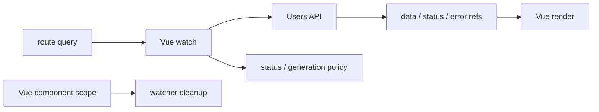
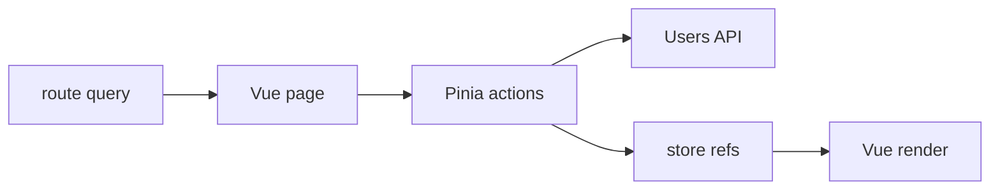
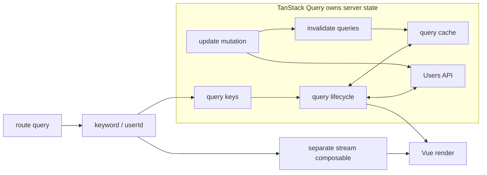
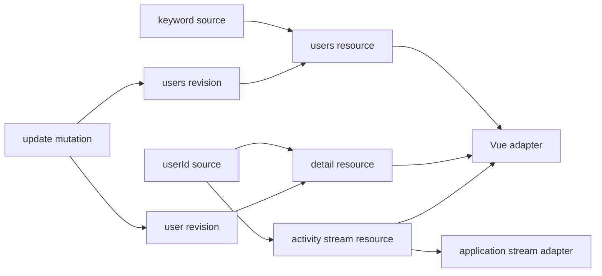

# Vue Async Ownership Slidev 簡報提案

> 狀態：內容提案修訂稿（已收斂為 explicit ownership 與 graph clarity／cost 的條件式主張）
>
> 預計形式：Slidev 技術演講
>
> 預計時間：40 分鐘，不含 Q&A；建議控制正式內容在 36–38 分鐘
>
> 主要語言：繁體中文，程式碼、API 名稱與必要技術詞彙保留英文
>
> 對應 Demo：`vue-async-ownership`
>
> Demo repository：`https://github.com/Luciano0322/vue-async-ownership`；正式活動前再確認 canonical URL 並產生 QR code

## 1. 提案目的

這份文件先定義演講的核心主張、敘事順序、取捨邊界與 Slidev 製作方式，再開始撰寫正式 `slides.md`。

目前 Demo 已完整涵蓋 Pure Vue、Pinia、TanStack Query、signal-kernel、Mock API、Router、TDD、E2E 與 presentation fallback。如果直接照開發順序介紹，容易讓演講變成功能導覽或工具比較，偏離真正想傳達的 ownership。

這場演講應只圍繞一個問題：

> 當 route、request、cache、mutation 與 stream 隨時間變化時，究竟是誰負責讓畫面保持正確？

## 2. 核心主張

### 2.1 一句話版本

> State management 幫助我們組織資料與變更；lifecycle ownership 指出哪一層負責維持跨時間的正確性。

這裡的 owner 不是「自動化最多的工具」，而是對某一組 lifecycle invariants 負責的 layer。Application 可以在 component、store、query options 或 graph factory 中宣告 policy；Vue、application code、Query runtime 或 signal-kernel runtime 則以不同機制維持它。

### 2.2 這場演講採取的立場

這場演講不是完全中立的工具導覽，而是提出一個有適用條件的架構判斷：

> 當 async correctness 同時依賴 query、mutation、stream 與 framework consumer 之間的 relationships 時，把這些 relationships 顯式建模成 graph，會比讓它們分散在 watch、action、cache 與 composable 中更容易理解。

本場將「更容易理解」限定在 relationship clarity：

- dependency 是否能被直接看見。
- invalidation 是否是 explicit relation，而不是藏在 imperative call sequence。
- query、mutation 與 stream 是否能使用一致的 lifecycle vocabulary。
- framework consumer 與 resource lifecycle 的邊界是否能被直接指出。
- 理解流程時，需要追蹤多少個 watch、action、callback 與 composable。

這不是對程式碼行數、執行效能、生態成熟度或開發速度的主張。

### 2.3 演講結論

Pure Vue、Pinia Action、TanStack Query 與 signal-kernel 是四種不同的 responsibility configuration：

- Pure Vue：Vue 擁有 reactive tracking 與 component-bound scope；application code 在 composable 中宣告並維持 request、status 與 stale-data policy。
- Pinia Action：store 擁有 shared state 與 workflow boundary；application-defined actions 維持 async policy，Pinia 不預先規定 server-state semantics。
- TanStack Query：query、mutation 與 cache runtime 維持 server-state lifecycle；這份 Demo 的 callback-style activity subscription 由獨立 Vue composable 擁有。
- signal-kernel：application 在 framework-independent graph factory 中宣告 cross-resource relationships；runtime 維持 resource dependency、metadata、invalidation 與 stale-result policy，Vue 保留 route adaptation、interaction、view projection 與 rendering。

本場的偏好與限制可以同時成立：

1. Local lifecycle 很清楚時，Pure Vue 通常是最低成本的選擇。
2. 問題是 shared client workflow 時，Pinia 能提供清楚的 application boundary。
3. 問題是 server state 時，TanStack Query 提供成熟的專門 lifecycle model。
4. 問題變成 cross-resource relationships 時，graph-first 能提高 relationship visibility，但必須支付新的 vocabulary、runtime、adapter、debugging 與 maturity cost。

決策條件不是「哪個工具擁有最多」，而是：

> 當追蹤隱含 relationships 的成本，大於建立與維護 graph 的成本時，graph-first 才開始有價值。

### 2.4 signal-kernel 的演講定位

本場將 signal-kernel 定位為：

> 一個已可運行的 framework-agnostic library，同時也是用來驗證 graph-first relationship clarity 假設的 architecture experiment。

演講不主張它是 Vue、Pinia 或 TanStack Query 的直接替代品：

- Pure Vue、Pinia 與 TanStack Query 分別處理不同 scope 的問題。
- signal-kernel 不是「比 Query Cache 更完整的下一層」，而是另一種顯式描述 cross-resource relationships 的設計。
- Demo 用相同的 selected outcomes 控制外部需求；它不證明 graph 較好，也不構成 benchmark 或完整選型。
- 由於 signal-kernel 是講者自己的設計，進入該章節時必須同時揭露 experimental maturity、abstraction、vocabulary、adapter、debugging 與 adoption cost。
- 目前 Demo 的 graph 在 Vue page setup 中建立，能證明 factory 不依賴 Vue、relationships 在 first render 前形成；不能宣稱 graph lifetime 已獨立於 component。
- 目前 stream resource 由 runtime 維持 source tracking、metadata、stale emission 與 accumulation，但 callback API 的 subscribe/unsubscribe bridge 仍由 application code 實作。

## 3. 目標觀眾

主要觀眾是已經會使用 Vue 3 Composition API，並碰過以下問題的前端開發者：

- 用 `watch()` 或 `watchEffect()` 觸發 API。
- 用 `ref()` 維護 loading、error 與 data。
- 使用 Pinia 組織跨 component 狀態。
- 聽過或正在評估 TanStack Query。
- 遇過舊 response 覆蓋新結果、更新後資料不同步、subscription 沒清除等問題。

觀眾不需要先理解 signal graph 或 signal-kernel。

### 3.1 語言策略

簡報以繁體中文受眾為主要設計對象，不製作中英雙語兩套內容。語言分工如下：

- 標題、論點、圖說、比較表與 speaker notes 使用繁體中文。
- 程式碼、型別、API、package 名稱與 route 保留英文，避免為翻譯而扭曲實際開發語境。
- `ownership`、`lifecycle`、`server state`、`invalidation` 等核心詞彙第一次出現時，用中文句子解釋；後續可直接保留英文。
- 不要求每個英文名詞都有逐字中文對照，重點是讓觀眾理解它在責任邊界中的角色。
- Slidev 全域語言設定使用 `zh-TW`，PDF 匯出前確認繁中字型、標點與 Mermaid 中文節點不會缺字。

這樣可維持 Vue 開發者熟悉的技術語境，同時避免主要論點因大量英文段落而增加理解負擔。

## 4. 非目標

以下內容不應進入主線，最多放在 appendix：

- 完整介紹 Vue reactivity 原理。
- 教學式介紹 Pinia 或 TanStack Query 全部 API。
- 詳解 Mock API、Vite middleware 與 scenario engine 的實作。
- 逐項解說 TDD Phase 0–9。
- 展開所有 race、abort、error 與 stream-disconnect cases。
- 比較 bundle size、效能 benchmark 或框架排名。
- 深入 signal-kernel runtime source code與 API ergonomics。
- 把 signal-kernel 描述成所有 Vue 專案的必選解法。

## 5. Ownership 的共用語言

本場將 ownership 定義為：

> 對某一組 lifecycle invariants 負責，並不等於所有細節都由 library 自動完成。

每個 model 都必須分開回答兩個維度：

1. Policy 在哪裡被宣告？
2. 哪個 framework、application layer 或 runtime 維持這項 invariant？

後面四個 model 再使用同一組問題：

1. 誰根據 route/source 觸發 request？
2. 誰保存 pending、refreshing、success 與 error？
3. 誰保留 stale data，並阻止舊 response 覆蓋新結果？
4. update 成功後，誰決定哪些資料需要重新載入？
5. userId 改變或 component unmount 時，誰停止舊 stream？
6. Vue 在這一版擁有哪些 route adaptation、interaction、view projection 與 rendering responsibility？

這六個問題比「用了幾個 `watch`」或「少寫幾行 code」更能準確描述差異。Manual policy 仍然可以有明確 owner；library automation 也不代表 application 不再負責宣告 domain meaning。

第 5 題必須允許誠實答案是「目前尚未完整處理」。這份 Demo 的 signal-kernel stream 已驗證 source switch 時停止舊 subscription，但尚未由共同 contract 證明 component unmount teardown；簡報應把它列為 current integration limitation，而不是用抽象模型掩蓋。

## 6. 敘事原則

### 6.1 使用同一個實驗

四個 model 應盡量共用：

- 相同 User Admin Dashboard。
- 相同 `UsersApi`。
- 相同 route-derived state。
- 相同 Mock API scenario。
- 相同 Search、Detail、Update 與 Activity 核心測試結果。

這是控制 user-visible scenario 的 architecture case study，不是嚴格控制實驗。四個實作的 abstraction level、runtime maturity、cache policy、ecosystem 與 application glue 並不相同，因此不能由 Demo 推導整體工具排名。

### 6.2 每一章回答同一組問題

每個 model 的段落都用同一個結構：

1. 這個 model 主要處理哪一種 problem scope？
2. Policy 在哪裡宣告，哪個 mechanism 維持 lifecycle invariants？
3. Vue 保留哪些 presentation responsibility？
4. 哪些 application glue 與 integration cost 仍然存在？
5. 這個 model 沒有試圖解決什麼？

### 6.3 不把演講做成排行榜

建議反覆提醒：

- Pinia 解決 shared client state 與組織問題，不等於自動接管 server-state lifecycle。
- TanStack Query 擅長 server state，不代表它應該擁有所有 arbitrary async process。
- signal-kernel 展示 graph-first relationship model，但也帶來 experimental maturity、abstraction、vocabulary、adapter、debugging 與 adoption cost。
- TanStack Query → signal-kernel 不是成熟度升級，而是問題 scope 從 server state 轉向跨 resource relationship。
- 小而局部的需求，Pure Vue 可能就是最合適的 ownership boundary。
- 更多 runtime automation 不會自動帶來更好的架構；維持 invariants 的機制必須與實際 lifecycle 相符。
- `Query + Vue composable` 是完整而合理的 architecture，不是等待 graph 補完的中間狀態。

### 6.4 如何討論 graph 的 clarity

本場可以明確偏好 graph-first，但只比較 relationships 是否更 visible、co-located 與 traceable。不要使用以下證據支持 clarity：

- 程式碼行數比較。
- 只展示其中一版的 happy path。
- 把 application glue 從 signal-kernel snippet 中隱藏。
- 用測試通過數量推導 architecture superiority。

每個 code excerpt 都應標示：

```text
Policy declared by:
Lifecycle enforced by:
Application glue omitted:
```

## 7. 建議演講標題

首選：

> 誰擁有這段非同步？Vue async lifecycle 的四種責任邊界

可選標題：

- 不是少寫一個 watch：Vue Async Ownership 的四種 responsibility map
- Same UI, Different Owner：重新理解 Vue 的非同步狀態
- Watch 與 Graph：Vue 非同步生命週期由誰負責？

副標：

> Pure Vue、Pinia Action、TanStack Query 與 signal-kernel

## 8. 40 分鐘時間配置

40 分鐘全部用於正式演講，Q&A 在演講結束後另計。內容本身以 38 分鐘為上限，留下約 2 分鐘處理換頁、現場反應、Demo 切換或短暫技術延遲。

| 段落 | 建議時間 | 累計 | 目的 |
| --- | ---: | ---: | --- |
| 講者資訊與問題定義 | 5 分鐘 | 5 | 簡短建立講者脈絡與 ownership 語言 |
| 共同 Demo | 3 分鐘 | 8 | 固定需求、UI、API 與比較基準 |
| Pure Vue baseline | 5 分鐘 | 13 | 區分 Vue scope responsibility 與 application async policy |
| Pinia Action | 5 分鐘 | 18 | 展示 store-owned workflow 與 application-defined lifecycle policy |
| TanStack Query | 7 分鐘 | 25 | 展示專門的 server-state lifecycle model 與有效的 stream boundary |
| signal-kernel | 7 分鐘 | 32 | 展示 explicit cross-resource relationships 與其交換成本 |
| 四版本對照、選擇原則與結論 | 6 分鐘 | 38 | 收斂 clarity 主張、限制與選擇條件 |
| 現場節奏緩衝 | 2 分鐘 | 40 | 保留換頁、停頓與 Demo 切換空間，不作為 Q&A |

彩排目標是 36–38 分鐘完成 Slide 26 的結論。Slide 27 的 Q&A／QR code 頁在 40 分鐘演講結束後顯示，不占用上述配置。若彩排超過 38 分鐘，優先刪除 appendix 細節與重複 Demo 操作，不壓縮 ownership 結論。

## 9. 建議投影片結構與文案

以下規劃共 27 張，包括講者資訊、章節頁、結論與會後 Q&A 頁。Slidev 的 click animation 不算額外投影片。

### Act 0：先定義問題

#### Slide 1 — 封面

標題：

> 誰擁有這段非同步？

副標：

> Pure Vue、Pinia Action、TanStack Query 與 signal-kernel 的四種責任邊界

畫面下方：

> Same scenario. Different responsibility map.

講者目標：先讓觀眾知道這不是「四套 state management 排名」。

#### Slide 2 — 講者資訊

建議版面採左側文字、右側照片或簡單識別圖，不要做成完整履歷，也不要把 React 當成畫面上的主要身份標籤。

畫面資訊：

```text
Luciano
Senior Frontend Engineer
Creator of signal-kernel

Reactivity · Async Lifecycle
Framework-independent Data Flow

[GitHub handle 或個人網站]
```

建議口說：

> 大家好，我是 Luciano，目前是一名前端工程師，也是 signal-kernel 的作者。我的主要工作背景從 React 生態出發，但這幾年在研究 reactivity、async resource 和跨框架資料流時，我開始把注意力從「某個 framework 怎麼更新畫面」，移到「哪一層負責維持 lifecycle correctness」。所以今天不是要把 React 的作法搬進 Vue，也不是要介紹一套 Vue 的替代方案。我做了一個完整的 Vue case study，讓 Pure Vue、Pinia Action、TanStack Query 和 signal-kernel 面對相同 UI、API 與 selected outcomes，再觀察它們如何配置 responsibility。

口說控制在 40–50 秒，只回答三件事：「我是誰」、「為什麼研究 ownership」、「為什麼這不是 React 對 Vue 的評論」。signal-kernel 只揭露作者身份與研究背景，不在此頁解釋 graph、resource、revision 或 adapter。

React 背景可以口頭交代為觀察來源，但不放成畫面主標籤，也不延伸成 React vs Vue。四個 model 都在同一個 Vue 專案與相同 behavior contract 下運行，是控制 selected outcomes 的方法，不是證明某個 architecture 較好的證據。

Slide 2 可以用小字放 GitHub handle 或個人網站，讓 PDF 中的文字可點擊，但不另外放 QR code。Demo repository QR code 留到最後一頁，避免觀眾在開場時開始掃碼而離開敘事。

開始製作時只需再補上頭像，以及確認要顯示的 GitHub handle 或個人網站。

#### Slide 3 — 一個 fetch，真的只是一個 fetch 嗎？

畫面文案依序出現：

- route 改變時，誰觸發下一次 request？
- 新 request 還沒完成時，要不要保留舊資料？
- 舊 response 最後才回來時，誰知道它已經過期？
- update 成功後，誰知道哪些資料需要刷新？
- component 離開後，誰停止 stream？

收尾：

> Request 很短；responsibility 會持續存在。

#### Slide 4 — State location ≠ lifecycle ownership

左右對照：

| State location | Lifecycle ownership |
| --- | --- |
| 資料放在哪裡？ | 哪一層維持跨時間的 invariants？ |
| component、store、cache、graph | trigger、stale、error、invalidate、dispose |

口說重點：

> 把 ref 搬進 store 會改變 state 與 workflow boundary；是否也改變 lifecycle policy，取決於 store action 實際宣告並維持了什麼。

#### Slide 5 — 固定情境，觀察不同 responsibility map

畫面文案：

- Same Dashboard
- Same Users API
- Same route state
- Same selected outcomes
- Different responsibility map

畫面下方必須直接揭露：

> Architecture case study — not a benchmark, controlled experiment, or complete tool evaluation.

建議搭配 Demo 的四個 route：

```text
/examples/vue
/examples/pinia
/examples/query
/examples/signal-kernel
```

#### Slide 6 — Ownership checklist

用六個簡短 badge 或逐項出現：

```text
trigger
status
stale
invalidate
dispose
render
```

口說重點：後面每個 model 都用同一份 checklist，不臨時發明評分標準。

每章都要再回答：

```text
Policy declared by?
Lifecycle enforced by?
Vue still owns?
Application glue omitted?
```

### Act 1：Pure Vue — local、explicit、component-bound

#### Slide 7 — Pure Vue baseline

標題：

> Pure Vue：local and explicit

建議 Mermaid：



#### Slide 8 — 真正變複雜的不是 fetch

建議只展示 10–14 行 curated snippet：

```ts
watch(keyword, async currentKeyword => {
  const generation = ++latestRequestGeneration
  usersStatus.value = hasLoadedUsers ? 'refreshing' : 'pending'

  const nextUsers = await api.fetchUsers({ keyword: currentKeyword })

  if (generation === latestRequestGeneration) {
    users.value = nextUsers
    usersStatus.value = 'success'
  }
}, { immediate: true })
```

畫面註記：

- Vue 維持 reactive dependency tracking 與 component-bound watcher cleanup。
- Application composable 宣告 request、stale protection 與 status policy。
- Manual 不代表沒有 owner；owner 在 application code，而且很容易定位。

#### Slide 9 — Pure Vue takeaway

大字：

> Local and explicit.

小字：

> Vue owns reactivity and scope cleanup. Application code owns the async policy.

不要把 Pure Vue 描述成錯誤解法或未完成階段。它是完整且合理的 local boundary，也是四個 model 共用的比較基準。

### Act 2：Pinia Action — store owns the workflow boundary

#### Slide 10 — 為什麼自然會想到 Pinia？

畫面文案：

- 多個 component 需要同一份狀態。
- request 與 update logic 不想散落在 page。
- 希望 actions 提供一致入口。

轉場句：

> 我們先把責任集中起來。

#### Slide 11 — Pinia 改變了什麼？

建議 Mermaid：



畫面註記：

> Store owns shared state and workflow. Application-defined actions maintain the async policy.

#### Slide 12 — Action 還是在手動編排

建議 snippet：

```ts
async function updateUser(userId, patch) {
  await api.updateUser({ userId, patch })

  await Promise.all([
    fetchUsers(currentKeyword),
    fetchUserDetail(userId),
  ])
}
```

口說重點：

- action 讓意圖集中。
- store 可以成為清楚的 application-level owner。
- reload、race guard、status transition 與 stream cleanup 的 policy 仍由這份 Pinia Action implementation 明確定義。
- 這是其中一種 Pinia architecture，不代表 Pinia 只能這樣組織 async work。

#### Slide 13 — Pinia takeaway

大字：

> Centralized makes policy explicit, not automatic.

建議中文口說：

> Store 已經擁有 shared workflow；Pinia 不會替 application 預先決定 server-state lifecycle semantics。

### Act 3：TanStack Query — server state 有了專門 owner

#### Slide 14 — TanStack Query ownership map

開場問題：

- 它來自 server。
- 它可能 stale。
- 它有 cache identity。
- mutation 後需要 invalidation。
- 多個 consumer 可能共享同一份結果。

先用這些特徵說明：users/detail 不是單純「放在 component 裡的資料」，而是具有遠端 identity 與 freshness policy 的 server state。

建議 Mermaid：



圖上的 ownership boundary 必須刻意包含 query、cache、mutation 與 invalidation，但不要把 stream 畫進 `QueryOwner` subgraph。

建議講解順序：

1. Route 仍然提供 `keyword` 與 `userId`，TanStack Query 不會取代 Vue Router。
2. Source 被投影成 query keys，query key 同時描述 server-state identity 與 dependency。
3. Query runtime 維持 request status、cancellation、stale result 與 cache interaction。
4. Vue 不再自己維護 users/detail 的 loading、error 與 retained data，而是消費 query result。
5. Mutation 成功後宣告 invalidation；matching cache entries 變成 stale，active queries 再依 lifecycle refetch。
6. 這份 Demo 的 callback-style Activity subscription 由獨立 Vue composable 擁有；這是一個有效的 architecture boundary。

這張圖要傳達的不是「所有東西都進 cache」，而是：

> 當問題是 server state，我們可以讓專門的 Query runtime 維持其 lifecycle invariants。

Speaker notes 建議：

- `queryFn` 仍由 application 提供，但 request lifecycle 不再由 page 的 `watch` 手動編排。
- `invalidateQueries()` 描述哪些 server state 已失效，不等於 application 自己依序呼叫每個 reload function。
- 不需要深入 QueryObserver、garbage collection 或 retry options，這些屬於 TanStack Query 教學而非 ownership 主線。
- Stream path 位於 subgraph 外，不代表 TanStack Query 缺少一塊能力；它表示 application 選擇了另一個 owner。
- 避免宣稱 TanStack Query 原則上不能處理 stream。官方另有 experimental [`streamedQuery`](https://tanstack.com/query/latest/docs/reference/streamedQuery) 處理 AsyncIterable，但它不等同這份 Demo 的 callback-style persistent subscription。
- 建議時間 90 秒；最後停在「server state 與 Activity subscription 都有清楚但不同的 owner」。

#### Slide 15 — Query key 成為 dependency

建議 snippet：

```ts
const usersQuery = useQuery({
  queryKey: computed(() => ['users', keyword.value]),
  queryFn: ({ signal }) =>
    api.fetchUsers({ keyword: keyword.value, signal }),
  placeholderData: previous => previous,
})
```

標示：

- query key owns identity。
- query lifecycle owns status。
- cache owns retained server data。

這張 code slide 是上一頁 ownership map 的局部放大。只 highlight `queryKey`、`queryFn` 與 `placeholderData`，不要重新解釋整張流程圖。

#### Slide 16 — Mutation 宣告 invalidation

建議 snippet：

```ts
const updateMutation = useMutation({
  mutationFn: api.updateUser,
  onSuccess: () => {
    queryClient.invalidateQueries({ queryKey: ['users'] })
    queryClient.invalidateQueries({ queryKey: ['user', userId.value] })
  },
})
```

口說重點：

> Application code 還是描述關係，但不再自行編排每一次 reload 的細節。

#### Slide 17 — TanStack Query 的 ownership boundary

畫面左邊：

```text
Query cache owns
✓ users request
✓ detail request
✓ mutation lifecycle
✓ invalidation
```

畫面右邊：

```text
Vue composable owns by design
✓ activity stream subscription
✓ stream event accumulation
✓ stream cleanup/error projection
```

關鍵句：

> TanStack Query owns server state. It does not automatically own every asynchronous process.

這張必須先承認：

> Query + Vue composable is already a valid and complete boundary for this demo.

進入下一章前必須明確說明：

> 到這裡，TanStack Query 與 Vue composable 已經各自在適合的 scope 維持 lifecycle。接下來不是補足 Query，而是換一個問題：如果團隊需要用同一張 responsibility map 理解 Query、Mutation、Stream、Derived State 與 framework consumer，顯式 graph 能否降低追蹤這些 relationships 的成本？

這張是 signal-kernel 的必要轉場，stream 細節控制在 60–90 秒。轉場的重點是「問題 scope 改變」，不是「工具能力升級」。

### Act 4：signal-kernel — explicit cross-resource relationships

#### Slide 18 — 我用 signal-kernel 驗證的假設

畫面主句：

> 當 correctness 橫跨 Query、Mutation、Stream 與 Vue consumer 時，explicit graph 能否降低追蹤 relationships 的成本？

一句話定義：

> signal-kernel 是一個 framework-agnostic、graph-first 的 reactive runtime，用來描述 source、async resource、mutation、stream 與 invalidation relationships。

定位揭露：

> 它是我建立的可運行 library，也是用來驗證 graph-first relationship clarity 的 architecture experiment；不是 Vue store 或 TanStack Query 的直接替代品。

畫面上以小字保留：

```text
Version: {{SIGNAL_KERNEL_VERSION}}
Maturity: experimental · author-maintained
```

建議畫面用三層責任呈現：

```text
Application declares
domain input · resource operations · revisions
external stream subscribe/unsubscribe adapter

Runtime maintains
dependency tracking · resource metadata
invalidation · cancellation · stale-emission suppression

Vue owns
route-to-source adaptation · interaction
view projection · component composition · rendering
```

邊界說明：

- Application 仍定義 domain input、API operation、derived meaning，以及哪些 revision 代表資料失效。
- Runtime 根據已宣告的 relationships 維持 dependency、resource metadata、invalidation 與 stale-result policy。
- Vue 消費 resource snapshots，但仍擁有 route adaptation、interaction handlers、view-model projection、component composition 與 rendering。
- 目前 Demo 的 graph factory 沒有 Vue dependency，但 graph instance 是在 page setup 中建立；它證明 relationships 在 first render 前形成，不證明 graph lifetime 已獨立於 component。
- 目前 callback-style Activity API 的底層 subscribe/unsubscribe bridge 仍由 application code 實作；runtime 維持 source change、metadata、event accumulation 與 stale emission policy。
- signal-kernel 不主張接管所有 server-state cache，也不主張所有 Vue 專案都需要 graph-first runtime。

建議口說：

> Pure Vue、Pinia Action 與 TanStack Query 都已經是各自 scope 的完整選擇。signal-kernel 是我自己的設計，我用它驗證另一個假設：當理解 correctness 必須來回追蹤 Query、Mutation、Stream 與 consumer 時，把 relationships 顯式放進 graph，是否能降低 reasoning cost。我的判斷是這份 Demo 中確實比較容易看見 dependency 與 invalidation，但它也新增 runtime、adapter、debugging model 與 maturity cost。

這頁控制在 75–90 秒，不展開各 API signature。最後用以下句子進入下一頁：

> Make relationships explicit. Keep presentation in Vue.

#### Slide 19 — Graph makes relationships visible

建議 Mermaid：



視覺重點不是 node 數量，也不是宣稱 runtime 會執行所有 integration work；而是 dependency、invalidation、stream 與 consumer boundary 可以在同一張 responsibility map 中被看見。Graph factory 不依賴 Vue，這份 Demo 則在 page setup 中建立 instance。

#### Slide 20 — Resource 宣告 dependency

建議 snippet：

```ts
const usersResource = createResource({
  input: keyword.get,
  observe: usersRevision.get,
  run: (currentKeyword, context) =>
    api.fetchUsers({
      keyword: currentKeyword,
      signal: context.signal,
    }),
})
```

標示：

- source change 觸發 resource。
- revision 描述 invalidation。
- pending/error/cancellation 屬於 resource metadata。

固定 footer：

```text
Policy declared by: graph factory
Lifecycle enforced by: signal-kernel resource runtime
Application glue omitted: Vue adapter + external stream bridge
```

#### Slide 21 — Vue 擁有 presentation；runtime 維持 resource lifecycle

畫面文案：

```text
Vue Router / interaction → Vue boundary adapter → graph source
Runtime resource snapshot → Vue adapter → view projection
Vue component composition → render
```

建議口說：

> Vue 的 watch 仍然存在，但在這份 Demo 中只把 route state 同步進 graph source，不直接編排 fetch 或 invalidation。Vue 消費的是 resource snapshot，不是 resource lifecycle；route adaptation、interaction handler、status projection、component composition 與 rendering 仍由 Vue 擁有。底層 callback subscription 的 unsubscribe bridge 則仍是 application integration responsibility。

#### Slide 22 — Clarity is not free

建議左右對照：

```text
Graph buys
✓ visible dependencies
✓ explicit invalidation relations
✓ shared resource vocabulary
✓ less imperative tracing

Graph costs
• new abstraction and vocabulary
• runtime and adapter integration
• a different debugging model
• experimental maturity and smaller ecosystem
• external teardown integration
```

畫面下方大字：

> Use a graph when the cost of tracing implicit relationships exceeds the cost of maintaining the graph.

建議口說：

> Graph 沒有消除複雜度，而是把原本分散在執行流程中的 relationships 顯式化。就這份 Demo 而言，我認為它讓 dependency、invalidation、stream 與 consumer boundary 更容易理解；但這份 clarity 不是免費的，也不代表每個專案都值得支付它的成本。

### Act 5：收斂與選擇

#### Slide 23 — 四種 ownership configuration

建議比較表：

| Concern | Pure Vue | Pinia Action | TanStack Query | signal-kernel |
| --- | --- | --- | --- | --- |
| Policy declared by | component/composable | store actions | query/mutation options + stream composable | graph factory + integration adapters |
| Lifecycle maintained by | Vue scope + application policy | store/application policy | Query runtime + Vue stream composable | resource runtime + application stream bridge |
| Trigger | Vue watch | page watch → action | query key | Vue watch → graph source → resource |
| Stale protection | generation guard | store generation guard | query lifecycle | resource runtime |
| Update refresh | manual reload | action orchestration | invalidation | revision relation |
| Stream | Vue composable cleanup | store action + page cleanup | separate Vue composable — valid boundary | stream resource + application unsubscribe adapter |
| Vue role | presentation + local integration | presentation + workflow coordinator | presentation + query/stream consumer | presentation + route-to-graph adapter + snapshot consumer |
| Scope demonstrated | local feature | shared client workflow | server state | explicit cross-resource relationships |
| Cost visible here | manual async policy | store orchestration | query/cache model + separate stream boundary | experimental runtime, vocabulary, adapter, debugging and teardown integration |

表格下方大字：

> Different scopes buy different clarity at different costs.

此頁停留約 2–3 分鐘，是整場最重要的總結頁。講解時沿著 concern 橫向比較 policy、enforcement mechanism、Vue role 與 integration cost，不由左到右描述成技術進化史。

#### Slide 24 — Same selected outcomes, different responsibility maps

畫面大字：

> 4 models × 10 contract executions = 40 passing cases

小字：

```text
8 shared async behaviors
1 shared-surface check
1 model-specific explanation check
```

只用一張圖或一句話交代 TDD：

- Contract 控制 selected outcomes；ownership 由 code path 與 responsibility map 判讀。
- 測試不證明 architecture superiority、framework independence、ecosystem maturity 或完整行為等價。
- 不逐條介紹測試實作。

#### Slide 25 — 哪一種 boundary 適合哪一種問題？

建議文案：

- Lifecycle 局部且容易追蹤：Pure Vue 通常是最低成本選擇。
- 需要 shared client state 與 application workflow：Pinia 提供清楚 store boundary。
- 需要 server-state identity、cache、freshness 與 mutation：TanStack Query 提供專門 lifecycle model。
- Correctness 開始依賴多種 resource relationships：可以評估 explicit graph 是否值得它的成本。

畫面補充：

```text
These are scopes, not levels.
They can coexist in the same application.
```

建議口說：

> 這四種 model 不是只能選一個。實際專案完全可能讓 Vue 管 presentation、Pinia 管 client workflow、TanStack Query 管 server state，再只把需要統一 relationship model 的部分交給 graph。是否值得採用 graph，取決於追蹤隱含 relationships 的成本，是否已經高過 graph vocabulary、runtime、adapter 與 debugging 的成本。

此頁必須補充：本場沒有評估 SSR、Devtools、bundle/performance、ecosystem、team familiarity 與長期維護成熟度，因此 `Scope demonstrated` 不是完整選型結論。

#### Slide 26 — 結論

大字：

> Make lifecycle ownership explicit at the scope where correctness is enforced.

補充核心句：

> signal-kernel 不是這場演講的結論，explicit ownership 才是。signal-kernel 是我嘗試把這個立場做成可運行系統的方式。

講者立場：

> 在這份 cross-resource case study 中，我認為 graph 讓 dependency、invalidation、stream 與 consumer relationships 更容易被看見；但 clarity 不是免費的，也不代表每個專案都值得支付它的成本。

最後留給觀眾的問題：

> 在你的系統裡，追蹤隱含 relationships 的成本，已經高過建立 explicit graph 的成本了嗎？

#### Slide 27 — Q&A 與 Demo repository

這頁在 40 分鐘正式內容結束後顯示，作為 Q&A 背景與會後入口。畫面保持簡單：

```text
Questions?

[Demo repository QR code]

[短網址]
Pure Vue · Pinia · TanStack Query · signal-kernel
```

QR code 應指向公開且穩定的 Demo repository URL，QR 下方必須同時印出可讀的短網址，避免相機、投影亮度或網路狀況造成掃描失敗。

Repository 目前已公開，但正式投影片仍先保留 `{{DEMO_REPO_URL}}` 與 QR placeholder，直到活動前確認 canonical URL、README 與 release state 都不再變更。不要對本機路徑、暫存 branch、短期 preview deployment 或尚未確認的 URL 產生正式 QR code。公開後再將產出的靜態 SVG 或 PNG 放入 `public/qr/`，並以至少兩支手機及實際投影畫面驗證。

全場只保留這一個主要 QR code。個人網站、GitHub profile、signal-kernel package 與投影片網址不各自產生 QR；改由 Demo repository README 統一提供延伸連結。若未來確實需要同時發佈 repo、slides 與聯絡方式，再考慮讓唯一 QR 指向由講者長期維護的資源頁。

## 10. Live Demo 規劃

### 10.1 主線固定 route

主線使用穩定成功情境：

```text
/examples/vue?keyword=a&userId=1&scenario=default
```

原因：

- 四個 model 顯示相同資料。
- Activity 維持 connected，不讓錯誤色彩搶走 ownership 主題。
- `DemoNav` 切換 model 時會保留 keyword、userId 與 scenario。

### 10.2 不重複操作四次

建議只完整操作一次 Search → Detail → Update，證明共同 Dashboard 可以工作。進入各 model 段落時，以切 route、對照 responsibility map 與一段 code 為主。

`StatusPanel` 的 ownership notes 是講者撰寫的 interpretation，不是 runtime 自己產生的證據。簡報不可用「畫面上寫著誰擁有」來證明 ownership；必須回到 policy 宣告位置、lifecycle enforcement path 與 application glue。

推薦節奏：

1. Intro 後用 Pure Vue 展示共同 Dashboard，約 60–90 秒。
2. 每章結尾只切換一次 model，約 20–30 秒。
3. Slide 23 前不再做 60 秒 happy-path route sweep；改用 30–45 秒的共用 race／stream-switch contract trace，證明 selected outcomes 一致。

### 10.3 Error 與 stream-disconnect

`detail-not-found`、`update-error`、`race-condition`、`stream-disconnect` 留在 appendix 或 Q&A。

它們是 lifecycle policy 的觀察材料，不是 architecture ranking 的證據。主線最多挑一個所有 model 共用的 race 或 stream-switch trace；`stream-disconnect` 因 interruption policy 目前不完全相同，維持在 appendix。

### 10.4 備援素材

主簡報備援圖應重新產生為：

- 真正 16:9 的 viewport screenshot。
- `scenario=default`。
- 相同 keyword 與 userId。
- 四張圖片使用一致的成功狀態。

目前 Demo repository 中使用 `fullPage: true` 與 `stream-disconnect` 的圖片可保留為 error/stream appendix，不建議作為四 model 的主要比較圖。

### 10.5 公開 repository 與 QR code

Demo repository 是演講後讓觀眾自行重現四種 ownership model 的主要入口，但不應讓 repo 導覽占用 40 分鐘主線。

公開前需完成：

- 確認 repository 的公開名稱與 canonical URL 不會在演講後立即變更。
- README 首屏說明演講主題、四個 routes、Node/pnpm 需求與啟動指令。
- 預設進入 `scenario=default`，讓觀眾第一次執行就看到穩定成功路徑。
- 明確標示 signal-kernel 的定位與版本，避免觀眾把實驗性 API 誤認為通用標準。
- 移除 token、內部連結、個人路徑及不適合公開的截圖或 metadata。

QR code 製作規則：

1. 等公開 URL 最終確定後才產生，不為目前未公開的位址製作臨時 QR。
2. 優先直接連到 repository 首頁；若使用短網址，該 redirect 必須由講者長期控制。
3. 使用靜態 SVG 為主，保留足夠留白與高對比，不把 QR 疊在漸層或截圖上。
4. QR 下方永遠顯示人眼可輸入的短網址。
5. 在 Slidev dev server、PDF export 與會場投影距離下各測試一次。
6. 全場維持單一主要 QR，其他外部連結集中到 repository README，避免觀眾不知道該掃哪一個。

主線中只需在共同 Demo 時口頭說明「最後會提供 repo」，正式 QR 只放在 Slide 27，讓觀眾在內容結束後再掃描。

## 11. Slidev 專案結構建議

目前 `slides.md` 是 Slidev starter 範例。正式製作時建議不要持續把所有內容堆在單一檔案。

```text
v-tw-talk-2026/
  slides.md
  pages/
    00-intro.md
    10-pure-vue.md
    20-pinia.md
    30-tanstack-query.md
    40-signal-kernel.md
    50-comparison.md
    90-appendix.md
  components/
    OwnershipBadge.vue
    OwnershipTransfer.vue
    DemoRoute.vue
  snippets/
    pure-vue-watch.ts
    pinia-update.ts
    tanstack-query.ts
    signal-kernel-resource.ts
  public/
    screenshots/
    qr/
  docs/
    vue-async-ownership-talk-proposal.md
```

### 11.1 `slides.md` 的責任

`slides.md` 只保留：

- 全域 frontmatter。
- `lang: zh-TW` 與繁中字型設定。
- 封面。
- 各章 `src` imports。
- 共用 style 或 theme tokens。

### 11.2 `pages/` 的責任

依敘事章節切割，而不是每張 slide 一個檔案。這能讓調整時間或刪除整章時保持簡單。

### 11.3 `snippets/` 的責任

只放為演講重新整理過的 8–16 行程式碼。不要直接展示完整 production file，否則觀眾會花時間讀不影響 ownership 的細節。

每份 snippet 頂端註明來源，例如：

```ts
// Adapted from vue-async-ownership/src/examples/vue-baseline/useVueUsersDemo.ts
```

### 11.4 `components/` 的責任

第一版不需要先做大量 Slidev components。只有同一種視覺重複三次以上，才抽成 component。

優先候選：

- `OwnershipBadge`：顯示目前 owner。
- `OwnershipTransfer`：顯示責任從 A 移到 B。
- `DemoRoute`：統一展示 route 與 QR/link。

## 12. Slidev 呈現原則

### 12.1 一張 slide 只保留一個論點

避免同頁同時放：

- 完整程式碼。
- 架構圖。
- 四個 bullet。
- Demo 截圖。

如果一頁需要講超過 90 秒，優先拆頁。

### 12.2 Code 每次只強調一個 responsibility

建議使用 line highlighting 或 Magic Move，但不要讓動畫本身成為內容：

- Pure Vue：highlight generation/status。
- Pinia Action：highlight workflow boundary/manual policy。
- TanStack Query：highlight query key/invalidation。
- signal-kernel：highlight input/observe/revision。

四段 excerpt 都必須使用相同 footer：

```text
Policy declared by:
Lifecycle enforced by:
Application glue omitted:
```

不要用 excerpt 行數暗示生產力或架構優劣。

### 12.3 Click animation 的使用

適合逐步顯示：

- ownership checklist。
- 四張平行 responsibility map 中的 concern 分布。
- Mermaid graph relations。

不建議：

- 每個 bullet 都需要點擊。
- 同一頁超過 4 次 click。
- 大量 motion、旋轉或裝飾動畫。

### 12.4 Speaker notes

每張正式 slide 都應有 speaker notes，至少包含：

- 這頁唯一要傳達的句子。
- 預計秒數。
- 若時間不足可刪除的補充。
- 下一頁的轉場句。

範例：

```md
<!--
Core: Store owns the workflow boundary; actions define policy, while Pinia does not prescribe server-state semantics.
Time: 60 sec.
Cut: Do not explain store setup syntax.
Transition: What changes when the problem is specifically server state?
-->
```

## 13. 視覺方向

建議使用深色 neutral navy／charcoal 背景與白灰色全域 accent，讓簡報與 live demo 看起來屬於同一個系統，但不讓任何 model 的顏色成為整份 deck 的主色。

建議語意色：

- Pure Vue：blue。
- Pinia：yellow。
- TanStack Query：red/orange。
- signal-kernel：teal。
- Shared contract：neutral white/gray。

使用原則：

- 背景固定，不隨章節大幅換 theme。
- 四個 model 使用相近飽和度與相同視覺權重；色彩只用於 owner badge、箭頭與 code highlight。
- 正文維持高對比。
- 不用紅色表示 TanStack Query 的錯誤；紅色在該章只作品牌提示。
- signal-kernel 的 teal 不作封面、結論或全域 hero accent。
- Demo screenshot 不作滿版背景，避免字太小。

## 14. 主線、Appendix 與刪除邊界

### 主線必留

- ownership 定義。
- architecture case study 與「不是 benchmark／控制實驗」的限制。
- Pure Vue、Pinia、TanStack Query、signal-kernel 各一個 ownership hotspot。
- TanStack Query＋Vue composable 是有效完整 boundary。
- graph-first relationship clarity、Vue presentation boundary 與 signal-kernel integration cost。
- 四種 responsibility configuration 比較表。
- 40 次 contract execution 作為 selected-outcome control，不作為 ownership 或優劣證明。
- graph clarity 的條件式選擇原則與結論。

### Appendix

- Mock API scenarios。
- generation guard 與 race-condition 細節。
- `detail-not-found`／`update-error`。
- stream-disconnect。
- Router query preservation。
- TDD Phase 0–9 清單。
- signal-kernel stream API ergonomics。
- graph factory 與 component instance lifetime 的差異。
- signal-kernel current stream unsubscribe bridge 與 unmount disposal limitation。

### 直接刪除

- Slidev starter 的功能教學頁。
- 與 ownership 無關的套件安裝步驟。
- Node/pnpm 環境處理。
- i18n 規劃。
- 開發過程中的檔案搬移與 CSS 清理紀錄。

## 15. 製作階段

### P0：確認提案

- 確認標題、觀眾程度與活動資訊。
- 蒐集 Slide 2 所需的講者姓名、職稱、頭像與個人連結。
- 使用已確認定位：signal-kernel 是可運行的 framework-agnostic architecture experiment，用來驗證 explicit graph 是否提高 cross-resource relationship clarity；不是 Vue、Pinia 或 TanStack Query 的直接替代品。
- 固定判斷條件：只有當 implicit relationship tracing cost 高於 graph cost 時，才值得評估 graph-first。

### P1：內容骨架

- 清除 Slidev starter pages。
- 建立 6 個 main section files。
- 先只放標題、核心句、speaker notes。
- 不處理動畫與精緻 CSS。

### P2：Code 與圖

- 從 Demo 擷取 curated snippets。
- 建立四張平行 responsibility maps，不使用升級箭頭。
- 完成四種 responsibility configuration comparison table。
- 每章最多保留一個主要 code example。
- 每段 code 標示 policy、enforcement mechanism 與 omitted glue。

### P3：Demo 與備援

- 活動前確認 Demo repository 的 canonical URL、README 與公開狀態。
- 產生 `default` scenario 的真正 16:9 screenshots。
- 以最終公開 URL 建立 QR code 與可讀短連結。
- 以手機、Slidev 與 PDF 驗證 QR code。
- 確認無網路時仍能完成演講。

### P4：彩排與刪減

- 第一次不暫停彩排並記錄時間。
- Slide 26 結束時間超過 38 分鐘就刪內容，不加快語速。
- 第二次彩排驗證 demo 切換。
- 最後匯出 PDF，確認 code、Mermaid 與中文字型。

## 16. Definition of Done

- [ ] 觀眾能在 30 秒內理解 ownership 的定義。
- [ ] 觀眾能分辨「policy 在哪裡宣告」與「哪個 mechanism 維持 invariant」。
- [ ] 四個 model 都能用相同語法回答六個 ownership 問題。
- [ ] 每章都有一句清楚的 takeaway。
- [ ] Pure Vue 被描述成完整 local boundary，Vue 的 reactive tracking 與 scope cleanup 沒有被抹去。
- [ ] Pinia Action 被描述成 store-owned workflow；Pinia 沒有被縮減成只搬動 state location。
- [ ] TanStack Query＋Vue stream composable 被描述成有效且完整的 architecture boundary。
- [ ] TanStack Query 的 stream 說法限定在這份 callback-style Demo implementation，不宣稱 universal inability。
- [ ] signal-kernel 被明確描述成講者建立的可運行 architecture experiment，而不是所有專案的必選方案。
- [ ] graph clarity 的收益與 experimental maturity、runtime、vocabulary、adapter、debugging、teardown cost 同頁呈現。
- [ ] signal-kernel 只宣稱 graph factory framework-independent、instance 在 first render 前建立，不宣稱 Demo 已證明 component-independent lifetime。
- [ ] stream resource 的 runtime responsibility 與 application subscribe/unsubscribe bridge 被分開描述。
- [ ] TanStack Query → signal-kernel 的轉場被描述成 scope change，而不是能力升級。
- [ ] Vue 被描述成 route adaptation、interaction、view projection、component composition 與 rendering 的 owner，而不是被動 renderer。
- [ ] 全稿不使用「四次轉移」、「停在哪一層」或 `component → store → cache → graph` 表達升級路線。
- [ ] Slide 5 明確標示 case study 不是 benchmark、控制實驗或完整工具選型。
- [ ] Slide 24 將 40 cases 說明為 8 個 async behaviors＋1 個 surface check＋1 個 explanation check，再乘以四個 model。
- [ ] Contract 只用來控制 selected outcomes，不用來證明 ownership、clarity 或 architecture superiority。
- [ ] 主線只有一條穩定 live demo flow。
- [ ] 主線不使用 `stream-disconnect` 當作四模型預設畫面。
- [ ] 每段 code 可在 20 秒內看完。
- [ ] Slide 2 的講者介紹可在 45 秒內完成。
- [ ] Slide 26 的正式內容彩排不超過 38 分鐘，完整場次不超過 40 分鐘。
- [ ] Q&A 明確安排在 40 分鐘演講結束後。
- [ ] 標題、圖說與核心論述以繁體中文呈現，技術識別字保留英文。
- [ ] 活動前最終確認後，Slide 27 的 QR code 與短網址均可正確開啟。
- [ ] 不操作 Demo 仍能用 screenshots 或 PDF 完成演講。
- [ ] Slidev build 與 PDF export 均成功。

## 17. 已確認條件與待填資料

### 17.1 已確認

- 演講本體為 40 分鐘，不含 Q&A。
- Slide 2 使用 `Luciano / Senior Frontend Engineer / Creator of signal-kernel`；畫面以 `Reactivity / Async Lifecycle / Framework-independent Data Flow` 為主，React 背景只在口說中作為研究起點，不成為框架身份主標籤。
- 演講採取明確但有條件的立場：cross-resource correctness 出現時，explicit graph 能提高 relationship visibility；這項 clarity 必須與 runtime、vocabulary、adapter、debugging、teardown 與 maturity cost 一起評估。
- 四個 model 是不同 responsibility configuration，不是成熟度或抽象層級的升級路線。
- signal-kernel 是講者將 explicit ownership 立場做成可運行系統的嘗試，不是演講要求觀眾採用的結論。
- Demo repository 已公開；結尾需要以活動前最終確認的 canonical URL 產生 QR code 與可讀短網址。
- 全場只使用一個主要 QR code；其他外部資源由 Demo repository README 串接。
- 主要受眾使用繁體中文；程式碼、API 與 ownership vocabulary 可保留英文。

### 17.2 製作時待填

1. 講者頭像，以及 Slide 2 要顯示的 GitHub handle／個人網站。
2. 活動前最終確認的 Demo repository canonical URL 與短網址。
3. signal-kernel 的 package version 與 maturity disclaimer，需在 Demo repository README 和 Slide 27 延伸資源中保持一致。

signal-kernel 的演講定位已確認，不再列為待決策項目。上述資料不阻擋 P1 內容骨架。Slide 2 可先使用明確 placeholder；QR code 必須以最終公開 URL 重新驗證後再製作。
