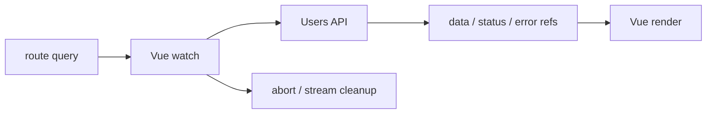
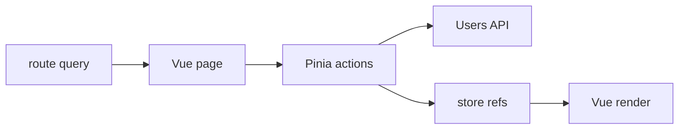
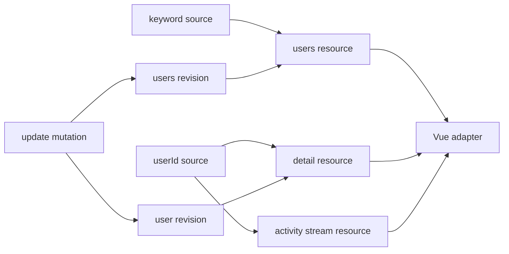

# Vue Async Ownership Slidev 簡報提案

> 狀態：內容提案初稿
>
> 預計形式：Slidev 技術演講
>
> 預計時間：40 分鐘，建議控制正式內容在 33–35 分鐘
>
> 對應 Demo：`vue-async-ownership`

## 1. 提案目的

這份文件先定義演講的核心主張、敘事順序、取捨邊界與 Slidev 製作方式，再開始撰寫正式 `slides.md`。

目前 Demo 已完整涵蓋 Pure Vue、Pinia、TanStack Query、signal-kernel、Mock API、Router、TDD、E2E 與 presentation fallback。如果直接照開發順序介紹，容易讓演講變成功能導覽或工具比較，偏離真正想傳達的 ownership。

這場演講應只圍繞一個問題：

> 當 route、request、cache、mutation 與 stream 隨時間變化時，究竟是誰負責讓畫面保持正確？

## 2. 核心主張

### 2.1 一句話版本

> State management 在問資料放在哪裡；ownership 在問誰負責讓它隨時間保持正確。

### 2.2 英文輔助句

> Same UI. Same API. Different owner.

### 2.3 演講結論

Pure Vue、Pinia、TanStack Query 與 signal-kernel 不只是四種寫法，而是四種不同的責任邊界：

- Pure Vue：component/composable 直接擁有 async lifecycle。
- Pinia：狀態與操作移入 store，但 lifecycle semantics 仍由 application code 編排。
- TanStack Query：query、mutation 與 cache 接管 server-state lifecycle；stream 仍在 query cache 之外。
- signal-kernel：dependency、resource、revision、mutation 與 stream 關係由 render 前建立的 graph 擁有，Vue 成為 consumer。

這不是單純的「後者永遠比前者好」，而是讓開發者能辨認：

1. 現在的責任由誰承擔。
2. 這個 owner 是否真的理解該 lifecycle。
3. 責任轉移後，application code 還剩下哪些工作。

## 3. 目標觀眾

主要觀眾是已經會使用 Vue 3 Composition API，並碰過以下問題的前端開發者：

- 用 `watch()` 或 `watchEffect()` 觸發 API。
- 用 `ref()` 維護 loading、error 與 data。
- 使用 Pinia 組織跨 component 狀態。
- 聽過或正在評估 TanStack Query。
- 遇過舊 response 覆蓋新結果、更新後資料不同步、subscription 沒清除等問題。

觀眾不需要先理解 signal graph 或 signal-kernel。

## 4. 非目標

以下內容不應進入主線，最多放在 appendix：

- 完整介紹 Vue reactivity 原理。
- 教學式介紹 Pinia 或 TanStack Query 全部 API。
- 詳解 Mock API、Vite middleware 與 scenario engine 的實作。
- 逐項解說 TDD Phase 0–9。
- 展開所有 race、abort、error 與 stream-disconnect cases。
- 比較 bundle size、效能 benchmark 或框架排名。
- 深入 signal-kernel runtime source code與 API ergonomics。
- 把 signal-kernel 描述成所有 Vue 專案的必選解法。

## 5. Ownership 的共用語言

演講開始時應先固定 ownership 的判斷問題，後面四個 model 都用同一組問題比較：

1. 誰根據 route/source 觸發 request？
2. 誰保存 pending、refreshing、success 與 error？
3. 誰保留 stale data，並阻止舊 response 覆蓋新結果？
4. update 成功後，誰決定哪些資料需要重新載入？
5. userId 改變或 component unmount 時，誰停止舊 stream？
6. Vue component 是 lifecycle owner，還是 lifecycle consumer？

這六個問題比「用了幾個 `watch`」或「少寫幾行 code」更能準確描述差異。

## 6. 敘事原則

### 6.1 使用同一個實驗

四個 model 必須共用：

- 相同 User Admin Dashboard。
- 相同 `UsersApi`。
- 相同 route-derived state。
- 相同 Mock API scenario。
- 相同 Search、Detail、Update 與 Activity 行為。

主線只改變 owner，不改變需求。

### 6.2 每一章只回答兩件事

每個 model 的段落都用同一個結構：

1. 這一版誰擁有 lifecycle？
2. 相較上一版，責任移到哪裡，又有哪些責任沒有移動？

### 6.3 不把演講做成排行榜

建議反覆提醒：

- Pinia 解決 shared client state 與組織問題，不等於自動接管 server-state lifecycle。
- TanStack Query 擅長 server state，不代表它應該擁有所有 arbitrary async process。
- signal-kernel 展示 graph-first ownership，但也帶來新的 abstraction 與 API 成本。
- 小而局部的需求，Pure Vue 可能就是最合理的停止點。

## 7. 建議演講標題

首選：

> 誰擁有這段非同步？從 Pure Vue、Pinia、TanStack Query 到 signal-kernel

可選標題：

- 不是少寫一個 watch：Vue Async Ownership 的四次轉移
- Same UI, Different Owner：重新理解 Vue 的非同步狀態
- From Watch to Graph：Vue 非同步生命週期由誰負責？

副標：

> State management tells us where data lives. Ownership tells us who keeps it correct.

## 8. 40 分鐘時間配置

| 段落 | 建議時間 | 累計 | 目的 |
| --- | ---: | ---: | --- |
| 問題定義與共同 Demo | 5 分鐘 | 5 | 建立 ownership 語言，不急著介紹工具 |
| Pure Vue baseline | 5 分鐘 | 10 | 看見 application code 擁有的全部責任 |
| Pinia | 5 分鐘 | 15 | 區分「集中管理」與「lifecycle ownership」 |
| TanStack Query | 7 分鐘 | 22 | 展示 server-state ownership 的實質轉移 |
| signal-kernel | 8 分鐘 | 30 | 展示 graph-first 與 render-before ownership |
| 四版本對照與選擇原則 | 5 分鐘 | 35 | 收斂主張，避免變成工具推銷 |
| 緩衝／Q&A | 5 分鐘 | 40 | 保留 live demo 與現場節奏空間 |

正式內容第一次彩排若超過 35 分鐘，優先刪除 appendix 細節，不壓縮 ownership 結論。

## 9. 建議投影片結構與文案

以下規劃約 24 張，包括章節頁與結尾。Slidev 的 click animation 不算額外投影片。

### Act 0：先定義問題

#### Slide 1 — 封面

標題：

> 誰擁有這段非同步？

副標：

> 從 Pure Vue、Pinia、TanStack Query 到 signal-kernel

畫面下方：

> Same UI. Same API. Different owner.

講者目標：先讓觀眾知道這不是「四套 state management 排名」。

#### Slide 2 — 一個 fetch，真的只是一個 fetch 嗎？

畫面文案依序出現：

- route 改變時，誰觸發下一次 request？
- 新 request 還沒完成時，要不要保留舊資料？
- 舊 response 最後才回來時，誰知道它已經過期？
- update 成功後，誰知道哪些資料需要刷新？
- component 離開後，誰停止 stream？

收尾：

> Request 很短；responsibility 會持續存在。

#### Slide 3 — State location ≠ lifecycle ownership

左右對照：

| State location | Lifecycle ownership |
| --- | --- |
| 資料放在哪裡？ | 誰保證它隨時間保持正確？ |
| component、store、cache、graph | trigger、stale、error、invalidate、dispose |

口說重點：

> 把 ref 搬進 store，可能改變資料的位置，卻不一定改變誰在負責。

#### Slide 4 — 今天只改變一個變因

畫面文案：

- Same Dashboard
- Same Users API
- Same route state
- Same user behavior
- Different owner

建議搭配 Demo 的四個 route：

```text
/examples/vue
/examples/pinia
/examples/query
/examples/signal-kernel
```

#### Slide 5 — Ownership checklist

用六個簡短 badge 或逐項出現：

```text
trigger
status
stale
invalidate
dispose
render
```

口說重點：後面每個 model 都用同一份 checklist，不臨時發明評分標準。

### Act 1：Pure Vue — ownership 全部在 application code

#### Slide 6 — Pure Vue baseline

標題：

> Pure Vue：責任清楚，而且都在我們手上

建議 Mermaid：



#### Slide 7 — 真正變複雜的不是 fetch

建議只展示 10–14 行 curated snippet：

```ts
watch(keyword, async currentKeyword => {
  const generation = ++latestRequestGeneration
  usersStatus.value = hasLoadedUsers ? 'refreshing' : 'pending'

  const nextUsers = await api.fetchUsers({ keyword: currentKeyword })

  if (generation === latestRequestGeneration) {
    users.value = nextUsers
    usersStatus.value = 'success'
  }
}, { immediate: true })
```

畫面註記只標三件事：

- trigger 是我們的。
- stale protection 是我們的。
- status policy 也是我們的。

#### Slide 8 — Pure Vue takeaway

大字：

> Local and explicit.

小字：

> Ownership 很清楚，但 correctness 依賴 application code 每次都記得處理完整 lifecycle。

不要把 Pure Vue 描述成錯誤解法。它是後續 ownership 轉移的 baseline。

### Act 2：Pinia — 搬動位置，不代表責任消失

#### Slide 9 — 為什麼自然會想到 Pinia？

畫面文案：

- 多個 component 需要同一份狀態。
- request 與 update logic 不想散落在 page。
- 希望 actions 提供一致入口。

轉場句：

> 我們先把責任集中起來。

#### Slide 10 — Pinia 改變了什麼？

建議 Mermaid：



畫面註記：

> Store owns the location. Application actions still define the lifecycle.

#### Slide 11 — Action 還是在手動編排

建議 snippet：

```ts
async function updateUser(userId, patch) {
  await api.updateUser({ userId, patch })

  await Promise.all([
    fetchUsers(currentKeyword),
    fetchUserDetail(userId),
  ])
}
```

口說重點：

- action 讓意圖集中。
- 但 reload、race guard、status transition 與 stream cleanup 仍是自行定義。

#### Slide 12 — Pinia takeaway

大字：

> Centralized does not mean delegated.

建議中文口說：

> Pinia 讓我們更容易找到責任，但沒有自動接管 async semantics。

### Act 3：TanStack Query — server state 有了專門 owner

#### Slide 13 — 這些資料真的是 client state 嗎？

畫面文案：

- 它來自 server。
- 它可能 stale。
- 它有 cache identity。
- mutation 後需要 invalidation。
- 多個 consumer 可能共享同一份結果。

轉場句：

> 當問題是 server state，我們可以把 ownership 交給理解 server state 的工具。

#### Slide 14 — Query key 成為 dependency

建議 snippet：

```ts
const usersQuery = useQuery({
  queryKey: computed(() => ['users', keyword.value]),
  queryFn: ({ signal }) =>
    api.fetchUsers({ keyword: keyword.value, signal }),
  placeholderData: previous => previous,
})
```

標示：

- query key owns identity。
- query lifecycle owns status。
- cache owns retained server data。

#### Slide 15 — Mutation 宣告 invalidation

建議 snippet：

```ts
const updateMutation = useMutation({
  mutationFn: api.updateUser,
  onSuccess: () => {
    queryClient.invalidateQueries({ queryKey: ['users'] })
    queryClient.invalidateQueries({ queryKey: ['user', userId.value] })
  },
})
```

口說重點：

> Application code 還是描述關係，但不再自行編排每一次 reload 的細節。

#### Slide 16 — Query 不需要擁有所有非同步

畫面左邊：

```text
Query cache owns
✓ users request
✓ detail request
✓ mutation lifecycle
✓ invalidation
```

畫面右邊：

```text
Application still owns
• activity stream subscription
• stream event accumulation
• stream cleanup/error projection
```

關鍵句：

> TanStack Query owns server state. It does not automatically own every asynchronous process.

這張是 signal-kernel 的必要轉場，stream 細節控制在 60–90 秒。

### Act 4：signal-kernel — ownership 在 render 之前形成

#### Slide 17 — 如果 lifecycle 不從 component 開始呢？

大字：

> Graph first. Render second.

補充：

> 先建立 source、resource 與 invalidation relations，再讓 Vue 消費它們。

#### Slide 18 — Graph owns the relationships

建議 Mermaid：



視覺重點不是 node 數量，而是 relations 在 Vue mount 前已存在。

#### Slide 19 — Resource 宣告 dependency

建議 snippet：

```ts
const usersResource = createResource({
  input: keyword.get,
  observe: usersRevision.get,
  run: (currentKeyword, context) =>
    api.fetchUsers({
      keyword: currentKeyword,
      signal: context.signal,
    }),
})
```

標示：

- source change 觸發 resource。
- revision 描述 invalidation。
- pending/error/cancellation 屬於 resource metadata。

#### Slide 20 — Vue 只同步外部 source，並消費 graph

畫面文案：

```text
Route → graph source
Graph resource → Vue adapter
Vue → render
```

建議口說：

> Vue 的 watch 仍可能存在，但它只負責把 framework route source 同步進 graph，不再編排 fetch、invalidate 或 subscription。

#### Slide 21 — signal-kernel takeaway

大字：

> Ownership moved before the framework lifecycle.

補充：

> 代價是新的 abstraction、graph vocabulary 與 API learning curve。

不要把此頁講成「最終答案」，而是 ownership boundary 的另一種設計可能。

### Act 5：收斂與選擇

#### Slide 22 — 四次 ownership 轉移

建議比較表：

| Concern | Pure Vue | Pinia | TanStack Query | signal-kernel |
| --- | --- | --- | --- | --- |
| State/status | local refs | store refs | query/mutation cache | resource metadata |
| Trigger | Vue watch | page + action | query key | graph source |
| Stale protection | generation/abort | store logic | query lifecycle | resource runtime |
| Update refresh | manual reload | action orchestration | invalidation | revision relation |
| Stream | watch cleanup | store action | separate composable | stream resource |
| Vue role | owner | coordinator | query consumer | graph consumer |

此頁停留約 2–3 分鐘，是整場最重要的總結頁。

#### Slide 23 — Same behavior, different ownership

畫面大字：

> 4 models × 10 behaviors = 40 contract cases

小字：

> 相同的 UI 結果，不代表相同的 lifecycle owner。

只用一張圖或一句話交代 TDD：

- 共用 contract 證明比較的是 ownership，而不是不同需求或不同 API。
- 不逐條介紹測試實作。

#### Slide 24 — 什麼時候該停在哪一層？

建議文案：

- 局部、短生命週期：Pure Vue 通常足夠。
- shared client state 與 workflow：考慮 Pinia。
- server state、cache、mutation：考慮 TanStack Query。
- 多種 async relations、framework-independent lifecycle：評估 graph-first。

收尾提醒：

> 這些工具可以組合；真正重要的是不要讓 responsibility 無主。

#### Slide 25 — 結論

大字：

> Tooling changes where code lives.  
> Ownership changes who guarantees correctness.

最後留給觀眾的問題：

> 下一次 route 改變、response 晚到或 component unmount 時，誰會保證你的畫面仍然正確？

#### Slide 26 — Q&A

畫面保持簡單：

```text
Questions?

/examples/vue
/examples/pinia
/examples/query
/examples/signal-kernel
```

可附 Demo repository QR code。

## 10. Live Demo 規劃

### 10.1 主線固定 route

主線使用穩定成功情境：

```text
/examples/vue?keyword=a&userId=1&scenario=default
```

原因：

- 四個 model 顯示相同資料。
- Activity 維持 connected，不讓錯誤色彩搶走 ownership 主題。
- `DemoNav` 切換 model 時會保留 keyword、userId 與 scenario。

### 10.2 不重複操作四次

建議只完整操作一次 Search → Detail → Update，證明 Dashboard 可以工作。進入各 model 段落時，以切 route、看 StatusPanel ownership notes、對照一段 code 為主。

推薦節奏：

1. Intro 後用 Pure Vue 展示共同 Dashboard，約 60–90 秒。
2. 每章結尾只切換一次 model，約 20–30 秒。
3. Slide 22 比較表前，快速依序切過四個 routes，約 60 秒。

### 10.3 Error 與 stream-disconnect

`detail-not-found`、`update-error`、`race-condition`、`stream-disconnect` 留在 appendix 或 Q&A。

它們是 ownership correctness 的證據，不是主線必須逐項展示的內容。

### 10.4 備援素材

主簡報備援圖應重新產生為：

- 真正 16:9 的 viewport screenshot。
- `scenario=default`。
- 相同 keyword 與 userId。
- 四張圖片使用一致的成功狀態。

目前 Demo repository 中使用 `fullPage: true` 與 `stream-disconnect` 的圖片可保留為 error/stream appendix，不建議作為四 model 的主要比較圖。

## 11. Slidev 專案結構建議

目前 `slides.md` 是 Slidev starter 範例。正式製作時建議不要持續把所有內容堆在單一檔案。

```text
v-tw-talk-2026/
  slides.md
  pages/
    00-intro.md
    10-pure-vue.md
    20-pinia.md
    30-tanstack-query.md
    40-signal-kernel.md
    50-comparison.md
    90-appendix.md
  components/
    OwnershipBadge.vue
    OwnershipTransfer.vue
    DemoRoute.vue
  snippets/
    pure-vue-watch.ts
    pinia-update.ts
    tanstack-query.ts
    signal-kernel-resource.ts
  public/
    screenshots/
    qr/
  docs/
    vue-async-ownership-talk-proposal.md
```

### 11.1 `slides.md` 的責任

`slides.md` 只保留：

- 全域 frontmatter。
- 封面。
- 各章 `src` imports。
- 共用 style 或 theme tokens。

### 11.2 `pages/` 的責任

依敘事章節切割，而不是每張 slide 一個檔案。這能讓調整時間或刪除整章時保持簡單。

### 11.3 `snippets/` 的責任

只放為演講重新整理過的 8–16 行程式碼。不要直接展示完整 production file，否則觀眾會花時間讀不影響 ownership 的細節。

每份 snippet 頂端註明來源，例如：

```ts
// Adapted from vue-async-ownership/src/examples/vue-baseline/useVueUsersDemo.ts
```

### 11.4 `components/` 的責任

第一版不需要先做大量 Slidev components。只有同一種視覺重複三次以上，才抽成 component。

優先候選：

- `OwnershipBadge`：顯示目前 owner。
- `OwnershipTransfer`：顯示責任從 A 移到 B。
- `DemoRoute`：統一展示 route 與 QR/link。

## 12. Slidev 呈現原則

### 12.1 一張 slide 只保留一個論點

避免同頁同時放：

- 完整程式碼。
- 架構圖。
- 四個 bullet。
- Demo 截圖。

如果一頁需要講超過 90 秒，優先拆頁。

### 12.2 Code 每次只強調一個 responsibility

建議使用 line highlighting 或 Magic Move，但不要讓動畫本身成為內容：

- Pure Vue：highlight generation/status。
- Pinia：highlight manual reload。
- TanStack Query：highlight query key/invalidation。
- signal-kernel：highlight input/observe/revision。

### 12.3 Click animation 的使用

適合逐步顯示：

- ownership checklist。
- responsibility 從 component → store → cache → graph 的轉移。
- Mermaid graph relations。

不建議：

- 每個 bullet 都需要點擊。
- 同一頁超過 4 次 click。
- 大量 motion、旋轉或裝飾動畫。

### 12.4 Speaker notes

每張正式 slide 都應有 speaker notes，至少包含：

- 這頁唯一要傳達的句子。
- 預計秒數。
- 若時間不足可刪除的補充。
- 下一頁的轉場句。

範例：

```md
<!--
Core: Pinia centralizes lifecycle code but does not automatically own it.
Time: 60 sec.
Cut: Do not explain store setup syntax.
Transition: What if the data is specifically server state?
-->
```

## 13. 視覺方向

建議延續 Demo 的深色 navy＋teal 語言，讓簡報與 live demo 看起來屬於同一個系統。

建議語意色：

- Pure Vue：blue。
- Pinia：yellow。
- TanStack Query：red/orange。
- signal-kernel：teal。
- Shared contract：neutral white/gray。

使用原則：

- 背景固定，不隨章節大幅換 theme。
- 色彩主要用於 owner badge、箭頭與 code highlight。
- 正文維持高對比。
- 不用紅色表示 TanStack Query 的錯誤；紅色在該章只作品牌提示。
- Demo screenshot 不作滿版背景，避免字太小。

## 14. 主線、Appendix 與刪除邊界

### 主線必留

- ownership 定義。
- 相同 UI／API／behavior 的比較前提。
- Pure Vue、Pinia、TanStack Query、signal-kernel 各一個 ownership hotspot。
- TanStack Query 的 stream boundary。
- graph-first 與 Vue consumer boundary。
- 四模型比較表。
- 40-case shared contract 作為證據。
- 選擇原則與結論。

### Appendix

- Mock API scenarios。
- generation guard 與 race-condition 細節。
- `detail-not-found`／`update-error`。
- stream-disconnect。
- Router query preservation。
- TDD Phase 0–9 清單。
- signal-kernel stream API ergonomics。
- 為什麼 graph 在 Vue mount 前建立。

### 直接刪除

- Slidev starter 的功能教學頁。
- 與 ownership 無關的套件安裝步驟。
- Node/pnpm 環境處理。
- i18n 規劃。
- 開發過程中的檔案搬移與 CSS 清理紀錄。

## 15. 製作階段

### P0：確認提案

- 確認標題、觀眾程度與活動資訊。
- 確認 40 分鐘是否包含 Q&A。
- 確認 signal-kernel 的定位是實驗性案例、library introduction，或正式解法。

### P1：內容骨架

- 清除 Slidev starter pages。
- 建立 6 個 main section files。
- 先只放標題、核心句、speaker notes。
- 不處理動畫與精緻 CSS。

### P2：Code 與圖

- 從 Demo 擷取 curated snippets。
- 建立 ownership transfer diagrams。
- 完成四模型 comparison table。
- 每章最多保留一個主要 code example。

### P3：Demo 與備援

- 加入固定 Demo URL。
- 產生 `default` scenario 的真正 16:9 screenshots。
- 建立 QR code 或短連結。
- 確認無網路時仍能完成演講。

### P4：彩排與刪減

- 第一次不暫停彩排並記錄時間。
- 超過 35 分鐘就刪內容，不加快語速。
- 第二次彩排驗證 demo 切換。
- 最後匯出 PDF，確認 code、Mermaid 與中文字型。

## 16. Definition of Done

- [ ] 觀眾能在 30 秒內理解 ownership 的定義。
- [ ] 四個 model 都能回答相同的六個 ownership 問題。
- [ ] 每章都有一句清楚的 takeaway。
- [ ] Pinia 沒有被錯誤描述成自動處理 async lifecycle。
- [ ] TanStack Query 沒有被描述成擁有 arbitrary stream。
- [ ] signal-kernel 沒有被描述成所有專案的必選方案。
- [ ] 主線只有一條穩定 live demo flow。
- [ ] 主線不使用 `stream-disconnect` 當作四模型預設畫面。
- [ ] 每段 code 可在 20 秒內看完。
- [ ] 正式內容彩排不超過 35 分鐘。
- [ ] 不操作 Demo 仍能用 screenshots 或 PDF 完成演講。
- [ ] Slidev build 與 PDF export 均成功。

## 17. 開始製作前仍需確認

1. 40 分鐘是否包含 Q&A？
2. 活動與講者資訊要如何呈現在封面？
3. signal-kernel 是否需要介紹 package 背景，還是只作為 graph-first ownership 案例？
4. Demo repository 是否會公開，需不需要 QR code？
5. 簡報主要語言是否全中文，code／ownership vocabulary 保留英文？

在這五項確認前，可以先完成 P1 內容骨架；不應先投入大量 theme、動畫或 custom components。
