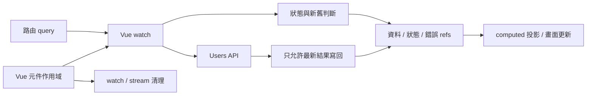
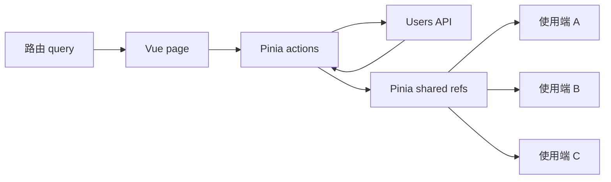
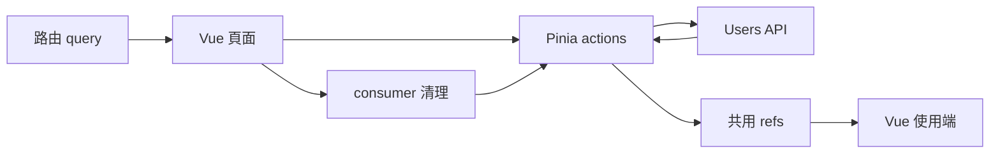
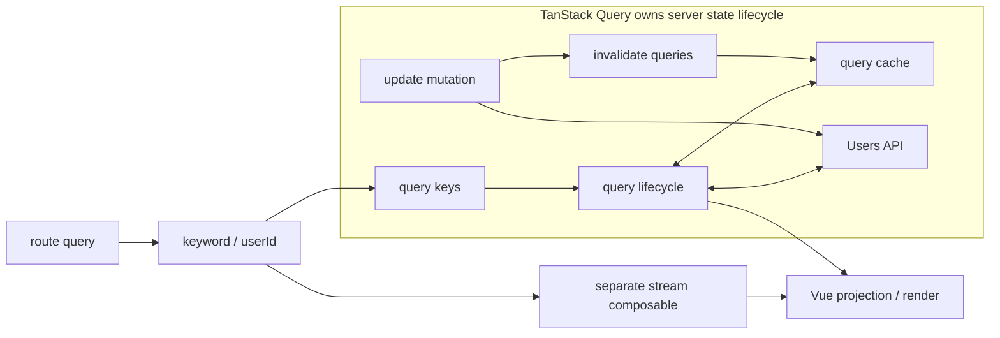
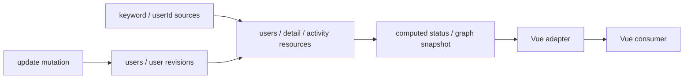

# Vue Async Ownership Slidev 簡報提案

> 狀態：P0 內容決策完成（活動定版資訊、共同 async lifecycle model、35 張教學結構與條件式 graph clarity／cost 主張已確認；照片裁切與發布素材待補）
>
> 預計形式：Slidev 技術演講
>
> 預計時間：40 分鐘，不含 Q&A；建議控制正式內容在 36–38 分鐘
>
> 主要語言：繁體中文，程式碼、API 名稱與必要技術詞彙保留英文
>
> 活動：v-taiwan Meetup #5 · Session 2
>
> 日期與場地：2026 年 8 月 15 日（星期六）· Red space 多元商務空間
>
> 對應 Demo：`vue-async-ownership`
>
> Demo repository：`https://github.com/Luciano0322/vue-async-ownership`；canonical URL 已確認，QR SVG 已產生並通過程式解碼驗證

## 1. 提案目的

這份文件先定義演講的核心主張、敘事順序、取捨邊界與 Slidev 製作方式，再開始撰寫正式 `slides.md`。

目前 Demo 已完整涵蓋 Pure Vue、Pinia、TanStack Query、signal-kernel、Mock API、Router、TDD、E2E 與 presentation fallback。如果直接照開發順序介紹，容易讓演講變成功能導覽或工具比較，偏離真正想傳達的 ownership。

這場演講應只圍繞一個問題：

> 當 route、request、cache、mutation 與 stream 隨時間變化時，究竟是誰負責讓畫面保持正確？

## 2. 核心主張

### 2.1 一句話版本

> Async Ownership 是一段非同步工作跨時間運行時，觸發、狀態傳播、生命週期正確性、UI 消費與清理責任在系統邊界之間的配置。

這裡的 Async Ownership 是整體 responsibility map；async responsibility 是 trigger、status、stale、invalidate、dispose 或 render 等可分配責任；owner 則是在相關 lifetime 內，持續維持某項 responsibility 正確性的 boundary。同一段 async work 可以有多個 owner，不代表所有細節都由同一個 library 自動完成。

### 2.2 這場演講採取的立場

這場演講不是完全中立的工具導覽，而是提出一個有適用條件的架構判斷：

> 當 async state 需要同時參與 reactive source、invalidation 與 derived state，先在 framework 之外把它建模成 reactive graph node，會比讓 async lifecycle 與 Vue reactivity 只透過多段 adapter/composition glue 連接更容易指出 ownership。

本場將「更容易理解」限定在 ownership 與 relationship clarity：

- dependency 是否能被直接看見。
- invalidation 是否是 explicit relation，而不是藏在 imperative call sequence。
- query、mutation 與 stream 是否能使用一致的 lifecycle vocabulary。
- framework consumer 與 resource lifecycle 的邊界是否能被直接指出。
- async lifecycle、snapshot 與 reactive dependency 在進入 framework 前是否已有共同表示。
- 理解流程時，需要追蹤多少個 watch、action、callback 與 composable。

這不是對程式碼行數、執行效能、生態成熟度或開發速度的主張。

### 2.3 演講結論

Pure Vue、Pinia Action、TanStack Query 與 signal-kernel 是四種不同的 responsibility configuration：

- Pure Vue：Vue 擁有 reactive tracking 與 component-bound scope；application code 在 composable 中宣告並維持 request、status 與 stale-data policy。
- Pinia Action：store 擁有 shared state 與 workflow boundary；application-defined actions 維持 async policy，Pinia 不預先規定 server-state semantics。
- TanStack Query：query、mutation 與 cache runtime 維持 server-state lifecycle；這份 Demo 的 callback-style activity subscription 由獨立 Vue composable 擁有。
- signal-kernel：application 在 framework-independent graph factory 中把 source、async resource、revision 與 derived state 建成 reactive relationships；runtime 維持 resource lifecycle 與 snapshot propagation，Vue 主要作為 input adapter 與 UI consumer。

本場的偏好與限制可以同時成立：

1. Local lifecycle 很清楚時，Pure Vue 通常是最低成本的選擇。
2. 問題是 shared client workflow 時，Pinia 能提供清楚的 application boundary。
3. 問題是 server state 時，TanStack Query 提供成熟的專門 lifecycle model。
4. 問題需要讓 async dependency 本身先於 framework 被 reactive 表達時，graph-first 能提高 ownership visibility，但必須支付新的 vocabulary、runtime、adapter、debugging 與 maturity cost。

決策條件不是「哪個工具擁有最多」，而是：

> 當維持 async state 與 framework reactivity 之間的隱含 adaptation，已經比建立與維護 graph、adapter 更難理解時，graph-first 才開始有價值。

### 2.4 signal-kernel 的演講定位

本場將 signal-kernel 定位為：

> 一個已可運行的 framework-agnostic library，同時也是用來驗證「async state 作為 reactive graph primitive」假設的 architecture experiment。

演講不主張它是 Vue、Pinia 或 TanStack Query 的直接替代品：

- Pure Vue、Pinia 與 TanStack Query 分別處理不同 scope 的問題。
- signal-kernel 不是「比 Query Cache 更完整的下一層」，而是另一種讓 async lifecycle、snapshot 與 dependencies 在進入 Vue 前具有 reactive representation 的設計。
- Demo 用相同的 selected outcomes 控制外部需求；它不證明 graph 較好，也不構成 benchmark 或完整選型。
- 由於 signal-kernel 是講者自己的設計，進入該章節時必須同時揭露 experimental maturity、abstraction、vocabulary、adapter、debugging 與 adoption cost。
- 目前 Demo 的 graph 在 Vue page setup 中建立，但 Vue adapter 採 borrowed-consumer contract；component unmount 只停止 downstream observation，不自動成為 graph dispose signal。Graph instance 的真正 owner 仍應由 application boundary 明確宣告。
- 目前 stream resource 由 runtime 維持 source tracking、metadata、stale emission 與 accumulation，但 callback API 的 subscribe/unsubscribe bridge 仍由 application code 實作。

## 3. 目標觀眾

主要觀眾是已經會使用 Vue 3 Composition API，並碰過以下問題的前端開發者：

- 用 `watch()` 或 `watchEffect()` 觸發 API。
- 用 `ref()` 維護 loading、error 與 data。
- 使用 Pinia 組織跨 component 狀態。
- 聽過或正在評估 TanStack Query。
- 遇過舊 response 覆蓋新結果、更新後資料不同步、subscription 沒清除等問題。

觀眾不需要先理解 signal graph 或 signal-kernel。

### 3.1 語言策略

簡報以繁體中文受眾為主要設計對象，不製作中英雙語兩套內容。語言分工如下：

- 標題、論點、圖說、比較表與 speaker notes 使用繁體中文。
- 程式碼、型別、API、package 名稱與 route 保留英文，避免為翻譯而扭曲實際開發語境。
- `ownership`、`lifecycle`、`server state`、`invalidation` 等核心詞彙第一次出現時，用中文句子解釋；後續可直接保留英文。
- 不要求每個英文名詞都有逐字中文對照，重點是讓觀眾理解它在責任邊界中的角色。
- 可見文案優先使用「非同步狀態、響應式圖、轉接層、消費端、執行層、狀態快照、依賴關係、擁有者、清理規則」；`Ownership`、`Graph` 與 `source / resource / revision / computed / observe` 可保留，因為它們分別是全場主題、模型名稱與實際 API vocabulary。
- 四個 model 的 responsibility map 固定使用六個中文欄位：`問題範圍 / 規則宣告 / 生命週期維持 / Vue 的責任 / 應用程式銜接 / 成本／非目標`。不在不同章節改用 `Policy / Lifecycle owner / Application glue` 等英文主標籤。
- Map、卡片與 takeaway 由中文承擔概念解釋；產品名稱、套件名稱、API、程式碼識別字與狀態機 canonical tokens 才保留英文。必要時採「中文概念＋英文識別字」，不為追求全中文而切斷與原始碼的對照。
- Slidev 全域語言設定使用 `zh-TW`，PDF 匯出前確認繁中字型、標點與 Mermaid 中文節點不會缺字。

這樣可維持 Vue 開發者熟悉的技術語境，同時避免主要論點因大量英文段落而增加理解負擔。

## 4. 非目標

以下內容不應進入主線，最多放在 appendix：

- 完整介紹 Vue reactivity 原理。
- 教學式介紹 Pinia 或 TanStack Query 全部 API。
- 詳解 Mock API、Vite middleware 與 scenario engine 的實作。
- 逐項解說 TDD Phase 0–9。
- 展開所有 race、abort、error 與 stream-disconnect cases。
- 比較 bundle size、效能 benchmark 或框架排名。
- 深入 signal-kernel runtime source code與 API ergonomics。
- 把 signal-kernel 描述成所有 Vue 專案的必選解法。

## 5. Async work lifecycle 與 Ownership 的共用語言

在比較 framework、store、query runtime 或 graph 之前，先用 implementation-neutral vocabulary 建立最小模型。這裡的 async work 不只是一個 Promise，而是一段會隨 source、consumer 與時間變化的工作：

```text
source / identity
→ trigger / start
→ pending or active
→ success / error / emission
→ invalidate / refresh / source switch
→ dispose
```

Request-like resource 與 stream-like resource 不必共用完全相同的 state machine：request 通常 settle 一次，stream 可能持續 emission、reconnect 或切換 subscription。兩者共用的是 lifecycle questions，而不是相同 API：

- source 改變時，誰開始下一份工作？
- 新工作進行時，舊資料是否保留？
- 舊 response 或 emission 晚到時，誰判斷它已經過期？
- mutation 完成後，誰宣告哪些資料失效？
- source switch 或 async owner 結束時，誰停止舊工作？
- 哪一層把 lifecycle snapshot 投影成 UI？

這個最小模型刻意不使用 query key、revision、resource graph 等特定工具 vocabulary。它是四個 model 的共同觀察基準，避免先用任何一個實作的抽象定義問題。

本場將 Async Ownership 定義為：

> 一段非同步工作跨時間運行時，觸發、狀態傳播、生命週期正確性、UI 消費與清理責任，在 system boundaries 之間如何被配置與承擔。

這個定義包含三個層次：

1. `Async Ownership`：整體 responsibility-to-owner mapping。
2. `Async responsibility`：trigger、status、stale、invalidate、dispose、render 等可分配責任。
3. `Owner`：在相關 lifetime 內，以實際 mechanism 持續維持其中一項責任正確性的 boundary。

每個 model 都必須分開回答四個維度：

1. 哪些 async responsibilities 移到新的 boundary？
2. 哪些 responsibilities 仍留在 Vue 或 application code？
3. Policy 在哪裡被宣告？
4. 哪個 framework、application layer 或 runtime 以什麼 mechanism 維持這項 invariant？

後面四個 model 再使用同一組問題：

1. 誰根據 route/source 觸發 request？
2. 誰保存 pending、refreshing、success 與 error？
3. 誰保留 stale data，並阻止舊 response 覆蓋新結果？
4. update 成功後，誰決定哪些資料需要重新載入？
5. userId 改變或 async owner dispose 時，誰停止舊 stream？Consumer detach 是否只解除觀察？
6. Vue 在這一版擁有哪些 route adaptation、interaction、view projection 與 rendering responsibility？

這六個問題比「用了幾個 `watch`」或「少寫幾行 code」更能準確描述差異。Manual policy 仍然可以有明確 owner；library automation 也不代表 application 不再負責宣告 domain meaning。

第 5 題必須分開 consumer lifetime 與 graph lifetime。signal-kernel Vue adapter 已驗證 Vue scope dispose 會停止 downstream kernel effect，並刻意不呼叫 resource `cancel()`；這是 framework-neutral borrowed-consumer contract。Source-switch 時停止舊 activity subscription 則由 graph resource 驗證。Graph 最終何時 dispose、如何清除 external effect，應由 graph owner 的 application contract 決定，不應由 component unmount 隱式推導。

## 6. 敘事原則

### 6.1 使用同一個實驗

四個 model 應盡量共用：

- 相同 User Admin Dashboard。
- 相同 `UsersApi`。
- 相同 route-derived state。
- 相同 Mock API scenario。
- 相同 Search、Detail、Update 與 Activity 核心測試結果。

這是控制 user-visible scenario 的 architecture case study，不是嚴格控制實驗。四個實作的 abstraction level、runtime maturity、cache policy、ecosystem 與 application glue 並不相同，因此不能由 Demo 推導整體工具排名。

### 6.2 每一章回答同一組問題

每個 model 的段落都用同一個結構：

1. 這個 model 主要處理哪一種 problem scope？
2. 哪些 async responsibilities 移到新的 boundary，哪些仍然留下？
3. Policy 在哪裡宣告，哪個 mechanism 維持 lifecycle invariants？
4. Vue 保留哪些 presentation 與 consumer responsibility？
5. 哪些 application glue 與 integration cost 仍然存在？
6. 這個 model 沒有試圖解決什麼？

### 6.3 不把演講做成排行榜

建議反覆提醒：

- Pinia 解決 shared client state 與組織問題，不等於自動接管 server-state lifecycle。
- TanStack Query 擅長 server state，不代表它應該擁有所有 arbitrary async process。
- signal-kernel 展示 async-state-as-reactive-graph model，但也帶來 experimental maturity、abstraction、vocabulary、adapter、debugging 與 adoption cost。
- TanStack Query → signal-kernel 不是成熟度升級，而是 ownership 從「Query runtime 發布 snapshot 給 Vue」轉成「async state 先進入 reactive graph，再由 Vue adapter 消費」。
- 小而局部的需求，Pure Vue 可能就是最合適的 ownership boundary。
- 更多 runtime automation 不會自動帶來更好的架構；維持 invariants 的機制必須與實際 lifecycle 相符。
- `Query + Vue composable` 是完整而合理的 architecture，不是等待 graph 補完的中間狀態。

### 6.4 如何討論 graph 的 clarity

本場可以明確偏好 graph-first，但只比較 relationships 是否更 visible、co-located 與 traceable。不要使用以下證據支持 clarity：

- 程式碼行數比較。
- 只展示其中一版的 happy path。
- 把 application glue 從 signal-kernel snippet 中隱藏。
- 用測試通過數量推導 architecture superiority。

每個 code excerpt 都應標示：

```text
Policy declared by:
Lifecycle enforced by:
Application glue omitted:
```

## 7. 正式活動標題與 framing

活動定版標題：

> 從 Pinia Action 到 Async Resource：重新思考 Vue 應用中的非同步 Ownership

這個標題已對外發布，不再修改。開場必須主動說明「從……到……」描述的是觀察範圍的展開，不是工具升級、遷移路線或成熟度排名：

> 我們會從 Vue 開發者熟悉的 action 與 composable 出發，把 ownership 從一次 async workflow，逐步拉到 shared workflow、server-state lifecycle，再問 async state 能不能先成為 reactive graph，最後交給 Vue 消費。

`Async Resource` 在本場先作為 implementation-neutral concept：一段具有 source、status、result、error、refresh/invalidation 與 disposal lifecycle 的非同步工作。它不等於 signal-kernel package，也不預設必須由 graph runtime 實作。signal-kernel 是後半場用來驗證「async state 作為 reactive graph primitive」是否能讓 ownership 更明確的 architecture experiment。

「誰擁有這段非同步？」保留為開場問題與簡報內部主線，不取代活動定版標題。

## 8. 40 分鐘時間配置

40 分鐘全部用於正式演講，Q&A 在演講結束後另計。內容本身以 38 分鐘為上限，留下約 2 分鐘處理換頁、現場反應、Demo 切換或短暫技術延遲。

| 段落 | 張數 | 建議時間 | 累計 | 目的 |
| --- | ---: | ---: | ---: | --- |
| 講者資訊與 async lifecycle 建模 | 7 | 5 分鐘 | 5 | 建立 implementation-neutral lifecycle 與 ownership 語言 |
| 共同 Demo 情境 | 2 | 3 分鐘 | 8 | 固定需求、UI、API、selected outcomes 與比較基準 |
| Pure Vue baseline | 5 | 5 分鐘 | 13 | 先看清 Vue scope responsibility 與 application async policy |
| Pinia Action | 4 | 5 分鐘 | 18 | 展示 store-owned shared workflow 與 lifecycle mismatch |
| TanStack Query | 5 | 7 分鐘 | 25 | 展示專門的 server-state lifecycle model 與有效的 stream boundary |
| signal-kernel | 6 | 8 分鐘 | 33 | 先教必要 vocabulary，再展示 async state 成為 reactive graph node 的 ownership 與交換成本 |
| 四版本對照、選擇原則與結論 | 5 | 5 分鐘 | 38 | 用同一套 teaching contract 收斂 clarity 主張、限制與選擇條件 |
| 現場節奏緩衝 | — | 2 分鐘 | 40 | 保留換頁、停頓與 Demo 切換空間，不作為 Q&A |

規劃共 35 張，其中 Slide 35 的 Q&A／QR code 在正式內容結束後顯示。張數增加的目的不是增加論點，而是讓每張只處理一個認知任務；平均時間不能用張數均分，章節頁、diagram reveal 與 takeaway 可以在 20–40 秒內完成。

彩排目標是 36–38 分鐘完成 Slide 34 的結論。Slide 35 不占用上述配置。若彩排超過 38 分鐘，優先縮短 code walkthrough、合併重複 Demo 操作與移除 appendix 細節，不刪除共同 lifecycle model、各章 responsibility map 或 ownership 結論。

## 9. 建議投影片結構與文案

以下規劃共 35 張，包括講者資訊、共同 lifecycle model、共同 Demo、四個 model、結論與會後 Q&A 頁。Slidev 的 click animation 不算額外投影片。增加張數是為了拆開認知任務，不是增加更多工具功能導覽。

每個 model 都使用相同 teaching contract 收尾：

```text
Problem scope:
Policy declared by:
Lifecycle enforced by:
Vue still owns:
Application glue:
Cost / non-goal:
```

### Act 0：先替 async work 建立共同模型

#### Slide 1 — 活動定版封面

主標題：

> 從 Pinia Action 到 Async Resource

副標：

> 重新思考 Vue 應用中的非同步 Ownership

畫面下方：

```text
v-taiwan Meetup #5 · Session 2
Luciano Lee · 2026.08.15
```

開場第一分鐘必須明確校正 framing：

> 標題裡的「從……到……」不是工具升級或遷移路線，而是把 ownership 從 component workflow、shared workflow、server-state lifecycle，一路問到 async state 能否在 framework 之外先成為 reactive graph。

#### Slide 2 — 講者資訊

建議版面採左側文字、右側照片或簡單識別圖，不做成完整履歷，也不把 React 當成畫面上的主要身份主標籤。

```text
Luciano Lee
Senior Frontend Engineer
Creator of signal-kernel

Reactivity · Async Lifecycle
Framework-independent Data Flow

Demo Repo · 演講中可同步參照
github.com/Luciano0322/vue-async-ownership
```

建議口說：

> 我的主要工作背景從 React 生態出發，但這幾年研究 reactivity、async resource 和跨框架資料流時，我開始把注意力從「framework 怎麼更新畫面」，移到「哪一層負責維持 lifecycle correctness」。今天不是 React 對 Vue 的評論，也不是一套 Vue 替代方案的發表；我用一個完整 Vue case study，比較四種 responsibility configuration。Demo repository 已公開，想同步對照可先開著，最後一頁也會再提供 QR code。

口說控制在 40–50 秒。signal-kernel 只揭露作者身份與研究背景，不在此頁解釋 graph、resource、revision 或 adapter。Slide 2 只放低視覺權重的 Demo repository 文字連結，不放第二個 QR code；照片若使用目前完整講者卡，需避免重複姓名與職稱，優先取得同張照片的原始人像。

#### Slide 3 — 從 Promise 三態，過渡到完整 async lifecycle

建議依序 reveal：

```text
click 0: pending
click 1: fulfilled / rejected
         兩者都屬於 settled，結果不再回到 pending
click 2: source / identity
         → trigger / active / snapshot
         → invalidate / refresh / source switch
         → dispose
click 3: Promise settled 了；非同步責任還沒結束
```

這張先用 Promise 三態降低進入門檻，再指出三態只描述一次工作的 outcome。UI correctness 還需要處理 current source、refresh、source switch 與 disposal，因此後續使用較完整的 async lifecycle vocabulary。

畫面收尾：

> Request 很短；responsibility 會跨時間持續存在。

口說只建立事件順序，不介紹任何特定 library。重點是同一次 async work 在 resolve 以前、以後與 consumer 離開時都有 correctness requirement。

#### Slide 4 — Request 與 Stream 不必共用同一條 state machine

建議用三次 click 建立從 framework integration 到 lifecycle comparison 的過渡：

```text
click 0:
Vue source / component scope
→ external async work
→ Vue projection

Control flow 會跨 layer 接力；
lifecycle ownership 不會因此自動轉移。

click 1 — Request-like:
Vue source → trigger → pending → success / error → snapshot / render
source change：currentness / stale response 由誰負責？
mutation：invalidate / refresh 由誰負責？

click 2 — Stream-like:
Vue source → subscribe → active → emission* → snapshot / render
source switch / unmount：unsubscribe 由誰負責？
stream error：reconnect 或停止由誰決定？

click 3 — comparison:
Request-like
trigger → pending → settled；settled 後可 refresh

Stream-like
subscribe → active；active 期間反覆 emit，最後 dispose
```

共同問題：

```text
Who starts it?
Who rejects stale work?
Who keeps the snapshot correct?
Who disposes it?
```

避免為了統一 vocabulary 而假裝 request 與 stream 完全相同；本場只要求兩者能用同一組 ownership questions 討論。這張只描述 control-flow handoff 與不同 lifecycle shape；責任實際分布在哪些 layer，留到 Slide 5 展開。

#### Slide 5 — 一段 async work 進入 Vue 之後

畫面使用單一路徑與獨立 component-lifecycle 註記：

```text
Route / Props / Local Source
→ Application Code：trigger、status、stale、refresh
→ Promise / API / Stream：執行外部工作
→ Async Snapshot
→ Vue Reactivity：傳播變化
→ UI Render

Vue Component Lifecycle
└─ 定義 consumer scope 與 cleanup 時機
```

口說重點：

- Application code 決定 trigger，也常要維持 status、stale 與 refresh。
- Promise、API 或 stream 執行外部工作，但不知道 UI correctness。
- Vue reactivity 傳播 snapshot 的變化。
- Component lifecycle 定義 consumer 何時存在，以及 cleanup hook 何時發生。
- Component 將 snapshot 投影成 UI。

畫面在 30 秒內正式給出定義：

> Async Ownership：這些責任在系統邊界之間如何被配置與承擔。

這張使用「責任配置」而不是「ownership 被瓜分」，避免暗示所有 layer 在競爭同一份權力，也不把 Async Ownership 誤解成單一 owner handoff。

#### Slide 6 — State 放在哪裡，不等於 async lifecycle 由誰維持

這張不新增投影片，而是用兩次 click 建立概念過渡，避免觀眾一開始就同時處理 snapshot、兩種 lifecycle 與 ownership。

**Click 0 — 先從 state 走到 snapshot**

```text
pending → success(data A) → refreshing(data A)
                         ↓ UI 在某一刻讀取
snapshot = { status, data, error }
```

口說先固定定義：

> Async state 會跨時間改變；snapshot 不是另一套 state，而是 UI 在某一刻讀到的 async state。

**Click 1 — 拆開兩條 lifecycle**

| Vue lifecycle | Async lifecycle |
| --- | --- |
| mount → update → unmount | trigger → active → settle / refresh / dispose |
| consumer 何時存在 | work / resource 如何跨時間保持正確 |

兩條 lifecycle 會在 `unmount → cancel request / unsubscribe stream / detach consumer` 這類情境交會，但不能視為同一條 lifecycle。Vue lifecycle 可以觸發 async policy，卻不會自動維持 async work 的 currentness、stale 與 cleanup。

**Click 2 — 再回到 ownership 三層**

| Snapshot location | Async policy | Owner |
| --- | --- | --- |
| UI 此刻讀到的值放在哪裡？ | 規則在哪裡被宣告？ | 誰持續維持正確性？ |
| component、store、cache、graph | trigger、refresh、error、invalidation | currentness、status、stale、cleanup |

再用同一個具體例子收斂：

```text
Async Ownership = responsibility → owner 的配置圖
Snapshot 搬進 store，只證明讀取位置改變；
責任是否轉移，仍要看 action 與 runtime 接手了什麼。
```

口說重點：

> 把 ref 搬進 store 會改變 snapshot location，也可能改變 workflow boundary；但 stale、refresh 與 cleanup 是否轉移，仍取決於哪個 owner 以實際 mechanism 接手責任。

#### Slide 7 — 用六個問題讀出 Async Ownership

六個 badge 各自帶一個中文問題：

```text
trigger    誰開始工作？
status     誰維持進度？
stale      誰判斷資料已過期？
invalidate 誰宣告需要更新？
dispose    誰停止觀察或工作？
render     誰把 snapshot 投影成 UI？
```

畫面下方直接揭露：

> Architecture case study：比較 responsibility map，不做工具排名。

六個問題不是 Async Ownership 的定義，而是讀出 responsibility map 的分析座標。後面每個 model 都必須回答「哪些責任移動了」與「哪些仍留在 Vue 或 application code」，不臨時更換標準。Dashboard、Users API、route state 與 selected outcomes 留到 Act 1 建立，避免 Slide 7 同時承擔比較標準與 Demo 情境兩個認知任務。

### Act 1：固定共同 Demo 與觀察範圍

#### Slide 8 — 一個 Dashboard，三種 async work

畫面只保留：

```text
Search users      → request-like resource
Update user       → mutation + invalidation
User activity     → stream-like resource
```

Route 提供 `keyword` 與 `userId`。共同 UI 必須能觀察 pending、refreshing、success、error、stale-result protection、update 與 stream source switch。

#### Slide 9 — 四條 route，控制 selected outcomes

```text
/examples/vue
/examples/pinia
/examples/query
/examples/signal-kernel
```

建議現場只先操作一次共同 happy path，再在收斂章節展示一條 race 或 stream-switch trace。這份 Demo 控制 user-visible scenario 與 selected outcomes，不控制 abstraction level、runtime maturity、ecosystem 或 application glue。

### Act 2：Pure Vue — 先看清 framework 與 application 的邊界

#### Slide 10 — Vue 原本已經擁有什麼？

畫面使用 component scope：

```text
reactive dependency tracking
watch scheduling and cleanup registration
component mount / unmount scope
computed projection
component composition and rendering
```

口說重點：

> Pure Vue 不是「什麼都沒有」。Vue 已經維持 reactivity 與 consumer scope；application 另外宣告這個 feature 的 async policy。

#### Slide 11 — Pure Vue：怎麼開始寫？

這張保留單一 slide，使用五次 click 把實作脈絡拆成六幕，避免從概念直接跳到完整 watch。程式碼統一使用 Shiki `dark-plus` 主題，讓 TypeScript token 像 VS Code 一樣有明確色彩層次：

**Click 0 — 先建立 composable boundary**

```ts
export function useVueUsersDemo(api, keyword, userId) {
  const users = ref([])
  const usersStatus = ref('idle')

  return { users, usersStatus }
}
```

先說明 inputs 是外部能力與 reactive sources，outputs 是提供 Vue consumer 讀取的 snapshot refs。這一步建立 organization／reuse boundary，但還沒有決定 request correctness。

**Click 1 — 用 watch 接上第一版 happy path**

```ts
let hasLoadedUsers = false

watch(keyword, async currentKeyword => {
  usersStatus.value = hasLoadedUsers ? 'refreshing' : 'pending'
  users.value = await api.fetchUsers({ keyword: currentKeyword })
  hasLoadedUsers = true
  usersStatus.value = 'success'
}, { immediate: true })
```

這一幕只建立 `watch(keyword)` trigger、`pending / refreshing` 與 `immediate` policy，並在畫面下方提出問題：

> keyword 快速從 a → b，誰保證最後寫回的是 b？

**Click 2 — 解釋為什麼需要 generation**

```text
keyword = a → generation 1 → request A ─────── resolves last
keyword = b → generation 2 → request B ─ resolves first

UI: result b → stale result a
```

Promise 完成順序不等於 source 的最新順序。Generation policy 分成三步：

1. source change 時增加 `latestRequestGeneration`。
2. request 記住開始時的 `requestGeneration`。
3. 只有兩者仍相等，才允許 commit snapshot。

**Click 3 — 回到 `useVueUsersDemo.ts` 的完整 curated excerpt**

```ts
watch(keyword, async (currentKeyword) => {
  const requestGeneration = ++latestRequestGeneration
  usersStatus.value = hasLoadedUsers ? 'refreshing' : 'pending'

  try {
    const loadedUsers = await api.fetchUsers({ keyword: currentKeyword })

    if (requestGeneration === latestRequestGeneration) {
      users.value = loadedUsers
      hasLoadedUsers = true
      usersStatus.value = 'success'
    }
  } catch {
    if (requestGeneration === latestRequestGeneration)
      usersStatus.value = 'error'
  }
}, { immediate: true })
```

先讓觀眾看完整 policy 的位置與形狀，再逐步聚焦關鍵 invariant：

```text
immediate trigger
pending vs refreshing
generation guard
success/error transition
```

Generation 不是為了 Vue reactivity，而是 application 宣告的 stale-result policy。Manual 不代表沒有 owner；這些規則由 application composable 明確宣告。

**Click 4 — 聚焦 generation 的發號點**

只高亮：

```ts
const requestGeneration = ++latestRequestGeneration
```

每次 source change 都先產生新版本，每個 request captures 自己啟動時的版本。這一步不會取消舊 request，也不會阻止 request 並行。

**Click 5 — 聚焦 snapshot 的 commit guard**

同時高亮 success 與 error 的 `requestGeneration === latestRequestGeneration` 區段。舊 request 仍可 resolve 或 reject，但只有最新版本能寫回 data／status snapshot。

> Generation guard 不阻止 request 重入或並行；它阻止 stale request 晚完成後重新進入 commit 區段。

#### Slide 12 — 抽成 composable，ownership 有改變嗎？

左右對照：

```text
Before
page component owns refs + watch + policy

After
composable exposes a feature boundary
Vue scope still provides consumer lifetime
application code still declares async policy
```

關鍵句：

> Moving code changes organization and reuse; it does not automatically transfer lifecycle ownership.

這頁用來防止觀眾把「檔案移動」誤認為 owner 改變，也為 Pinia 的 shared workflow boundary 做準備。

#### Slide 13 — Pure Vue 的責任分布圖



固定 footer：

```text
問題範圍：單一功能內的非同步工作
規則由誰宣告：元件 / composable
生命週期由誰維持：Vue 作用域 + 應用程式規則
Vue 仍然負責：路由轉接、互動、衍生資料、渲染
應用程式還要補上：競態保護、狀態轉換、重載、串流橋接
代價 / 非目標：手動維持規則；沒有共用的 server state 語意
```

畫面以中文先傳達責任關係，只保留 `watch`、`composable`、`API`、`ref`、`computed` 等需要和程式碼對照的術語；不要求觀眾在現場先翻譯抽象欄位。

#### Slide 14 — Pure Vue takeaway

大字：

> Local, explicit, and complete for a local feature.

小字：

> Vue owns reactivity and scope cleanup. Application code owns the async policy.

不要把 Pure Vue 描述成錯誤解法或未完成階段。它是完整且合理的 local boundary，也是四個 model 共用的比較基準。

### Act 3：Pinia Action — store 擁有共用 workflow boundary

#### Slide 15 — 為什麼自然會想到 Pinia？

以「問題範圍擴大」做左右對照：

- 單一功能內可以由 component / composable 維持 snapshot、互動入口與 consumer lifetime。
- 多個 consumer 共用同一份狀態時，Pinia store 提供 shared snapshot 與 actions。
- Store 通常可以活得比單一元件久，形成跨 consumer 的 shared workflow boundary。

結論：

> Pinia 的價值不是搬動 ref，而是建立 shared state 與 workflow boundary。

轉場句：

> 問題從單一功能變成 shared client workflow；我們先把責任集中到 store boundary。

#### Slide 16 — Store 邊界改變了什麼？

使用三次 click 累積內容，所有區塊預留原本位置，避免 reveal 時版面跳動：

1. 初始畫面只看 route → page → actions/API → shared refs → consumers。
2. Click 1 顯示 Store 確實接走的 shared snapshot、actions 與跨 consumer 狀態。
3. Click 2 顯示不會自動獲得的取消／新舊判斷、失效／重載與 stream cleanup semantics。
4. Click 3 顯示 store／component lifetime 對照與結論。

建議 Mermaid：



畫面明確區分：

- Store lifetime 通常比單一 component consumer 長。
- Page 仍擁有 route adaptation 與 interaction。
- 將資料放進 Pinia 不會自動獲得 cancellation、stale、invalidation 或 stream semantics。

> Store 生命週期 ≠ 元件生命週期；共享狀態不等於自動擁有每一段 async lifecycle。

#### Slide 17 — Action 集中 policy，但仍由 application 編排

這張使用一次 click，先建立 shared workflow，再揭露仍需手動維持的 lifecycle policy。

**Click 0 — update → reload 有明確入口**

```ts
async function updateUser(userId, patch) {
  updateStatus.value = 'pending'

  await api.updateUser({ userId, patch })

  await Promise.all([
    fetchUsers(currentKeyword),
    fetchUserDetail(userId),
  ])

  updateStatus.value = 'success'
}
```

Action 讓 mutation、reload targets 與 status transition 集中，但這些規則仍由 application 宣告。

**Click 1 — policy 集中了，但沒有自動化**

左右並列 Demo 的兩段真實 integration：

- `latestUsersRequestGeneration` 仍在 fetch action 維持 currentness。
- `onUnmounted(() => store.unsubscribeActivity())` 仍由 Vue page 接回 consumer lifetime。

口說重點：

- Action 讓 update → reload 的 domain intent 集中。
- Store 可以成為清楚的 application-level workflow owner。
- Race guard、status transition、reload target 與 stream cleanup 仍由這份 implementation 宣告。
- Component unmount 不等於 store dispose；若 stream lifetime 跟 consumer 綁定，必須明確保留 page cleanup 或建立 store-level disposal policy。
- 這是其中一種 Pinia architecture，不代表 Pinia 只能這樣組織 async work。

#### Slide 18 — Pinia 的責任分布圖與 takeaway



固定 footer：

```text
問題範圍：共享的 client state 與 workflow
規則由誰宣告：store actions + 頁面整合
生命週期由誰維持：Pinia / Vue 響應機制 + 應用程式 actions
Vue 仍然負責：路由轉接、互動、衍生資料、渲染
應用程式還要補上：競態保護、重載順序、狀態、串流生命週期
代價 / 非目標：手動編排；不預設 server state 語意
```

大字：

> 集中，讓 policy 更清楚；不代表 policy 自動成立。

建議中文口說：

> Store 已經擁有 shared workflow；Pinia 不會替 application 預先決定 server-state lifecycle semantics。

### Act 4：TanStack Query — server state 有了專門 owner

#### Slide 19 — 這次問題不是 shared state，而是 server state

用三個 clicks 依序建立：

1. `Identity`：source 改變時，遠端資料的身分也跟著改變。
2. `Freshness`：cache 可以保留 snapshot，但 runtime 仍要維持 pending、stale、refreshing 與 request currentness。
3. `Relationship`：mutation 後，users list 與 selected detail 等相依資料需要失效。

先說明 users/detail 是具有 identity、freshness policy 與 relationship 的 server state，不只是「放在 component 或 store 裡的資料」。最後明確說出：「Pinia 沒有做錯；是問題範圍從 shared workflow 移到了 server-state lifecycle。」

#### Slide 20 — TanStack Query responsibility map



圖上的 ownership boundary 刻意包含 query、cache、mutation 與 invalidation，但不把 callback-style Activity stream 畫進 `QueryOwner`。

講解順序：

1. Route 仍提供 source；TanStack Query 不取代 Vue Router。
2. Source 被投影成 query keys。
3. Query runtime 維持 request status、cancellation、stale result 與 cache interaction。
4. Vue 消費 query result，不自行維護 users/detail lifecycle。
5. Activity stream 由獨立 Vue composable 擁有；這是有效的 architecture boundary。

#### Slide 21 — Query key 成為 server-state identity

```ts
const usersQueryKey = computed(
  () => ['users', keyword.value] as const,
)
const usersQuery = useQuery({
  queryKey: usersQueryKey,
  queryFn: ({ queryKey, signal }) =>
    api.fetchUsers({ keyword: queryKey[1], signal }),
  placeholderData: previousData => previousData,
})
```

標示：

- `queryKey` 描述 identity 與 reactive dependency。
- Query lifecycle 維持 status 與 cancellation。
- Cache 保留 server data。
- `placeholderData` 宣告切換期間的 projection policy。

只 highlight `queryKey`、`queryFn` 與 `placeholderData`，不深入 QueryObserver、garbage collection 或 retry options。

#### Slide 22 — Mutation 宣告 invalidation relationship

```ts
const updateMutation = useMutation({
  mutationFn: params => api.updateUser(params),
  onSuccess: async () => {
    const invalidations = [
      queryClient.invalidateQueries({ queryKey: ['users'] }),
    ]

    if (userId.value !== null) {
      invalidations.push(queryClient.invalidateQueries({
        queryKey: ['user', userId.value],
      }))
    }

    await Promise.all(invalidations)
  },
})
```

關鍵句：

> Application code 還是描述 domain relationship；Query runtime 維持 matching cache entries 的 stale 與 refetch lifecycle。

為了照顧沒有 TanStack Query 經驗的觀眾，不直接從整段語法開始。先在右側列出四個閱讀角色，再用四個 clicks 聚焦同一份程式碼：

1. `mutationFn`：application 提供實際的 remote work；runtime 維持 mutation status。
2. `['users']`：prefix key 表達所有 users list variants 都可能過期。
3. `['user', userId]`：存在 selected user 時，宣告精確的 detail relationship。
4. `Promise.all(invalidations)`：application 已說明「誰受影響」，runtime 接著 matching、mark stale 與 refetch active queries。

右側解釋卡與 code highlight 必須同步變化，版面維持固定；這張預留約 100 秒。

不要把 `invalidateQueries()` 描述成完全移除 application responsibility；application 仍需知道 mutation 影響哪些 server state。

#### Slide 23 — Server state 與 Vue reactivity 是兩個模型

這張用兩個 clicks 把 TanStack Query 的核心設計與下一章切入點拆成三幕：

1. 初始畫面先承認「分開管理」是設計選擇。
   - Query runtime：query identity、cache、request / mutation status、invalidation、refetch 與 observer snapshot。
   - Vue reactivity：route refs、component lifecycle、view projection 與 rendering。
   - Vue Query adapter：把 QueryObserver snapshot 暴露成 Vue 可追蹤的 refs。
2. 第一個 click 解釋 Demo 裡的 `computed/watch`。
   - `computed(queryKey / enabled)`：將 Vue route input 適配成 query options。
   - `computed(data / status)`：把 query result refs 投影成 UI 需要的 shape。
   - `watch(userId)`：維持 Query cache 之外的 callback-style stream composable。
   - 不要說 watch 在追蹤 response；response currentness 仍由 Query runtime 維持。
3. 第二個 click 固定 ownership boundary。
   - Async lifecycle 在 Query runtime。
   - UI reactivity 在 Vue runtime。
   - Adapter 與 composition glue 連接兩個模型，但不把 async lifecycle 變成 Vue lifecycle。

進入下一章前提出問題：

> 如果 source、async resource、invalidation 與 derived state 在進入 Vue 前就先成為 reactive graph，Vue 能不能更接近單純的 consumer？

避免宣稱 TanStack Query 原則上不能處理 stream。官方另有 experimental [`streamedQuery`](https://tanstack.com/query/latest/docs/reference/streamedQuery) 處理 AsyncIterable，但它不等同這份 Demo 的 callback-style persistent subscription。

### Act 5：signal-kernel — 非同步狀態成為響應式 Graph

術語界線：TanStack Query 專門管理的是 server state；Act 5 使用較廣義的 async state，因為 signal-kernel graph 同時表示 request、mutation、stream 及其 lifecycle metadata。兩者不能在所有情境下視為同義詞。

#### Slide 24 — 讓非同步狀態成為響應式圖的節點

初始畫面先延續 TanStack Query：

```text
Vue route refs / computed options
  → Query runtime / cache / observer
  → Vue Query adapter
  → reactive result refs / Vue consumer
```

第一個 click 才切到 signal-kernel：

```text
Vue route adapter
  → graph source
  → async resource + revision
  → derived graph state
  → Vue adapter
  → Vue consumer
```

限制句：

> 不是「TanStack 不具響應性、signal-kernel 才有」；差異是非同步依賴模型在 Query／快取邊界後透過轉接層進入 Vue，或先在框架之外成為響應式圖。

#### Slide 25 — signal-kernel 是什麼？

一句話定義：

> signal-kernel 是框架中立的響應式執行層，把非同步 resource 視為同時具有生命週期、狀態快照與 graph 依賴的節點。

必要 vocabulary：

```text
source             — 響應式輸入 / resource 識別
resource           — 非同步生命週期 + 響應式快照
revision           — 響應式失效訊號
computed / observe — 衍生狀態 / 宣告依賴
```

定位揭露：

> 它是我建立的可運行 library，也是驗證「非同步狀態作為響應式基本單位」的架構實驗；不是 Vue store 或 TanStack Query 的直接替代品。

畫面使用 Demo 的實際版本：

```text
@signal-kernel/core 0.1.4
@signal-kernel/async-runtime 0.3.1
@signal-kernel/vue 0.2.1
Maturity: experimental · pre-1.0 · author-maintained
```

#### Slide 26 — Graph 先描述非同步響應關係，再交給 Vue



Graph factory 沒有 Vue import；Vue adapter 才把 kernel snapshot 轉成 Vue refs。這份 Demo 的 graph instance 雖在 page setup 中建立，adapter 仍只借用 graph。Graph 可以跨 Vue consumer 存活；是否要在 page 結束時 dispose，必須由真正的 graph owner 明確決定，不能由 adapter 猜測。

#### Slide 27 — 讀取與更新，透過 revision 接成同一張 Graph

```ts
const users = createResource({
  input: keyword.get,
  observe: usersRevision.get,
  run: (keyword, context) =>
    api.fetchUsers({ keyword, signal: context.signal }),
})

const updateUser = createResource({
  trigger: 'manual',
  run: input => api.updateUser(input),
  invalidates: (_result, input) => [
    usersRevision,
    userRevision.target(input.userId),
  ],
})
```

- Revision 是代表「相關非同步狀態需要重新驗證」的響應式版本節點；不是資料、快取或 Mutation 結果。
- Resource 用 `observe` 讀取 revision，建立 revision → resource 的 Graph 依賴。
- Mutation 用 `invalidates` 宣告成功後影響的 revision targets；Application 擁有領域失效語意，執行層擁有成功時機與版本推進。
- `usersRevision` 對應列表重新驗證；`userRevision.target(input.userId)` 只對應被更新的使用者明細。
- Revision 推進後，Graph 依賴決定哪些 Resource 重新執行；Vue 只透過轉接層消費新快照。

使用三個 clicks 依序聚焦讀取端 `observe`、寫入端 `invalidates`、以及列表 revision 與 keyed detail revision 的作用範圍。不新增投影片，仍以 95 秒講完「Mutation 成功 → invalidates → revision 推進 → observe 感知 → Resource 重新執行」的完整循環。

#### Slide 28 — Vue 解除消費關係，不接管 Graph 生命週期

初始 pipeline：

```text
輸入轉接層                 Signal-kernel graph             輸出轉接層
route computed / watch  →  source / resource / computed  → useResource / useKernelValue
```

第一個 click 顯示 Demo 真實 glue：

- `watch(keyword / userId)`：Vue route reactivity → graph sources。
- `useResource / useKernelValue`：graph 快照 → Vue refs。
- 外層 `computed`：只整理 template 需要的 view shape，不維持 response lifecycle。

第二個 click 結算責任與兩種 teardown：

- Graph 執行層：依賴追蹤、非同步生命週期、快照傳播與 source 切換。
- Vue 轉接層＋消費端：route 轉接、下游觀察、畫面投影與渲染。
- Graph 擁有者：實例生命週期、resource 清理規則、外部 stream 清理與應用邊界。

Vue adapter tests 已證明兩個刻意並存的行為：Vue scope dispose 會停止 adapter observer；`useResource()`／`useStreamResource()` 不會因此呼叫 resource `cancel()`。這不是 teardown 缺口，而是 borrowed-consumer contract。畫面主句固定為：

> 解除 Vue 消費關係 ≠ 銷毀 Graph；框架中立的 Graph 可以跨元件存活。Graph 是否終止，由 Graph 擁有者決定。

#### Slide 29 — 響應式 Graph 的清晰度不是免費的

```text
採用 Graph 得到
✓ 非同步狀態成為 graph 節點
✓ source / revision 成為響應式依賴
✓ 衍生狀態先於 Vue 消費端形成
✓ Vue 更接近輸入邊界與 UI 消費端

採用 Graph 付出
• kernel 與 Vue 仍是兩套響應式執行層
• 輸入與輸出轉接層
• 新語彙與除錯模型
• 實驗階段成熟度
• 明確的 Graph 擁有者與外部清理規則
```

固定 footer：

```text
問題範圍：非同步狀態成為響應式 Graph
規則宣告：graph factory + resource 宣告
生命週期擁有者：resource 執行層 + Graph 擁有者
Vue 仍負責：route 轉接、互動、畫面投影、渲染
應用銜接：API 操作、轉接層、外部訂閱橋接
成本／非目標：實驗性執行層；不是通用的伺服器狀態替代品
```

畫面下方：

> 當你需要「async dependency 本身」先於 framework 被 reactive graph 表達，且這份 clarity 高於維護 graph 與 adapters 的成本時，這個模型才值得。

### Act 6：收斂與選擇

#### Slide 30 — 四種 Ownership 配置

實作以四個固定欄位搭配 click 切換 concern，避免把九列資訊一次塞進畫面。完整責任資料仍以以下比較表作為講稿依據：

| Concern | Pure Vue | Pinia Action | TanStack Query | signal-kernel |
| --- | --- | --- | --- | --- |
| Policy declared by | component/composable | store actions | query/mutation options + stream composable | graph factory + integration adapters |
| Lifecycle maintained by | Vue scope + application policy | store/application policy | Query runtime + Vue stream composable | resource runtime + application stream bridge |
| Trigger | Vue watch | page watch → action | query key | Vue watch → graph source → resource |
| Stale protection | generation guard | store generation guard | query lifecycle | resource runtime |
| Update refresh | manual reload | action orchestration | invalidation | revision relation |
| Stream | Vue composable cleanup | store action + page cleanup | separate Vue composable — valid boundary | stream resource + application unsubscribe adapter |
| Vue role | presentation + local integration | presentation + workflow coordinator | presentation + query/stream consumer | presentation + route-to-graph adapter + snapshot consumer |
| Scope demonstrated | local feature | shared client workflow | server state | async state as reactive graph |
| Cost visible here | manual async policy | store orchestration | query/cache model + separate stream boundary | second reactive runtime, vocabulary, adapters, debugging and teardown integration |

最後一個 click 的收斂句：

> 不同問題範圍，用不同成本換取不同程度的清晰度。

此頁停留約 2 分鐘，是整場最重要的總結頁。依序用 click 橫向比較負責的問題、規則與生命週期、Vue／stream 邊界、可見成本；不由左到右描述成技術進化史。

#### Slide 31 — 共同結果，不同責任圖

畫面大字：

> 4 種 Ownership 模型 × 10 個契約案例 = 40 次契約執行

小字：

```text
8 個共同非同步行為
1 個共同畫面契約
1 個模型說明案例
```

只用一張圖或一句話交代 TDD：

- Contract 控制 selected outcomes；ownership 由 code path 與 responsibility map 判讀。
- 測試不證明 architecture superiority、framework independence、ecosystem maturity 或完整行為等價。
- 不逐條介紹測試實作。

#### Slide 32 — 哪一種 boundary 適合哪一種問題？

建議文案：

- Lifecycle 局部且容易追蹤：Pure Vue 通常是最低成本選擇。
- 需要 shared client state 與 application workflow：Pinia 提供清楚 store boundary。
- 需要 server-state identity、cache、freshness 與 mutation：TanStack Query 提供專門 lifecycle model。
- 需要讓 async lifecycle、snapshot 與 dependencies 在 framework 之外先具有 reactive representation：可以評估 explicit graph 是否值得它的成本。

此頁先停在 problem-solution fit，不立即把四種方案組合起來。必須補充：本場沒有評估 SSR、Devtools、bundle/performance、ecosystem、team familiarity 與長期維護成熟度，因此 `Scope demonstrated` 不是完整選型結論。

#### Slide 33 — 這些 boundary 可以共存

建議使用分層而不是階梯圖：

```text
Vue             presentation + component scope
Pinia           shared client workflow
TanStack Query  server-state lifecycle
Explicit graph  async state dependency model before framework consumption
```

大字：

> 這些是不同問題範圍，不是不同工具等級。

建議口說：

> 這四種 model 不是只能選一個。實際專案完全可能讓 Vue 管 presentation、Pinia 管 client workflow、TanStack Query 管 server state，再只把需要在 framework 之外先建立 reactive dependency model 的 async resources 交給 graph。是否值得採用，取決於 ownership clarity 是否高過第二套 runtime、vocabulary、adapter 與 debugging 的成本。

不要用由左到右或由下到上的箭頭，避免重新製造升級路線。

#### Slide 34 — 結論

大字：

> Async Ownership 是一段非同步工作跨時間運行時，各項責任在系統邊界之間如何被配置與承擔。

補充核心句：

> signal-kernel 不是這場演講的結論；讓每項 async responsibility 都能指出 owner、lifetime 與維持 correctness 的 mechanism，才是結論。

講者立場：

> 在這份 case study 中，我認為把 async state 建成 reactive graph node，能讓 source、lifecycle、invalidation、snapshot 與 consumer ownership 更容易被看見；但 clarity 不是免費的，也不代表每個專案都值得支付它的成本。

最後留給觀眾的問題：

> 你的 async responsibilities 分布在哪裡？這張配置圖仍容易理解、測試與維持嗎？

#### Slide 35 — Q&A 與 Demo repository

這頁在 40 分鐘正式內容結束後顯示，作為 Q&A 背景與會後入口。畫面保持簡單：

```text
Q&A／提問與交流

[Demo repository QR code]

[短網址]
Pure Vue · Pinia · TanStack Query · signal-kernel
```

QR code 應指向公開且穩定的 Demo repository URL，QR 下方必須同時印出可讀的短網址，避免相機、投影亮度或網路狀況造成掃描失敗。

Repository canonical URL 已確認為 `https://github.com/Luciano0322/vue-async-ownership`。靜態 SVG 已放入 `public/qr/demo-repository.svg`，並以獨立 decoder 讀回相同完整 URL。Slide 35 同時顯示可手動輸入的 `github.com/Luciano0322/vue-async-ownership`；活動前仍需以至少兩支手機及實際投影畫面完成最終掃描驗證。

全場只保留這一個主要 QR code。個人網站、GitHub profile、signal-kernel package 與投影片網址不各自產生 QR；改由 Demo repository README 統一提供延伸連結。若未來確實需要同時發佈 repo、slides 與聯絡方式，再考慮讓唯一 QR 指向由講者長期維護的資源頁。

## 10. Live Demo 規劃

### 10.1 主線固定 route

主線使用穩定成功情境：

```text
/examples/vue?keyword=a&userId=1&scenario=default
```

原因：

- 四個 model 顯示相同資料。
- Activity 維持 connected，不讓錯誤色彩搶走 ownership 主題。
- `DemoNav` 切換 model 時會保留 keyword、userId 與 scenario。

### 10.2 不重複操作四次

建議只完整操作一次 Search → Detail → Update，證明共同 Dashboard 可以工作。進入各 model 段落時，以切 route、對照 responsibility map 與一段 code 為主。

`StatusPanel` 的 ownership notes 是講者撰寫的 interpretation，不是 runtime 自己產生的證據。簡報不可用「畫面上寫著誰擁有」來證明 ownership；必須回到 policy 宣告位置、lifecycle enforcement path 與 application glue。

推薦節奏：

1. Intro 後用 Pure Vue 展示共同 Dashboard，約 60–90 秒。
2. 每章結尾只切換一次 model，約 20–30 秒。
3. Slide 30 前不再做 60 秒 happy-path route sweep；改用 30–45 秒的共用 race／stream-switch contract trace，證明 selected outcomes 一致。

### 10.3 Error 與 stream-disconnect

`detail-not-found`、`update-error`、`race-condition`、`stream-disconnect` 留在 appendix 或 Q&A。

它們是 lifecycle policy 的觀察材料，不是 architecture ranking 的證據。主線最多挑一個所有 model 共用的 race 或 stream-switch trace；`stream-disconnect` 因 interruption policy 目前不完全相同，維持在 appendix。

### 10.4 備援素材

主簡報備援圖應重新產生為：

- 真正 16:9 的 viewport screenshot。
- `scenario=default`。
- 相同 keyword 與 userId。
- 四張圖片使用一致的成功狀態。

目前 Demo repository 中使用 `fullPage: true` 與 `stream-disconnect` 的圖片可保留為 error/stream appendix，不建議作為四 model 的主要比較圖。

### 10.5 公開 repository 與 QR code

Demo repository 是演講後讓觀眾自行重現四種 ownership model 的主要入口，但不應讓 repo 導覽占用 40 分鐘主線。

公開前需完成：

- 確認 repository 的公開名稱與 canonical URL 不會在演講後立即變更。
- README 首屏說明演講主題、四個 routes、Node/pnpm 需求與啟動指令。
- 預設進入 `scenario=default`，讓觀眾第一次執行就看到穩定成功路徑。
- 明確標示 signal-kernel 的定位與版本，避免觀眾把實驗性 API 誤認為通用標準。
- 移除 token、內部連結、個人路徑及不適合公開的截圖或 metadata。

QR code 製作規則：

1. 等公開 URL 最終確定後才產生，不為目前未公開的位址製作臨時 QR。
2. 優先直接連到 repository 首頁；若使用短網址，該 redirect 必須由講者長期控制。
3. 使用靜態 SVG 為主，保留足夠留白與高對比，不把 QR 疊在漸層或截圖上。
4. QR 下方永遠顯示人眼可輸入的短網址。
5. 在 Slidev dev server、PDF export 與會場投影距離下各測試一次。
6. 全場維持單一主要 QR，其他外部連結集中到 repository README，避免觀眾不知道該掃哪一個。

主線中只需在共同 Demo 時口頭說明「最後會提供 repo」，正式 QR 只放在 Slide 35，讓觀眾在內容結束後再掃描。

## 11. Slidev 專案結構建議

目前 `slides.md` 是 Slidev starter 範例。正式製作時建議不要持續把所有內容堆在單一檔案。

```text
v-tw-talk-2026/
  slides.md
  pages/
    00-intro.md
    10-shared-demo.md
    20-pure-vue.md
    30-pinia.md
    40-tanstack-query.md
    50-signal-kernel.md
    60-comparison.md
    90-appendix.md
  components/
    OwnershipBadge.vue
    ResponsibilityMap.vue
    DemoRoute.vue
  snippets/
    pure-vue-watch.ts
    pinia-update.ts
    tanstack-query.ts
    signal-kernel-resource.ts
  public/
    screenshots/
    qr/
  docs/
    vue-async-ownership-talk-proposal.md
```

### 11.1 `slides.md` 的責任

`slides.md` 只保留：

- 全域 frontmatter。
- `lang: zh-TW` 與繁中字型設定。
- 封面。
- 各章 `src` imports。
- 共用 style 或 theme tokens。

### 11.2 `pages/` 的責任

依敘事章節切割，而不是每張 slide 一個檔案。正式主線使用 7 個 section files：intro、shared demo、Pure Vue、Pinia、TanStack Query、signal-kernel、comparison。這能讓調整時間或刪除整章時保持簡單。

### 11.3 `snippets/` 的責任

只放為演講重新整理過的 8–16 行程式碼。不要直接展示完整 production file，否則觀眾會花時間讀不影響 ownership 的細節。

每份 snippet 頂端註明來源，例如：

```ts
// Adapted from vue-async-ownership/src/examples/vue-baseline/useVueUsersDemo.ts
```

### 11.4 `components/` 的責任

第一版不需要先做大量 Slidev components。只有同一種視覺重複三次以上，才抽成 component。

優先候選：

- `OwnershipBadge`：顯示目前 owner。
- `ResponsibilityMap`：用平行版面顯示 policy、enforcement、Vue responsibility 與 application glue。
- `DemoRoute`：統一展示 route 與 QR/link。

## 12. Slidev 呈現原則

### 12.1 一張 slide 只保留一個論點

避免同頁同時放：

- 完整程式碼。
- 架構圖。
- 四個 bullet。
- Demo 截圖。

如果一頁需要講超過 90 秒，優先拆頁。

### 12.2 Code 每次只強調一個 responsibility

建議使用 line highlighting 或 Magic Move，但不要讓動畫本身成為內容：

- Pure Vue：highlight generation/status。
- Pinia Action：highlight workflow boundary/manual policy。
- TanStack Query：highlight query key/invalidation。
- signal-kernel：highlight input/observe/revision。

四段 excerpt 都必須使用相同 footer：

```text
Policy declared by:
Lifecycle enforced by:
Application glue omitted:
```

不要用 excerpt 行數暗示生產力或架構優劣。

### 12.3 Click animation 的使用

適合逐步顯示：

- ownership checklist。
- 四張平行 responsibility map 中的 concern 分布。
- Mermaid graph relations。

不建議：

- 每個 bullet 都需要點擊。
- 同一頁超過 4 次 click。
- 大量 motion、旋轉或裝飾動畫。

### 12.4 Speaker notes

每張正式 slide 都應有 speaker notes，至少包含：

- 這頁唯一要傳達的句子。
- 預計秒數。
- 若時間不足可刪除的補充。
- 下一頁的轉場句。

範例：

```md
<!--
Core: Store owns the workflow boundary; actions define policy, while Pinia does not prescribe server-state semantics.
Time: 60 sec.
Cut: Do not explain store setup syntax.
Transition: What changes when the problem is specifically server state?
-->
```

## 13. 視覺方向

建議使用深色 neutral navy／charcoal 背景與白灰色全域 accent，讓簡報與 live demo 看起來屬於同一個系統，但不讓任何 model 的顏色成為整份 deck 的主色。

建議語意色：

- Pure Vue：blue。
- Pinia：yellow。
- TanStack Query：red/orange。
- signal-kernel：teal。
- Shared contract：neutral white/gray。

使用原則：

- 背景固定，不隨章節大幅換 theme。
- 四個 model 使用相近飽和度與相同視覺權重；色彩只用於 owner badge、箭頭與 code highlight。
- 正文維持高對比。
- 不用紅色表示 TanStack Query 的錯誤；紅色在該章只作品牌提示。
- signal-kernel 的 teal 不作封面、結論或全域 hero accent。
- Demo screenshot 不作滿版背景，避免字太小。

## 14. 主線、Appendix 與刪除邊界

### 主線必留

- implementation-neutral async lifecycle model，並區分 request-like 與 stream-like work。
- Vue 環境中 source、scope、application policy、runtime、external work 與 consumer responsibility 的分布。
- ownership 定義。
- architecture case study 與「不是 benchmark／控制實驗」的限制。
- Pure Vue、Pinia、TanStack Query、signal-kernel 都完整回答同一套 teaching contract。
- TanStack Query＋Vue composable 是有效完整 boundary。
- async-state-as-reactive-graph 的 ownership clarity、Vue input/consumer boundary 與 signal-kernel integration cost。
- 四種 responsibility configuration 比較表。
- 40 次 contract execution 作為 selected-outcome control，不作為 ownership 或優劣證明。
- graph clarity 的條件式選擇原則與結論。

### Appendix

- Mock API scenarios。
- generation guard 與 race-condition 細節。
- `detail-not-found`／`update-error`。
- stream-disconnect。
- Router query preservation。
- TDD Phase 0–9 清單。
- signal-kernel stream API ergonomics。
- graph factory、graph owner 與 component consumer lifetime 的差異。
- signal-kernel borrowed Vue adapter contract、source-switch cleanup 與 graph-owner disposal policy。

### 直接刪除

- Slidev starter 的功能教學頁。
- 與 ownership 無關的套件安裝步驟。
- Node/pnpm 環境處理。
- i18n 規劃。
- 開發過程中的檔案搬移與 CSS 清理紀錄。

## 15. 製作階段

### P0：確認提案

- 使用活動定版標題：`從 Pinia Action 到 Async Resource：重新思考 Vue 應用中的非同步 Ownership`。
- 使用已確認活動資訊：`v-taiwan Meetup #5 · Session 2 · 2026-08-15 · Red space 多元商務空間`。
- Slide 2 使用 `Luciano Lee / Senior Frontend Engineer / Creator of signal-kernel`，並提前顯示 Demo repository 文字連結。
- 確認講者照片使用原始人像，或決定如何處理目前已含舊活動文字的完整講者卡。
- 先建立 implementation-neutral async lifecycle model，再進入四個 model。
- 使用已確認定位：signal-kernel 是可運行的 framework-agnostic architecture experiment，用來驗證 async state 作為 reactive graph primitive 是否讓 ownership 更明確；不是 Vue、Pinia 或 TanStack Query 的直接替代品。
- 固定判斷條件：只有當 async state 與 framework reactivity 之間的 adaptation cost 高於 graph 與 adapter cost 時，才值得評估 graph-first。

### P1：內容骨架

- 詳細 task、acceptance 與實作紀錄使用 [`presentation_workflow.md`](./presentation_workflow.md) 追蹤。
- 清除 Slidev starter pages。
- 建立 7 個 main section files。
- 先只放標題、核心句、speaker notes。
- 35 張都先標示唯一 audience outcome、預計秒數、transition 與可刪內容。
- 不處理動畫與精緻 CSS。

### P2：Code 與圖

- 從 Demo 擷取 curated snippets。
- 建立四張平行 responsibility maps，不使用升級箭頭。
- 完成四種 responsibility configuration comparison table。
- 每章最多保留一個主要 code example。
- 每段 code 標示 policy、enforcement mechanism 與 omitted glue。

### P3：Demo 與備援

- 活動前確認 Demo repository 的 canonical URL、README 與公開狀態。
- 產生 `default` scenario 的真正 16:9 screenshots。
- 以最終公開 URL 建立 QR code 與可讀短連結。
- 以手機、Slidev 與 PDF 驗證 QR code。
- 確認無網路時仍能完成演講。

### P4：彩排與刪減

- 第一次不暫停彩排並記錄時間。
- Slide 34 結束時間超過 38 分鐘就刪內容，不加快語速。
- 第二次彩排驗證 demo 切換。
- 最後匯出 PDF，確認 code、Mermaid 與中文字型。

## 16. Definition of Done

- [ ] 觀眾能在 30 秒內說出：Async Ownership 是 async responsibilities 在系統邊界之間的配置，不是 state location 或 API caller。
- [ ] 觀眾能先用 source、trigger、active/settled、refresh/switch 與 dispose 描述 async work lifecycle。
- [ ] 觀眾能分辨 request-like 與 stream-like work 不必共用相同 state machine，但可回答相同 ownership questions。
- [ ] 觀眾能指出 Vue scope、application policy、runtime、external work 與 UI consumer 各自可能負責的範圍。
- [ ] 觀眾能分辨「policy 在哪裡宣告」與「哪個 mechanism 維持 invariant」。
- [ ] 四個 model 都能用相同語法回答六個 ownership 問題。
- [ ] 四個 model 都明確回答「哪些 responsibilities 移動了」與「哪些仍留在 Vue 或 application code」。
- [ ] 四個 model 都交代 problem scope、policy、enforcement、Vue responsibility、application glue 與 cost/non-goal。
- [ ] 四個 model 的權責分布圖都使用相同六欄中文結構，不以英文主標籤承擔主要概念。
- [ ] 每章都有一句清楚的 takeaway。
- [ ] Pure Vue 被描述成完整 local boundary，Vue 的 reactive tracking 與 scope cleanup 沒有被抹去。
- [ ] Pinia Action 被描述成 store-owned workflow；Pinia 沒有被縮減成只搬動 state location。
- [ ] TanStack Query＋Vue stream composable 被描述成有效且完整的 architecture boundary。
- [ ] TanStack Query 的 stream 說法限定在這份 callback-style Demo implementation，不宣稱 universal inability。
- [ ] signal-kernel 被明確描述成講者建立的可運行 architecture experiment，而不是所有專案的必選方案。
- [ ] graph clarity 的收益與 experimental maturity、runtime、vocabulary、adapter、debugging、teardown cost 同頁呈現。
- [ ] signal-kernel Vue adapter 被描述成 borrowed consumer：scope dispose 停止 observer，但不預設 cancel resource 或 dispose graph。
- [ ] graph instance lifetime 由 graph owner 決定，不把 component unmount 當成 framework-neutral graph 的隱含 dispose signal。
- [ ] stream resource 的 runtime responsibility 與 application subscribe/unsubscribe bridge 被分開描述。
- [ ] TanStack Query → signal-kernel 的轉場被描述成 async ownership representation 的改變，而不是能力升級。
- [ ] Vue 在 signal-kernel 版本被描述成 input adapter 與 UI consumer，仍擁有 route adaptation、interaction、view projection、component composition 與 rendering，而不是完全消失。
- [ ] 全稿不使用「四次轉移」、「停在哪一層」或 `component → store → cache → graph` 表達升級路線。
- [ ] Slide 7 明確標示 case study 不是 benchmark、控制實驗或完整工具選型。
- [ ] Slide 31 將 40 cases 說明為 8 個 async behaviors＋1 個 surface check＋1 個 explanation check，再乘以四個 model。
- [ ] Contract 只用來控制 selected outcomes，不用來證明 ownership、clarity 或 architecture superiority。
- [ ] 主線只有一條穩定 live demo flow。
- [ ] 主線不使用 `stream-disconnect` 當作四模型預設畫面。
- [ ] 每段 code 可在 20 秒內看完。
- [ ] Slide 2 的講者介紹可在 45 秒內完成。
- [ ] Slide 34 的正式內容彩排不超過 38 分鐘，完整場次不超過 40 分鐘。
- [ ] Q&A 明確安排在 40 分鐘演講結束後。
- [ ] 標題、圖說與核心論述以繁體中文呈現，技術識別字保留英文。
- [ ] 活動前最終確認後，Slide 35 的 QR code 與短網址均可正確開啟。
- [ ] 不操作 Demo 仍能用 screenshots 或 PDF 完成演講。
- [ ] Slidev build 與 PDF export 均成功。

## 17. 已確認條件與待填資料

### 17.1 已確認

- 演講本體為 40 分鐘，不含 Q&A。
- 活動為 `v-taiwan Meetup #5`，場次為 `Session 2`，日期為 `2026-08-15`，場地為 `Red space 多元商務空間`。
- 活動定版標題為 `從 Pinia Action 到 Async Resource：重新思考 Vue 應用中的非同步 Ownership`，不再修改；開場用 speaker notes 說明順序代表 problem scope 展開，不是工具升級。
- Slide 2 使用 `Luciano Lee / Senior Frontend Engineer / Creator of signal-kernel`；畫面以 `Reactivity / Async Lifecycle / Framework-independent Data Flow` 為主，另以低視覺權重顯示 Demo repository 文字連結。React 背景只在口說中作為研究起點，不成為框架身份主標籤。
- 四個 model 前先建立 implementation-neutral async lifecycle model；`Async Resource` 不等於 signal-kernel package。
- 演講採取明確但有條件的立場：當 async state 需要先於 framework 成為 reactive dependency model 時，explicit graph 能提高 ownership visibility；這項 clarity 必須與第二套 runtime、vocabulary、adapter、debugging、teardown 與 maturity cost 一起評估。
- 四個 model 是不同 responsibility configuration，不是成熟度或抽象層級的升級路線。
- signal-kernel 是講者將 explicit ownership 立場做成可運行系統的嘗試，不是演講要求觀眾採用的結論。
- Demo 使用 `@signal-kernel/core 0.1.4`、`@signal-kernel/async-runtime 0.3.1`、`@signal-kernel/vue 0.2.1`；簡報標示 `experimental · pre-1.0 · author-maintained`。
- Demo repository canonical URL 已確認；結尾已使用可解碼的靜態 QR SVG 與可讀 GitHub URL。
- 全場只使用一個主要 QR code；其他外部資源由 Demo repository README 串接。
- 主要受眾使用繁體中文；程式碼、API 與 ownership vocabulary 可保留英文。

### 17.2 製作時待填

1. 確認 Slide 2 使用原始人像，或如何裁切目前已含舊活動文字的完整講者卡。
2. 活動前以至少兩支手機與實際投影畫面掃描 Demo repository QR。
3. 若主辦提供 Session 2 的實際開始時間與正式 Logo assets，再決定是否加入封面或活動資訊頁。

signal-kernel 的演講定位、版本標示、maturity disclaimer 與 Demo repository canonical URL 已確認，不再列為待決策項目。Slide 2 可先使用目前照片 placeholder；QR code 已產生並通過程式解碼，剩餘實際手機與投影掃描驗收。
