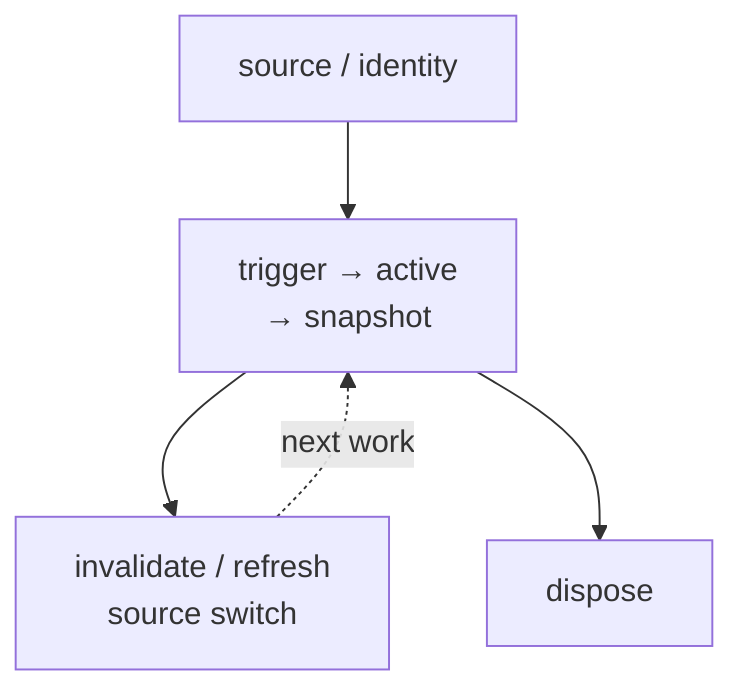
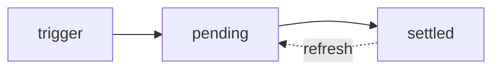
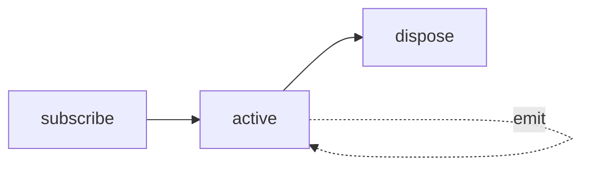

# Luciano Lee

Senior Frontend Engineer

Creator of signal-kernel

<div class="mt-8 opacity-75">

Reactivity · Async Lifecycle

Framework-independent Data Flow

</div>

<div class="mt-8 text-sm opacity-60">
  github.com/Luciano0322
</div>

::right::


<div class="mt-2 text-center text-xs opacity-45">
  P1 photo placeholder · raw portrait pending
</div>

<!--
Core: 交代研究 ownership 的背景，不把這場演講變成 React 對 Vue 的評論。
Time: 40 秒。
Talk track:
我是 Luciano，目前是一名前端工程師，也是 signal-kernel 的作者。
我的主要工作背景從 React 生態出發，但這幾年在研究 reactivity、async resource 和跨框架資料流時，我慢慢把注意力從「framework 怎麼更新畫面」，移到「哪一層負責讓 async lifecycle 持續保持正確」。
所以今天不是要把 React 的作法搬進 Vue，也不是一套 Vue 替代方案的發表。我做的是一個完整的 Vue case study，用相同 UI 與 selected outcomes，觀察四種 responsibility configuration。
Transition: 接下來先不談任何工具，先看一次 async work 從開始到結束究竟經歷了什麼。
Cut: React 背景可以縮成一句，只保留「研究起點，不是框架比較」。
-->

---
layout: center
clicks: 3
---

# 先從 Promise 三態開始

## pending → fulfilled / rejected

<div class="relative mt-4 h-[360px]">
<div v-click.hide="2" class="absolute inset-0 flex flex-col items-center justify-center">
<div class="text-sm font-semibold opacity-60">Promise 建立後</div>
<div class="mt-2 min-w-48 rounded-xl border px-8 py-4 text-center font-mono text-2xl">
pending
</div>

<div v-click="1" class="mt-3 text-4xl">↙　　　　　↘</div>

<div v-click="1" class="mt-1 grid grid-cols-2 gap-16 text-center">
<div>
<div class="text-sm opacity-60">成功完成</div>
<div class="mt-1 min-w-48 rounded-xl border px-6 py-4 font-mono text-xl">
fulfilled
</div>
</div>
<div>
<div class="text-sm opacity-60">失敗完成</div>
<div class="mt-1 min-w-48 rounded-xl border px-6 py-4 font-mono text-xl">
rejected
</div>
</div>
</div>

<div v-click="1" class="mt-5 text-lg font-semibold">
兩者都代表 settled：結果已固定，不會回到 pending。
</div>
</div>

<div v-click="2" class="absolute inset-0">
<div class="relative mb-2 h-7 text-center font-semibold">
<div v-click.hide="3" class="absolute inset-0 text-lg">
但 UI correctness 不只問「這次成功或失敗」
</div>
<div v-click="3" class="absolute inset-0 text-xl">
Promise settled 了；非同步責任還沒結束。
</div>
</div>


</div>
</div>

<!--
Core: Promise 三態只描述一次工作的結果；UI correctness 還需要處理 identity、refresh、switch 與 disposal。
Time: 55 秒。
Talk track:
Promise 建立後先進入 pending；工作成功會進入 fulfilled，失敗則進入 rejected。後面兩個狀態都叫 settled，而且結果固定後不會回到 pending。
這套模型很適合描述一次 Promise 最後成功或失敗，但 UI correctness 還會繼續問：這個結果是否仍屬於目前的 source、何時 refresh、source 切換時舊工作怎麼處理，以及 consumer 離開後誰 cleanup。
所以這場演講說的 async work，會從一次 Promise 的 outcome，向外擴到 source identity、active snapshot、refresh、source switch 和 dispose 的完整 lifecycle。
Transition: 不過 request 和 stream 的形狀不同，我不想為了統一術語，假裝它們共享完全相同的 state machine。
Cut: Promise 三態只說 pending 與 settled，不解釋 resolution procedure；直接進入完整 lifecycle。
-->

---
layout: default
clicks: 3
---

# Request 與 Stream

## Framework 裡的接力方式不同

<div class="relative mt-5 h-[390px]">
<div v-click.hide="1" class="absolute inset-0 flex flex-col justify-center">
<div class="flex items-center justify-center gap-4 text-center">
<div class="w-60 rounded-xl border p-5">
<div class="text-lg font-semibold">Vue source / scope</div>
<div class="mt-2 text-sm opacity-65">知道目前 source<br>與 consumer lifetime</div>
</div>
<div class="text-3xl">→</div>
<div class="w-60 rounded-xl border p-5">
<div class="text-lg font-semibold">External async work</div>
<div class="mt-2 text-sm opacity-65">執行 request<br>或持續 stream</div>
</div>
<div class="text-3xl">→</div>
<div class="w-60 rounded-xl border p-5">
<div class="text-lg font-semibold">Vue projection</div>
<div class="mt-2 text-sm opacity-65">把 snapshot / emission<br>投影成 UI</div>
</div>
</div>
<div class="mt-9 text-center text-xl font-semibold">
Control flow 會跨 layer 接力；lifecycle ownership 不會因此自動轉移。
</div>
</div>

<div v-click="[1, 2]" class="absolute inset-0">
<div class="text-center text-xl font-semibold">Request-like：通常等待一次 settled result</div>
<div class="mt-6 flex items-center justify-center gap-4 text-center">
<div class="w-52 rounded-xl border p-4">
<div class="font-semibold">Vue source</div>
<div class="mt-1 font-mono text-sm opacity-65">trigger</div>
</div>
<div class="text-3xl">→</div>
<div class="w-60 rounded-xl border p-4">
<div class="font-semibold">Request</div>
<div class="mt-1 font-mono text-sm opacity-65">pending → success / error</div>
</div>
<div class="text-3xl">→</div>
<div class="w-52 rounded-xl border p-4">
<div class="font-semibold">Vue consumer</div>
<div class="mt-1 font-mono text-sm opacity-65">snapshot → render</div>
</div>
</div>
<div class="mt-7 grid grid-cols-2 gap-4 text-center">
<div class="rounded-xl bg-gray-100 p-4 dark:bg-gray-800">
source 改變：誰判斷 currentness 與 stale response？
</div>
<div class="rounded-xl bg-gray-100 p-4 dark:bg-gray-800">
mutation 完成：誰宣告 invalidate / refresh？
</div>
</div>
</div>

<div v-click="[2, 3]" class="absolute inset-0">
<div class="text-center text-xl font-semibold">Stream-like：會持續產生 emission</div>
<div class="mt-6 flex items-center justify-center gap-4 text-center">
<div class="w-52 rounded-xl border p-4">
<div class="font-semibold">Vue source</div>
<div class="mt-1 font-mono text-sm opacity-65">subscribe</div>
</div>
<div class="text-3xl">→</div>
<div class="w-60 rounded-xl border p-4">
<div class="font-semibold">Stream</div>
<div class="mt-1 font-mono text-sm opacity-65">active ↺ emission*</div>
</div>
<div class="text-3xl">→</div>
<div class="w-52 rounded-xl border p-4">
<div class="font-semibold">Vue consumer</div>
<div class="mt-1 font-mono text-sm opacity-65">snapshot → render</div>
</div>
</div>
<div class="mt-7 grid grid-cols-2 gap-4 text-center">
<div class="rounded-xl bg-gray-100 p-4 dark:bg-gray-800">
source switch / unmount：誰負責 unsubscribe？
</div>
<div class="rounded-xl bg-gray-100 p-4 dark:bg-gray-800">
stream error：要 reconnect，還是停止？
</div>
</div>
</div>

<div v-click="3" class="absolute inset-0 bg-white dark:bg-[#121212]">
<div class="mb-3 text-center text-lg font-semibold">
相同的是 ownership questions，不是 API 形狀。
</div>

<div class="grid grid-cols-2 gap-5">
<div class="rounded-xl border p-3">
<div class="text-center font-semibold">Request-like</div>
<div class="slide4-final-mermaid">



</div>
</div>
<div class="rounded-xl border p-3">
<div class="text-center font-semibold">Stream-like</div>
<div class="slide4-final-mermaid">



</div>
</div>
</div>
</div>
</div>

<style>
.slide4-final-mermaid .mermaid {
  display: flex;
  height: 140px;
  align-items: center;
  justify-content: center;
}

.slide4-final-mermaid .mermaid svg {
  width: 100%;
  max-height: 140px;
}
</style>

<!--
Core: Framework、external work 與 UI projection 會在 control flow 上接力，但 request 與 stream 的 lifecycle responsibilities 不同，ownership 也不會因呼叫跨層就自動轉移。
Time: 70 秒。
Talk track:
放進 framework 後，control flow 通常從 Vue 的 source 與 component scope 出發，交給外部 async work，再回到 Vue projection。但呼叫跨過一層，不代表 lifecycle ownership 自動跟著轉移。
Request-like work 通常等待一次 settled result。除了 pending 與 success / error，application 還要回答 source 改變時誰拒絕 stale response，以及 mutation 後誰 refresh。
Stream-like work 會保持 active、持續產生 emission。它更直接依賴 source switch、unmount、unsubscribe 和 error policy。
因此 request 與 stream 不需要硬塞進同一個 state machine。真正共通的是：誰開始它、誰維持 current snapshot，以及最後誰停止它。
Transition: 當這些問題放回 Vue application，責任通常不會全部待在同一個檔案或同一套 runtime。
Cut: 跳過 request／stream 各自的問題卡，直接從 common boundary 切到最後比較圖。
-->

---
layout: center
---

# 一段 async work

## 責任通常分散在不同 layer

```text
Route / Props / Local Source
              │
              ▼
Composable / Store / Options ── declares policy
              │
              ▼
Vue / Query / Graph Runtime ─── maintains selected invariants
              │
       ┌──────┴──────┐
       ▼             ▼
   API / Stream   Resource Snapshot
                         │
                         ▼
                  Vue Projection / Render

Vue Component Scope
└─ component unmount → UI consumer 結束
   resource 是否 dispose，取決於 lifecycle owner
```

<div class="mt-6 text-center opacity-70">
  責任分散在不同層；正確性來自清楚的 ownership 邊界。
</div>

<!--
Core: Vue async correctness 通常由 source、scope、application policy、runtime、external work 與 UI consumer 共同構成。
Time: 55 秒。
Talk track:
放回 Vue application 以後，route、props 或 local state 通常提供 source；composable、store 或 options 宣告 application policy；framework 或 runtime 維持它承諾的 invariants。
API 和 stream 實際執行外部工作，但它們不知道 UI correctness。最後 Vue 還要把 snapshot 投影成 component tree，並提供 consumer 的 mount 與 unmount scope。
這個 scope 決定的是 UI consumer 何時結束；component unmount 不代表共享 resource、cache 或 stream 一定同時被 dispose，那仍取決於 lifecycle owner。
所以我不會說 ownership 被工具搶走或瓜分，而是 responsibility 本來就分散在不同 layer。真正的問題是：邊界是否清楚，以及誰對哪一項 invariant 負責。
Transition: 這也帶出今天最容易混淆的一件事：資料放在哪裡，不等於誰在負責。
Cut: 可刪除 external work 說明，保留 source、policy、runtime、Vue consumer 四層。
-->

---
layout: default
clicks: 2
---

# State 放在哪裡

## 不等於 async lifecycle 由誰維持

<div class="relative mt-5 h-[390px]">
  <div v-click.hide="1" class="absolute inset-0 flex flex-col items-center justify-center">
    <div class="text-xl font-semibold">Async state 會跨時間改變</div>
    <div class="mt-5 flex items-center gap-3 font-mono text-lg">
      <span class="rounded-lg border px-4 py-2">pending</span>
      <span class="opacity-45">→</span>
      <span class="rounded-lg border px-4 py-2">success(data A)</span>
      <span class="opacity-45">→</span>
      <span class="rounded-lg border px-4 py-2">refreshing(data A)</span>
    </div>
    <div class="mt-6 text-sm font-semibold opacity-60">UI 在某一刻讀取 ↓</div>
    <div class="mt-3 rounded-xl bg-gray-100 px-8 py-4 text-center dark:bg-gray-800">
      <div class="font-mono text-lg">snapshot = { status, data, error }</div>
      <div class="mt-2 font-semibold">
        Snapshot 不是另一套 state；它是 UI 此刻讀到的 async state。
      </div>
    </div>
  </div>

  <div v-click="[1, 2]" class="absolute inset-0">
    <div class="grid grid-cols-2 gap-5">
      <div class="rounded-xl border p-5 text-center">
        <div class="text-lg font-semibold">Vue lifecycle</div>
        <div class="mt-3 font-mono">mount → update → unmount</div>
        <div class="mt-3 text-sm opacity-70">consumer 何時存在</div>
      </div>
      <div class="rounded-xl border p-5 text-center">
        <div class="text-lg font-semibold">Async lifecycle</div>
        <div class="mt-3 font-mono">trigger → active → settle</div>
        <div class="mt-1 font-mono text-sm">refresh · dispose</div>
        <div class="mt-3 text-sm opacity-70">work / resource 如何跨時間保持正確</div>
      </div>
    </div>
    <div class="mx-auto mt-5 max-w-3xl rounded-xl bg-gray-100 p-4 text-center dark:bg-gray-800">
      <div class="font-mono text-sm">unmount → cancel request · unsubscribe stream · detach consumer</div>
      <div class="mt-2 text-lg font-semibold">兩條 lifecycle 會交會，但不是同一條。</div>
    </div>
  </div>

  <div v-click="2" class="absolute inset-0">
    <div class="grid grid-cols-3 gap-4 text-center">
      <div class="rounded-xl border p-4">
        <div class="text-lg font-semibold">1. Snapshot location</div>
        <div class="mt-2 text-sm">UI 此刻讀到的值放在哪裡？</div>
        <div class="mt-3 text-sm opacity-70">component · store<br>cache · graph</div>
      </div>
      <div class="rounded-xl border p-4">
        <div class="text-lg font-semibold">2. Async policy</div>
        <div class="mt-2 text-sm">規則在哪裡被宣告？</div>
        <div class="mt-3 text-sm opacity-70">trigger · refresh<br>error · invalidation</div>
      </div>
      <div class="rounded-xl border p-4">
        <div class="text-lg font-semibold">3. Async lifecycle owner</div>
        <div class="mt-2 text-sm">誰持續維持正確性？</div>
        <div class="mt-3 text-sm opacity-70">currentness · status<br>stale · cleanup</div>
      </div>
    </div>
    <div class="mt-5 rounded-xl bg-gray-100 p-4 text-center dark:bg-gray-800">
      <div><code>users snapshot</code>：component ref → Pinia store</div>
      <div class="mt-2 font-semibold">
        只證明讀取位置改變；async lifecycle owner 是否改變，仍要看 action 與 runtime 的承諾。
      </div>
    </div>
  </div>
</div>

<!--
Core: Snapshot 是 UI 某一刻讀到的 async state；Vue lifecycle 與 async lifecycle 會交會，但不是同一條；location、policy 與 owner 也是三個不同問題。
Time: 85 秒。
Talk track:
第一步先釐清 state 和 snapshot。Async state 會隨時間從 pending 走到 success，也可能帶著舊資料進入 refreshing；snapshot 不是另一套 state，而是 UI 在某一刻讀到的 status、data 與 error。
第二步把兩條 lifecycle 分開。Vue lifecycle 描述 component consumer 何時 mount、update、unmount；async lifecycle 描述 request 或 stream 何時 trigger、active、settle、refresh、dispose。
兩條線會在 unmount 時交會，例如 cancel request、unsubscribe stream 或 detach consumer，但 Vue lifecycle 本身不等於 async lifecycle。
第三步才回到 ownership。假設把 users snapshot 從 component ref 搬進 Pinia store，可以確定的是讀取位置改變了，也可能建立 shared workflow boundary。
但 stale response 怎麼判斷、refresh 何時發生、consumer 離開後誰 cleanup，不會因為換了容器就自動得到答案。
因此後面會分開看三件事：snapshot 放在哪裡、async policy 在哪裡宣告，以及誰持續維持 async lifecycle correctness。
Transition: 為了避免每一章臨時更換標準，接下來先固定六個 ownership questions。
Cut: 快速點到最後一幕，只保留「location、policy、owner 是三件事」。
-->

---
layout: center
---

# 接下來怎麼比較

## 固定問這六個 Ownership questions

<div class="mt-8 grid grid-cols-3 gap-4 text-center">
  <div class="rounded-xl border p-4">
    <div class="font-mono text-lg">trigger</div>
    <div class="mt-1 text-sm opacity-70">誰開始工作？</div>
  </div>
  <div class="rounded-xl border p-4">
    <div class="font-mono text-lg">status</div>
    <div class="mt-1 text-sm opacity-70">誰維持進度？</div>
  </div>
  <div class="rounded-xl border p-4">
    <div class="font-mono text-lg">stale</div>
    <div class="mt-1 text-sm opacity-70">誰判斷資料已過期？</div>
  </div>
  <div class="rounded-xl border p-4">
    <div class="font-mono text-lg">invalidate</div>
    <div class="mt-1 text-sm opacity-70">誰宣告需要更新？</div>
  </div>
  <div class="rounded-xl border p-4">
    <div class="font-mono text-lg">dispose</div>
    <div class="mt-1 text-sm opacity-70">誰停止觀察或工作？</div>
  </div>
  <div class="rounded-xl border p-4">
    <div class="font-mono text-lg">render</div>
    <div class="mt-1 text-sm opacity-70">誰把 snapshot 投影成 UI？</div>
  </div>
</div>

<div class="mt-8 text-center text-lg font-semibold">
  後面四種 model，都回答同一組 ownership questions。
</div>

<div class="mt-5 text-center text-sm font-semibold opacity-70">
  Architecture case study：比較 responsibility map，不做工具排名。
</div>

<!--
Core: 後面四種 model 固定回答同一組 ownership questions，不臨時更換比較標準。
Time: 40 秒。
Talk track:
每一章都會回答 trigger、status、stale、invalidate、dispose 和 render 由誰負責。
這六個問題不要求同一個 owner；它們是用來畫出 responsibility map，讓我們看見責任如何分布，以及 application 還要補上哪些 glue。
這仍然是 architecture case study，不是 benchmark，也不能直接證明哪套工具全面更好。
Transition: 問題固定後，下一段再建立共同 Dashboard，看看裡面同時存在的三種 async work。
Cut: 只保留六個問題與「不是工具排名」。
-->
