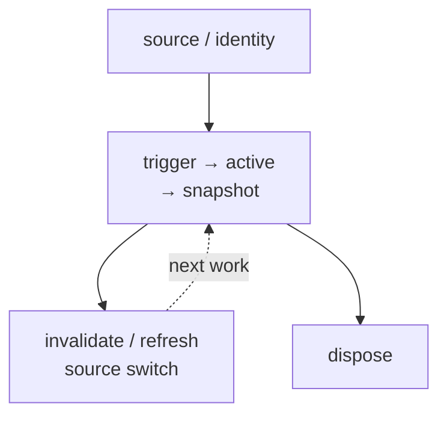
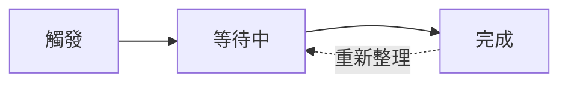
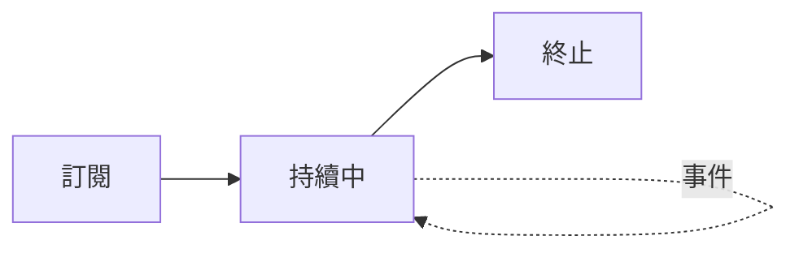

# Luciano Lee

Senior Frontend Engineer

Creator of signal-kernel

<div class="mt-8 opacity-75">

Reactivity · Async Lifecycle

Framework-independent Data Flow

</div>

<div class="mt-8 rounded-xl border border-gray-300 px-4 py-3 dark:border-gray-700">
  <div class="text-xs font-semibold opacity-55">Demo Repo · 演講中可同步參照</div>
  <a
    href="https://github.com/Luciano0322/vue-async-ownership"
    target="_blank"
    rel="noreferrer"
    class="mt-1 block font-mono text-xs text-cyan-700 no-underline dark:text-cyan-300"
  >github.com/Luciano0322/vue-async-ownership</a>
</div>

::right::


<div class="mt-2 text-center text-xs opacity-45">
  P1 photo placeholder · raw portrait pending
</div>

<!--
Core: 交代研究 ownership 的背景，不把這場演講變成 React 對 Vue 的評論；同時提前給出 Demo repository 讓觀眾同步參照。
Time: 45 秒。
Talk track:
我是 Luciano，目前是一名前端工程師，也是 signal-kernel 的作者。
我的主要工作背景從 React 生態出發，但這幾年在研究 reactivity、async resource 和跨框架資料流時，我慢慢把注意力從「framework 怎麼更新畫面」，移到「哪一層負責讓 async lifecycle 持續保持正確」。
所以今天不是要把 React 的作法搬進 Vue，也不是一套 Vue 替代方案的發表。我做的是一個完整的 Vue case study，用相同 UI 與 selected outcomes，觀察四種 responsibility configuration。
今天使用的 Demo 已經公開，連結先放在這裡；想同步對照原始碼可以先開著，最後一頁也會再提供 QR code。
Transition: 接下來先不談任何工具，先看一次 async work 從開始到結束究竟經歷了什麼。
Cut: React 背景可以縮成一句；Demo Repo 口頭提示也可略過，連結仍保留在畫面。
-->

---
layout: center
clicks: 3
---

# 先從 Promise 三態開始

## pending → fulfilled / rejected

<div class="relative mt-4 h-[360px]">
<div v-click.hide="2" class="absolute inset-0 flex flex-col items-center justify-center">
<div class="text-sm font-semibold opacity-60">Promise 建立後</div>
<div class="mt-2 min-w-48 rounded-xl border px-8 py-4 text-center font-mono text-2xl">
pending
</div>

<div v-click="1" class="mt-3 text-4xl">↙　　　　　↘</div>

<div v-click="1" class="mt-1 grid grid-cols-2 gap-16 text-center">
<div>
<div class="text-sm opacity-60">成功完成</div>
<div class="mt-1 min-w-48 rounded-xl border px-6 py-4 font-mono text-xl">
fulfilled
</div>
</div>
<div>
<div class="text-sm opacity-60">失敗完成</div>
<div class="mt-1 min-w-48 rounded-xl border px-6 py-4 font-mono text-xl">
rejected
</div>
</div>
</div>

<div v-click="1" class="mt-5 text-lg font-semibold">
兩者都代表 settled：結果已固定，不會回到 pending。
</div>
</div>

<div v-click="2" class="absolute inset-0">
<div class="relative mb-2 h-7 text-center font-semibold">
<div v-click.hide="3" class="absolute inset-0 text-lg">
但 UI correctness 不只問「這次成功或失敗」
</div>
<div v-click="3" class="absolute inset-0 text-xl">
Promise settled 了；非同步責任還沒結束。
</div>
</div>


</div>
</div>

<!--
Core: Promise 三態只描述一次工作的結果；UI correctness 還需要處理 identity、refresh、switch 與 disposal。
Time: 55 秒。
Talk track:
Promise 建立後先進入 pending；工作成功會進入 fulfilled，失敗則進入 rejected。後面兩個狀態都叫 settled，而且結果固定後不會回到 pending。
這套模型很適合描述一次 Promise 最後成功或失敗，但 UI correctness 還會繼續問：這個結果是否仍屬於目前的 source、何時 refresh、source 切換時舊工作怎麼處理，以及 consumer 離開後誰 cleanup。
所以這場演講說的 async work，會從一次 Promise 的 outcome，向外擴到 source identity、active snapshot、refresh、source switch 和 dispose 的完整 lifecycle。
Transition: 不過 request 和 stream 的形狀不同，我不想為了統一術語，假裝它們共享完全相同的 state machine。
Cut: Promise 三態只說 pending 與 settled，不解釋 resolution procedure；直接進入完整 lifecycle。
-->

---
layout: default
clicks: 3
---

# 請求與串流

## 在框架裡的接力方式不同

<div class="relative mt-5 h-[390px]">
<div v-click.hide="1" class="absolute inset-0 flex flex-col justify-center">
<div class="flex items-center justify-center gap-4 text-center">
<div class="w-60 rounded-xl border p-5">
<div class="text-lg font-semibold">Vue 來源／作用域</div>
<div class="mt-2 text-sm opacity-65">知道目前來源<br>與 UI 消費端生命週期</div>
</div>
<div class="text-3xl">→</div>
<div class="w-60 rounded-xl border p-5">
<div class="text-lg font-semibold">外部非同步工作</div>
<div class="mt-2 text-sm opacity-65">執行請求<br>或持續串流</div>
</div>
<div class="text-3xl">→</div>
<div class="w-60 rounded-xl border p-5">
<div class="text-lg font-semibold">Vue 畫面投影</div>
<div class="mt-2 text-sm opacity-65">把狀態快照／事件<br>投影成 UI</div>
</div>
</div>
<div class="mt-9 text-center text-xl font-semibold">
控制流程會跨層接力；生命週期 Ownership 不會因此自動轉移。
</div>
</div>

<div v-click="[1, 2]" class="absolute inset-0">
<div class="text-center text-xl font-semibold">請求型工作：通常等待一次完成結果</div>
<div class="mt-6 flex items-center justify-center gap-4 text-center">
<div class="w-52 rounded-xl border p-4">
<div class="font-semibold">Vue 來源</div>
<div class="mt-1 font-mono text-sm opacity-65">觸發</div>
</div>
<div class="text-3xl">→</div>
<div class="w-60 rounded-xl border p-4">
<div class="font-semibold">請求</div>
<div class="mt-1 font-mono text-sm opacity-65">pending → success / error</div>
</div>
<div class="text-3xl">→</div>
<div class="w-52 rounded-xl border p-4">
<div class="font-semibold">Vue 消費端</div>
<div class="mt-1 font-mono text-sm opacity-65">狀態快照 → 渲染</div>
</div>
</div>
<div class="mt-7 grid grid-cols-2 gap-4 text-center">
<div class="rounded-xl bg-gray-100 p-4 dark:bg-gray-800">
來源改變：誰判斷目前結果與過期回應？
</div>
<div class="rounded-xl bg-gray-100 p-4 dark:bg-gray-800">
mutation 完成：誰宣告失效／重新整理？
</div>
</div>
</div>

<div v-click="[2, 3]" class="absolute inset-0">
<div class="text-center text-xl font-semibold">串流型工作：會持續產生事件</div>
<div class="mt-6 flex items-center justify-center gap-4 text-center">
<div class="w-52 rounded-xl border p-4">
<div class="font-semibold">Vue 來源</div>
<div class="mt-1 font-mono text-sm opacity-65">訂閱</div>
</div>
<div class="text-3xl">→</div>
<div class="w-60 rounded-xl border p-4">
<div class="font-semibold">串流</div>
<div class="mt-1 font-mono text-sm opacity-65">持續中 ↺ 事件*</div>
</div>
<div class="text-3xl">→</div>
<div class="w-52 rounded-xl border p-4">
<div class="font-semibold">Vue 消費端</div>
<div class="mt-1 font-mono text-sm opacity-65">狀態快照 → 渲染</div>
</div>
</div>
<div class="mt-7 grid grid-cols-2 gap-4 text-center">
<div class="rounded-xl bg-gray-100 p-4 dark:bg-gray-800">
來源切換／元件卸載：誰負責取消訂閱？
</div>
<div class="rounded-xl bg-gray-100 p-4 dark:bg-gray-800">
串流錯誤：要重新連線，還是停止？
</div>
</div>
</div>

<div v-click="3" class="absolute inset-0 bg-white dark:bg-[#121212]">
<div class="mb-3 text-center text-lg font-semibold">
相同的是 Ownership 問題，不是 API 形狀。
</div>

<div class="grid grid-cols-2 gap-5">
<div class="rounded-xl border p-3">
<div class="text-center font-semibold">請求型工作</div>
<div class="slide4-final-mermaid">



</div>
</div>
<div class="rounded-xl border p-3">
<div class="text-center font-semibold">串流型工作</div>
<div class="slide4-final-mermaid">



</div>
</div>
</div>
</div>
</div>

<style>
.slide4-final-mermaid .mermaid {
  display: flex;
  height: 140px;
  align-items: center;
  justify-content: center;
}

.slide4-final-mermaid .mermaid svg {
  width: 100%;
  max-height: 140px;
}
</style>

<!--
Core: Framework、external work 與 UI projection 會在 control flow 上接力，但 request 與 stream 的 lifecycle responsibilities 不同，ownership 也不會因呼叫跨層就自動轉移。
Time: 60 秒。
Talk track:
放進 framework 後，control flow 通常從 Vue 的 source 與 component scope 出發，交給外部 async work，再回到 Vue projection。但呼叫跨過一層，不代表 lifecycle ownership 自動跟著轉移。
Request-like work 通常等待一次 settled result。除了 pending 與 success / error，application 還要回答 source 改變時誰拒絕 stale response，以及 mutation 後誰 refresh。
Stream-like work 會保持 active、持續產生 emission。它更直接依賴 source switch、unmount、unsubscribe 和 error policy。
因此 request 與 stream 不需要硬塞進同一個 state machine。真正共通的是：誰開始它、誰維持 current snapshot，以及最後誰停止它。
Transition: 當這些問題放回 Vue application，責任通常不會全部待在同一個檔案或同一套 runtime。
Cut: 跳過 request／stream 各自的問題卡，直接從 common boundary 切到最後比較圖。
-->

---
layout: center
---

# 一段非同步工作進入 Vue 之後

## 執行、狀態與生命週期不會由同一個機制包辦

```text
路由 / Props / 區域來源
              │
              ▼
應用程式程式碼 ── 觸發 · 狀態 · 新舊判斷 · 重新整理
              │
              ▼
Promise / API / 串流 ── 執行外部工作
              │
              ▼
        非同步狀態快照
              │
              ▼
Vue 響應式系統 ── 傳播變化 ──▶ UI 渲染

Vue 元件生命週期
└─ 定義 UI 消費端範圍與清理時機
```

<div class="mt-6 rounded-xl bg-emerald-50 p-4 text-center text-lg font-semibold dark:bg-emerald-950">
  非同步 Ownership：這些責任在系統邊界之間如何被配置與承擔。
</div>

<!--
Core: Async Ownership 是一段非同步工作跨時間運行時，觸發、狀態傳播、生命週期正確性、UI 消費與清理責任在不同系統邊界之間的配置。
Time: 55 秒。
Talk track:
一段非同步工作進入 Vue 後，route、props 或 local state 提供來源；application code 決定何時觸發，也常要自己維持 status、stale result 與 refresh。Promise、API 或 stream 實際執行外部工作，但不知道 UI correctness。
結果回來後，Vue reactivity 傳播 snapshot 的變化；component lifecycle 定義 consumer 何時存在，以及 cleanup hook 何時發生；component 最後把 snapshot render 成 UI。這些都是同一段 async work 的不同責任。
這場說的 Async Ownership，就是 trigger、狀態傳播、生命週期正確性、UI 消費與清理，分別被哪些系統邊界承擔。它不是 state 放在哪裡，也不要求只有一個 owner。
Transition: 定義成立後，下一張先拆開最容易混淆的 state location、Vue lifecycle 與 async lifecycle。
Cut: 保留 application code、external work、Vue reactivity、component lifecycle 四行與定義框。
-->

---
layout: default
clicks: 2
---

# 狀態放在哪裡

## 不等於非同步生命週期由誰維持

<div class="relative mt-5 h-[390px]">
  <div v-click.hide="1" class="absolute inset-0 flex flex-col items-center justify-center">
    <div class="text-xl font-semibold">非同步狀態會跨時間改變</div>
    <div class="mt-5 flex items-center gap-3 font-mono text-lg">
      <span class="rounded-lg border px-4 py-2">pending</span>
      <span class="opacity-45">→</span>
      <span class="rounded-lg border px-4 py-2">success(data A)</span>
      <span class="opacity-45">→</span>
      <span class="rounded-lg border px-4 py-2">refreshing(data A)</span>
    </div>
    <div class="mt-6 text-sm font-semibold opacity-60">UI 在某一刻讀取 ↓</div>
    <div class="mt-3 rounded-xl bg-gray-100 px-8 py-4 text-center dark:bg-gray-800">
      <div class="font-mono text-lg">snapshot = { status, data, error }</div>
      <div class="mt-2 font-semibold">
        狀態快照不是另一套 state；它是 UI 此刻讀到的非同步狀態。
      </div>
    </div>
  </div>

  <div v-click="[1, 2]" class="absolute inset-0">
    <div class="grid grid-cols-2 gap-5">
      <div class="rounded-xl border p-5 text-center">
        <div class="text-lg font-semibold">Vue 元件生命週期</div>
        <div class="mt-3 font-mono">mount → update → unmount</div>
        <div class="mt-3 text-sm opacity-70">UI 消費端何時存在</div>
      </div>
      <div class="rounded-xl border p-5 text-center">
        <div class="text-lg font-semibold">非同步工作生命週期</div>
        <div class="mt-3 font-mono">trigger → active → settle</div>
        <div class="mt-1 font-mono text-sm">refresh · dispose</div>
        <div class="mt-3 text-sm opacity-70">工作／資源如何跨時間保持正確</div>
      </div>
    </div>
    <div class="mx-auto mt-5 max-w-3xl rounded-xl bg-gray-100 p-4 text-center dark:bg-gray-800">
      <div class="font-mono text-sm">unmount → cancel request · unsubscribe stream · detach consumer</div>
      <div class="mt-2 text-lg font-semibold">兩條 lifecycle 會交會，但不是同一條。</div>
    </div>
  </div>

  <div v-click="2" class="absolute inset-0">
    <div class="grid grid-cols-3 gap-4 text-center">
      <div class="rounded-xl border p-4">
        <div class="text-lg font-semibold">1. 狀態快照位置</div>
        <div class="mt-2 text-sm">UI 此刻讀到的值放在哪裡？</div>
        <div class="mt-3 text-sm opacity-70">component · store<br>cache · graph</div>
      </div>
      <div class="rounded-xl border p-4">
        <div class="text-lg font-semibold">2. 非同步規則</div>
        <div class="mt-2 text-sm">規則在哪裡被宣告？</div>
        <div class="mt-3 text-sm opacity-70">trigger · refresh<br>error · invalidation</div>
      </div>
      <div class="rounded-xl border p-4">
        <div class="text-lg font-semibold">3. 責任邊界</div>
        <div class="mt-2 text-sm">誰持續維持正確性？</div>
        <div class="mt-3 text-sm opacity-70">currentness · status<br>stale · cleanup</div>
      </div>
    </div>
    <div class="mt-5 rounded-xl bg-gray-100 p-4 text-center dark:bg-gray-800">
      <div><b>非同步 Ownership = 責任 → 責任邊界的配置圖</b></div>
      <div class="mt-2 font-semibold">
        Snapshot 搬進 store，只證明讀取位置改變；責任是否轉移，仍要看 action 與 runtime 接手了什麼。
      </div>
    </div>
  </div>
</div>

<!--
Core: Async Ownership 是 responsibility 到 owner 的配置圖；snapshot location、policy declaration 與持續維持 correctness 的 owner 是三個不同問題。
Time: 75 秒。
Talk track:
第一步先釐清 state 和 snapshot。Async state 會隨時間從 pending 走到 success，也可能帶著舊資料進入 refreshing；snapshot 不是另一套 state，而是 UI 在某一刻讀到的 status、data 與 error。
第二步把兩條 lifecycle 分開。Vue lifecycle 描述 component consumer 何時 mount、update、unmount；async lifecycle 描述 request 或 stream 何時 trigger、active、settle、refresh、dispose。
兩條線會在 unmount 時交會，例如 cancel request、unsubscribe stream 或 detach consumer，但 Vue lifecycle 本身不等於 async lifecycle。
第三步把這些差異放回 Async Ownership。假設把 users snapshot 從 component ref 搬進 Pinia store，可以確定的是讀取位置改變了，也可能建立 shared workflow boundary。
但 stale response 怎麼判斷、refresh 何時發生、consumer 離開後誰 cleanup，不會因為換了容器就自動得到答案。
因此後面會分開看三件事：snapshot 放在哪裡、async policy 在哪裡宣告，以及誰持續維持各項 async responsibility。整體的 responsibility-to-owner mapping，才是這場說的 Async Ownership。
Transition: 為了讓每一章都能畫出同一種責任配置圖，接下來固定六個分析問題。
Cut: 快速點到最後一幕，只保留「location、policy、owner 是三件事」。
-->

---
layout: center
---

# 用六個問題讀出非同步 Ownership

## 它們是權責分布圖的分析座標

<div class="mt-8 grid grid-cols-3 gap-4 text-center">
  <div class="rounded-xl border p-4">
    <div class="font-mono text-lg">trigger</div>
    <div class="mt-1 text-sm opacity-70">誰開始工作？</div>
  </div>
  <div class="rounded-xl border p-4">
    <div class="font-mono text-lg">status</div>
    <div class="mt-1 text-sm opacity-70">誰維持進度？</div>
  </div>
  <div class="rounded-xl border p-4">
    <div class="font-mono text-lg">stale</div>
    <div class="mt-1 text-sm opacity-70">誰判斷資料已過期？</div>
  </div>
  <div class="rounded-xl border p-4">
    <div class="font-mono text-lg">invalidate</div>
    <div class="mt-1 text-sm opacity-70">誰宣告需要更新？</div>
  </div>
  <div class="rounded-xl border p-4">
    <div class="font-mono text-lg">dispose</div>
    <div class="mt-1 text-sm opacity-70">誰停止觀察或工作？</div>
  </div>
  <div class="rounded-xl border p-4">
    <div class="font-mono text-lg">render</div>
    <div class="mt-1 text-sm opacity-70">誰把 snapshot 投影成 UI？</div>
  </div>
</div>

<div class="mt-8 text-center text-lg font-semibold">
  每一章都回答：哪些責任移動了？哪些仍留在 Vue 或應用程式程式碼？
</div>

<div class="mt-5 text-center text-sm font-semibold opacity-70">
  架構案例研究：比較權責分布圖，不做工具排名。
</div>

<!--
Core: 六個問題不是 Async Ownership 的定義，而是用來讀出 responsibility-to-owner mapping 的共同分析座標。
Time: 35 秒。
Talk track:
Async Ownership 已經定義成 async responsibilities 在系統邊界之間的配置。接著每一章都用 trigger、status、stale、invalidate、dispose 和 render 六個問題，把這張配置圖讀出來。
這六個責任不要求同一個 owner。每看完一種 model，都要能回答兩句話：哪些責任移動到新的 boundary，哪些仍留在 Vue 或 application code。
這仍然是 architecture case study，不是 benchmark，也不能直接證明哪套工具全面更好。
Transition: 分析方法固定後，下一段建立共同 Dashboard，讓四個 model 面對完全相同的 request、mutation 與 stream responsibilities。
Cut: 只保留六個問題，以及「移動了什麼、留下了什麼」。
-->
