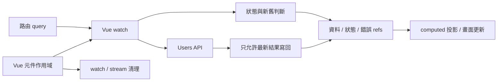

# Vue 原本已經擁有什麼？

## Pure Vue 不是「什麼都沒有」

<div class="mt-6 grid grid-cols-[1.15fr_0.85fr] gap-6">
  <div class="rounded-2xl border border-blue-300 p-5 dark:border-blue-700">
    <div class="text-sm font-semibold text-blue-600 dark:text-blue-300">VUE MAINTAINS</div>
    <div class="mt-4 grid grid-cols-2 gap-3 text-sm">
      <div class="rounded-lg bg-blue-50 p-3 dark:bg-blue-950">
        <div class="font-semibold">Reactive tracking</div>
        <div class="mt-1 opacity-65">dependency 變化能被追蹤</div>
      </div>
      <div class="rounded-lg bg-blue-50 p-3 dark:bg-blue-950">
        <div class="font-semibold">Watch scheduling</div>
        <div class="mt-1 opacity-65">callback 與 cleanup registration</div>
      </div>
      <div class="rounded-lg bg-blue-50 p-3 dark:bg-blue-950">
        <div class="font-semibold">Component scope</div>
        <div class="mt-1 opacity-65">mount / unmount 與 scope cleanup</div>
      </div>
      <div class="rounded-lg bg-blue-50 p-3 dark:bg-blue-950">
        <div class="font-semibold">Computed projection</div>
        <div class="mt-1 opacity-65">state → UI snapshot</div>
      </div>
      <div class="col-span-2 rounded-lg bg-blue-50 p-3 text-center dark:bg-blue-950">
        <span class="font-semibold">Composition + rendering</span>
        <span class="ml-2 opacity-65">組合 consumer 並更新畫面</span>
      </div>
    </div>
  </div>

  <div class="rounded-2xl border p-5">
    <div class="text-sm font-semibold opacity-55">APPLICATION DECLARES</div>
    <div class="mt-4 text-lg font-semibold">這個 feature 的 async policy</div>
    <div class="mt-4 grid gap-2 text-sm">
      <div class="rounded-lg bg-gray-100 px-3 py-2 dark:bg-gray-800">何時 trigger / refresh</div>
      <div class="rounded-lg bg-gray-100 px-3 py-2 dark:bg-gray-800">pending / refreshing / error</div>
      <div class="rounded-lg bg-gray-100 px-3 py-2 dark:bg-gray-800">currentness / stale result</div>
      <div class="rounded-lg bg-gray-100 px-3 py-2 dark:bg-gray-800">mutation reload / stream bridge</div>
    </div>
  </div>
</div>

<div class="mt-5 text-center text-lg font-semibold">
  Vue 維持 reactivity 與 consumer scope；application code 維持 feature policy。
</div>

<!--
Core: Pure Vue 已提供完整的 reactive consumer boundary；manual async policy 仍有明確的 application owner。
Time: 55 秒。
Talk track:
先把「Pure Vue」這個名字拆開看。它不是沒有 runtime，也不是所有責任都從零開始。
Vue 已經替我們維持 reactive dependency tracking、watch scheduling、component mount 和 unmount scope、computed projection，以及 component composition 和 rendering。
這些都是畫面保持 reactive 的必要責任，不能因為接下來要談其他工具就把它們抹掉。
但 Vue 不知道這個 Dashboard 的 users request 應該何時算 refreshing、舊 response 何時失效、update 後要 reload 什麼，或 stream source 切換時要採用什麼 policy。
在 Pure Vue 版本裡，這些規則由 application code 明確宣告並維持。Manual 不代表沒有 owner，只代表 owner 是我們寫的 component 或 composable。
Transition: 接下來從 composable 的 inputs / outputs 開始，逐步把 watch 與 stale-result policy 寫進去。
Cut: 只保留「Vue 維持 reactivity 與 scope；application 維持 feature policy」。
-->

---
layout: default
clicks: 5
---

<div v-if="$clicks === 0">
  <h1>Pure Vue：怎麼開始寫？</h1>
  <h2>從 <code>useVueUsersDemo</code> composable 到 generation guard</h2>
  <div class="mt-3 grid grid-cols-[1.2fr_0.8fr] gap-6">
    <div>
      <div class="mb-2 text-xs font-semibold opacity-55">
        Step 1 · 先建立 feature boundary
      </div>

<div class="slide11-code">

```ts
export function useVueUsersDemo(api, keyword, userId) {
  const users = ref([])
  const usersStatus = ref('idle')

  return { users, usersStatus }
}
```

</div>

</div>

<div class="grid content-center gap-4">
<div class="rounded-xl border p-4">
<div class="text-sm font-semibold opacity-55">INPUTS</div>
<div class="mt-2 font-mono text-sm">api · keyword · userId</div>
<div class="mt-2 text-sm opacity-65">外部能力 + reactive sources</div>
</div>
<div class="text-center text-3xl opacity-40">↓</div>
<div class="rounded-xl border border-blue-300 p-4 dark:border-blue-700">
<div class="text-sm font-semibold text-blue-600 dark:text-blue-300">COMPOSABLE OUTPUT</div>
<div class="mt-2 font-mono text-sm">users · usersStatus</div>
<div class="mt-2 text-sm opacity-65">給 Vue consumer 讀取的 snapshot refs</div>
</div>
</div>
</div>

  <div class="mt-4 rounded-xl bg-blue-50 p-3 text-center font-semibold dark:bg-blue-950">
    先建立 organization / reuse boundary；request correctness 還沒有答案。
  </div>
</div>

<div v-else-if="$clicks === 1">
  <h1>Pure Vue：怎麼開始寫？</h1>
  <h2>從 <code>useVueUsersDemo</code> composable 到 generation guard</h2>
  <div class="mt-3 grid grid-cols-[1.15fr_0.85fr] gap-6">
    <div>
      <div class="mb-2 text-xs font-semibold opacity-55">
        Step 2 · 用 watch 接上第一版 happy path
      </div>

<div class="slide11-code">

```ts
let hasLoadedUsers = false

watch(keyword, async currentKeyword => {
  usersStatus.value = hasLoadedUsers ? 'refreshing' : 'pending'
  users.value = await api.fetchUsers({ keyword: currentKeyword })
  hasLoadedUsers = true
  usersStatus.value = 'success'
}, { immediate: true })
```

</div>

</div>

<div class="grid content-center gap-3">
<div class="rounded-xl border p-4">
<div class="font-mono text-sm text-blue-600 dark:text-blue-300">watch(keyword)</div>
<div class="mt-1 text-sm opacity-65">reactive source 改變就 trigger</div>
</div>
<div class="rounded-xl border p-4">
<div class="font-mono text-sm text-blue-600 dark:text-blue-300">pending / refreshing</div>
<div class="mt-1 text-sm opacity-65">決定是否保留已有 snapshot</div>
</div>
<div class="rounded-xl border p-4">
<div class="font-mono text-sm text-blue-600 dark:text-blue-300">immediate: true</div>
<div class="mt-1 text-sm opacity-65">composable 建立時先執行一次</div>
</div>
</div>
</div>

  <div class="mt-4 rounded-xl bg-amber-50 p-3 text-center font-semibold dark:bg-amber-950">
    現在可以 fetch；但 keyword 快速從 a → b，誰保證最後寫回的是 b？
  </div>
</div>

<div v-else-if="$clicks === 2">
  <h1>Pure Vue：怎麼開始寫？</h1>
  <h2>從 <code>useVueUsersDemo</code> composable 到 generation guard</h2>
  <div class="mt-3 text-center text-lg font-semibold">Step 3 · Promise 完成順序，不等於 source 的最新順序</div>

  <div class="mt-5 grid gap-3 font-mono text-sm">
    <div class="grid grid-cols-[120px_130px_1fr_150px] items-center gap-3 rounded-xl border p-3">
      <div>keyword = a</div>
      <div class="rounded bg-gray-100 px-3 py-2 text-center dark:bg-gray-800">generation 1</div>
      <div>request A ────────────────────────▶</div>
      <div class="rounded bg-rose-50 px-3 py-2 text-center dark:bg-rose-950">最後才 resolve</div>
    </div>
    <div class="grid grid-cols-[120px_130px_1fr_150px] items-center gap-3 rounded-xl border border-blue-300 p-3 dark:border-blue-700">
      <div>keyword = b</div>
      <div class="rounded bg-blue-50 px-3 py-2 text-center dark:bg-blue-950">generation 2</div>
      <div>request B ───────────▶</div>
      <div class="rounded bg-blue-50 px-3 py-2 text-center dark:bg-blue-950">先 resolve</div>
    </div>
  </div>

  <div class="mt-4 grid grid-cols-[1fr_auto_1fr] items-center gap-4 text-center">
    <div class="rounded-xl bg-blue-50 p-3 dark:bg-blue-950">
      UI 顯示 keyword b 的結果 ✓
    </div>
    <div class="text-2xl opacity-45">→</div>
    <div class="rounded-xl bg-rose-50 p-3 dark:bg-rose-950">
      request A 回來後覆蓋成 stale result ✕
    </div>
  </div>

  <div class="mt-5 grid grid-cols-3 gap-3 text-center text-sm">
    <div class="rounded-xl border p-3"><b>1.</b> source change<br><code>++latestGeneration</code></div>
    <div class="rounded-xl border p-3"><b>2.</b> request captures<br><code>requestGeneration</code></div>
    <div class="rounded-xl border p-3"><b>3.</b> 相等才允許<br>commit snapshot</div>
  </div>
</div>

<div v-else>
  <h1>Pure Vue：怎麼開始寫？</h1>
  <h2>從 <code>useVueUsersDemo</code> composable 到 generation guard</h2>
  <div class="mt-3 grid grid-cols-[1.25fr_0.75fr] gap-6">
    <div>
      <div v-if="$clicks === 3" class="mb-2 text-xs font-semibold opacity-55">
        Step 4 · 把完整 policy 放回 <code>useVueUsersDemo.ts</code>
      </div>
      <div v-else-if="$clicks === 4" class="mb-2 text-xs font-semibold text-blue-600 dark:text-blue-300">
        Step 5 · source 每次改變，都先發出新的 generation
      </div>
      <div v-else class="mb-2 text-xs font-semibold text-emerald-600 dark:text-emerald-300">
        Step 6 · 只有仍為最新的 request，才可進入 commit 區段
      </div>

<div v-if="$clicks === 3" class="slide11-code slide11-code-compact">

```ts
watch(keyword, async (currentKeyword) => {
  const requestGeneration = ++latestRequestGeneration
  usersStatus.value = hasLoadedUsers ? 'refreshing' : 'pending'

  try {
    const loadedUsers = await api.fetchUsers({ keyword: currentKeyword })

    if (requestGeneration === latestRequestGeneration) {
      users.value = loadedUsers
      hasLoadedUsers = true
      usersStatus.value = 'success'
    }
  } catch {
    if (requestGeneration === latestRequestGeneration)
      usersStatus.value = 'error'
  }
}, { immediate: true })
```

</div>

<div v-else-if="$clicks === 4" class="slide11-code slide11-code-compact slide11-code-focus slide11-code-focus-generation">

```ts
watch(keyword, async (currentKeyword) => {
  const requestGeneration = ++latestRequestGeneration
  usersStatus.value = hasLoadedUsers ? 'refreshing' : 'pending'

  try {
    const loadedUsers = await api.fetchUsers({ keyword: currentKeyword })

    if (requestGeneration === latestRequestGeneration) {
      users.value = loadedUsers
      hasLoadedUsers = true
      usersStatus.value = 'success'
    }
  } catch {
    if (requestGeneration === latestRequestGeneration)
      usersStatus.value = 'error'
  }
}, { immediate: true })
```

</div>

<div v-else class="slide11-code slide11-code-compact slide11-code-focus slide11-code-focus-guard">

```ts
watch(keyword, async (currentKeyword) => {
  const requestGeneration = ++latestRequestGeneration
  usersStatus.value = hasLoadedUsers ? 'refreshing' : 'pending'

  try {
    const loadedUsers = await api.fetchUsers({ keyword: currentKeyword })

    if (requestGeneration === latestRequestGeneration) {
      users.value = loadedUsers
      hasLoadedUsers = true
      usersStatus.value = 'success'
    }
  } catch {
    if (requestGeneration === latestRequestGeneration)
      usersStatus.value = 'error'
  }
}, { immediate: true })
```

</div>
</div>

<div class="grid content-center gap-2">
<div class="rounded-xl border p-3" :class="$clicks === 3 ? 'border-blue-300 dark:border-blue-700' : ''">
<div class="font-mono text-sm text-blue-600 dark:text-blue-300">immediate trigger</div>
<div class="mt-1 text-sm opacity-65">source 一開始就啟動工作</div>
</div>
<div class="rounded-xl border p-3">
<div class="font-mono text-sm text-blue-600 dark:text-blue-300">pending vs refreshing</div>
<div class="mt-1 text-sm opacity-65">是否保留已有 snapshot</div>
</div>
<div class="rounded-xl border p-3" :class="$clicks === 4 ? 'border-blue-400 bg-blue-50 dark:border-blue-600 dark:bg-blue-950' : ''">
<div class="font-mono text-sm text-blue-600 dark:text-blue-300">issue generation</div>
<div class="mt-1 text-sm opacity-65">每個 request captures 啟動時的版本</div>
</div>
<div class="rounded-xl border p-3" :class="$clicks >= 5 ? 'border-emerald-400 bg-emerald-50 dark:border-emerald-600 dark:bg-emerald-950' : ''">
<div class="font-mono text-sm text-emerald-600 dark:text-emerald-300">commit guard</div>
<div class="mt-1 text-sm opacity-65">舊 request 可完成，但不能寫回 snapshot</div>
</div>
</div>
</div>

  <div v-if="$clicks < 5" class="mt-2 rounded-xl bg-blue-50 p-2 text-center font-semibold dark:bg-blue-950">
    Generation 不是為了 reactivity；它是 application 的 stale-result policy。
  </div>
  <div v-else class="mt-2 rounded-xl bg-emerald-50 p-2 text-center font-semibold dark:bg-emerald-950">
    它不阻止 request 並行；它阻止 stale request 重新進入 commit 區段。
  </div>
</div>

<style>
.slide11-code {
  overflow: hidden;
  border-radius: 0.5rem;
}

.slide11-code .slidev-code-wrapper {
  margin: 0;
}

.slide11-code .slidev-code {
  margin: 0;
  border-radius: 0.5rem;
  padding: 0.9rem 1rem;
  font-size: 13px;
  line-height: 1.5;
}

.slide11-code-compact .slidev-code {
  font-size: 11px;
  line-height: 1.35;
}

.slide11-code-focus .line {
  opacity: 0.28;
}

.slide11-code-focus-generation .line:nth-child(2),
.slide11-code-focus-guard .line:nth-child(n+8):nth-child(-n+12),
.slide11-code-focus-guard .line:nth-child(n+14):nth-child(-n+15) {
  display: inline-block;
  width: calc(100% + 2rem);
  margin-left: -1rem;
  padding-left: 1rem;
  opacity: 1;
  background: rgba(59, 130, 246, 0.2);
  box-shadow: inset 3px 0 #60a5fa;
}

.slide11-code-focus-guard .line:nth-child(n+8):nth-child(-n+12),
.slide11-code-focus-guard .line:nth-child(n+14):nth-child(-n+15) {
  background: rgba(16, 185, 129, 0.18);
  box-shadow: inset 3px 0 #34d399;
}
</style>

<!--
Core: 先建立 composable boundary，再用 watch 宣告 trigger/status；generation guard 用來阻止較舊 request 在較晚完成時覆蓋目前 snapshot。
Time: 115 秒。
Talk track:
第一幕先不要急著看 watch。useVueUsersDemo 先接收 API 與 keyword、userId 兩個 reactive sources，再暴露 users 與 usersStatus 給 Vue consumer。這一步建立的是 feature 的 organization 和 reuse boundary，還沒有回答 request correctness。
第二幕加入第一版 happy path。watch 讓 keyword 改變時 trigger request；hasLoadedUsers 區分初次 pending 和保留舊 snapshot 的 refreshing；immediate 讓 composable 建立時先跑一次。
但只 await 還不夠。假設 keyword 先是 a、很快變成 b，request B 可能先完成，request A 卻比較晚完成。若兩個 Promise 都能直接寫 users，畫面會先正確顯示 b，再被舊的 a 覆蓋。
第三幕就是 generation 的理由。每次 source change 都增加 latestRequestGeneration；每個 request 記住自己開始時的 requestGeneration；只有兩者仍相等時，才代表它仍屬於最新 source，可以 commit snapshot。
第四幕回到 Demo 的完整實作，先看 policy 的全貌。
第五幕只聚焦 ++latestRequestGeneration。source 每改變一次就發出新版號；每個 request captures 自己啟動時的 requestGeneration。這不會取消或阻止先前 request 繼續執行。
第六幕聚焦兩個相等判斷。success 與 error 都只有在 requestGeneration 仍等於 latestRequestGeneration 時才能寫回。舊 request 可以 resolve 或 reject，但不能重新進入 commit 區段改動 snapshot。
Generation 不是 Vue reactivity 需要的機制，也不是為了讓 watch 能執行；它是 application 自己宣告的 stale-result policy。
所以 manual policy 仍有明確 owner：這段 application composable。代價是這些 invariants 都需要自己寫、自己測。
Transition: 我們剛才直接把 policy 寫進 composable；下一張回頭問，這個組織邊界本身是否真的轉移了 lifecycle ownership。
Cut: 快速切到 race 畫面，再依序顯示發新版號與 commit guard；省略第一版 happy path 的逐行說明。
-->

---
layout: default
---

# 抽成 composable

## Ownership 有改變嗎？

<div class="mt-8 grid grid-cols-[1fr_auto_1fr] items-center gap-5">
  <div class="rounded-2xl border p-6">
    <div class="text-sm font-semibold opacity-55">BEFORE</div>
    <div class="mt-3 text-xl font-semibold">Page component</div>
    <div class="mt-5 grid gap-2 text-sm opacity-75">
      <div>refs / computed</div>
      <div>watch + cleanup registration</div>
      <div>async policy</div>
    </div>
  </div>

  <div class="text-4xl opacity-45">→</div>

  <div class="rounded-2xl border border-blue-300 p-6 dark:border-blue-700">
    <div class="text-sm font-semibold text-blue-600 dark:text-blue-300">AFTER</div>
    <div class="mt-3 text-xl font-semibold">Feature composable</div>
    <div class="mt-5 grid gap-2 text-sm opacity-75">
      <div>exposes refs + operations</div>
      <div>reusable organization boundary</div>
      <div>async policy 仍由 application 宣告</div>
    </div>
  </div>
</div>

<div class="mt-7 grid grid-cols-2 gap-5 text-center">
  <div class="rounded-xl bg-gray-100 p-4 dark:bg-gray-800">
    <div class="text-sm opacity-55">改變的是</div>
    <div class="mt-1 font-semibold">organization · reuse · API surface</div>
  </div>
  <div class="rounded-xl bg-gray-100 p-4 dark:bg-gray-800">
    <div class="text-sm opacity-55">不會自動改變的是</div>
    <div class="mt-1 font-semibold">Vue scope · async lifecycle owner</div>
  </div>
</div>

<div class="mt-6 text-center text-xl font-semibold">
  移動 code 會建立組織邊界，不會自動轉移 lifecycle ownership。
</div>

<!--
Core: Composable 建立 organization、reuse 與 API boundary；只有檔案位置改變，並不自動構成 lifecycle ownership transfer。
Time: 50 秒。
Talk track:
一開始把 refs、watch 和 policy 寫在 page component 裡，page 很容易變得太長。
抽成 composable 以後，我們得到可重用的 feature API，也讓 page 只需要處理 route adaptation、interaction 和 rendering。這是很有價值的 organization boundary。
但 async policy 仍然是 application code 宣告的；它仍依賴 Vue scope 提供 consumer lifetime，generation guard 和 status transition 也沒有換成另一個 runtime 維持。
所以不要只看檔案搬到哪裡就判斷 owner 改變。要看維持 invariant 的 mechanism 是否真的改變。
Transition: 把目前出現的責任放回同一張 map，就能看到 Pure Vue 的完整 boundary。
Cut: 只保留「organization boundary 不等於 ownership transfer」。
-->

---
layout: default
---

# Pure Vue 的責任分布圖

## Vue 作用域 + 應用程式規則，共同完成局部邊界

<div class="pure-vue-map">



</div>

<div class="mt-2 grid grid-cols-3 gap-2 text-[11px] leading-4">
  <div class="rounded-lg border px-3 py-2"><b>問題範圍</b><br>單一功能內的非同步工作</div>
  <div class="rounded-lg border px-3 py-2"><b>規則由誰宣告</b><br>元件 / composable</div>
  <div class="rounded-lg border px-3 py-2"><b>生命週期由誰維持</b><br>Vue 作用域 + 應用程式規則</div>
  <div class="rounded-lg border px-3 py-2"><b>Vue 仍然負責</b><br>路由轉接 · 互動 · 衍生資料 · 渲染</div>
  <div class="rounded-lg border px-3 py-2"><b>應用程式還要補上</b><br>競態保護 · 狀態轉換 · 重載 · 串流橋接</div>
  <div class="rounded-lg border px-3 py-2"><b>代價 / 非目標</b><br>手動維持規則 · 無共用 server state 語意</div>
</div>

<style>
.pure-vue-map .mermaid {
  display: flex;
  height: 245px;
  align-items: center;
  justify-content: center;
}

.pure-vue-map .mermaid svg {
  width: 100%;
  max-height: 245px;
}
</style>

<!--
Core: Pure Vue 的局部邊界由 Vue 作用域與應用程式規則共同完成，不是只有元件，也不是沒有生命週期 owner。
Time: 70 秒。
Talk track:
從路由 query 開始，Vue watch 追蹤來源變化；同一個元件作用域也決定 watch 與 stream 的清理何時生效。
應用程式規則在 watch 和 composable 裡決定狀態、新舊結果、更新後重載與 stream 橋接；Users API 只執行外部工作，不知道哪個回應仍可進入畫面。
最後 refs 與 computed 投影回到 Vue，由 Vue consumer 更新畫面。
下方六個欄位是後面每種做法都會回答的共同問題。Pure Vue 處理的是單一功能；規則由元件或 composable 宣告；生命週期正確性由 Vue 作用域與應用程式規則一起維持。
應用程式需要補上的連接與代價都很明確：規則要自己維持與測試，而且沒有共用的 server state 語意。這是成本描述，不代表解法不完整。
Transition: 所以 Pure Vue 的結論不是「先這樣寫，之後再換掉」，而是先看問題是否仍局限在單一功能內。
Cut: 只走路由 → watch → 規則/API → refs → 畫面，底部六欄留給觀眾拍照。
-->

---
layout: center
---

# Pure Vue takeaway

<div class="mt-10 text-center">
  <div class="text-4xl font-semibold text-blue-600 dark:text-blue-300">
    對 local feature：完整、明確，而且合理
  </div>
  <div class="mt-4 text-xl opacity-70">
    Local, explicit, and complete for a local feature.
  </div>
</div>

<div class="mx-auto mt-10 grid max-w-4xl grid-cols-2 gap-5 text-center">
  <div class="rounded-2xl border p-5">
    <div class="text-sm font-semibold opacity-55">VUE OWNS</div>
    <div class="mt-2 text-lg font-semibold">reactivity · scope cleanup</div>
    <div class="mt-2 text-sm opacity-65">projection · composition · render</div>
  </div>
  <div class="rounded-2xl border p-5">
    <div class="text-sm font-semibold opacity-55">APPLICATION OWNS</div>
    <div class="mt-2 text-lg font-semibold">feature async policy</div>
    <div class="mt-2 text-sm opacity-65">status · currentness · reload · stream bridge</div>
  </div>
</div>

<div class="mt-8 text-center text-lg font-semibold">
  它是後面比較的基準，不是等待被下一個工具修好的半成品。
</div>

<!--
Core: Pure Vue 是完整且合理的 local-feature ownership boundary，也是後續比較 responsibility configuration 的 baseline。
Time: 50 秒。
Talk track:
Pure Vue 這一章只收斂成一句話：對 lifecycle 局部、關係容易追蹤的 feature，它是完整、明確，而且通常成本最低的選擇。
Vue 擁有 reactivity、consumer scope cleanup、projection 和 rendering；application code 擁有 feature 的 async policy。這個 responsibility configuration 已經能讓 Dashboard 保持正確。
接下來比較 Pinia、TanStack Query 和 signal-kernel，不是因為 Pure Vue 是等待被修好的半成品，而是當 problem scope 改變時，我們可能希望重新配置 responsibility。
Transition: 第一個 scope change 是：當狀態與 workflow 不再只屬於單一 component，而要被多個 consumer 共用時，Pinia 自然會進入討論。
Cut: 只說大字結論，以及「baseline 不是半成品」。
-->
