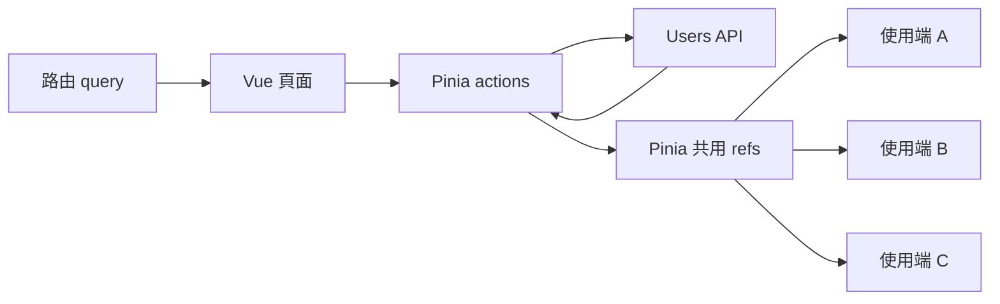
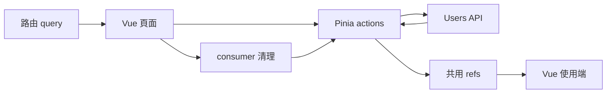

# 什麼時候 Pinia 自然會出現？

## 問題不再只屬於單一元件

<ChapterHeader
  :index="4"
  title="Pinia"
  question="當狀態與流程跨越 component，ownership 如何移進 store？"
/>

<div class="mt-3 grid grid-cols-[0.8fr_auto_1.2fr] items-center gap-5">
  <div class="rounded-2xl border p-4">
    <div class="text-sm font-semibold opacity-55">單一功能內</div>
    <div class="mt-3 text-xl font-semibold">Component / composable</div>
    <div class="mt-4 grid gap-2 text-sm opacity-70">
      <div>一份 snapshot</div>
      <div>一組互動入口</div>
      <div>一段 consumer lifetime</div>
    </div>
  </div>

  <div class="text-center">
    <div class="text-sm font-semibold text-amber-600 dark:text-amber-300">問題範圍擴大</div>
    <div class="mt-2 text-4xl opacity-45">→</div>
  </div>

  <div class="rounded-2xl border border-amber-300 p-4 dark:border-amber-700">
    <div class="text-sm font-semibold text-amber-600 dark:text-amber-300">多個 consumer 共用</div>
    <div class="mt-3 grid grid-cols-[1fr_auto_1fr] items-center gap-3 text-center text-sm">
      <div class="rounded-lg bg-amber-50 p-2 dark:bg-amber-950">搜尋頁面</div>
      <div class="opacity-45">↘</div>
      <div class="rounded-lg bg-amber-50 p-2 dark:bg-amber-950">使用者詳情</div>
      <div class="col-span-3 rounded-xl border border-amber-300 p-2 font-semibold dark:border-amber-700">
        Pinia store<br><span class="font-normal opacity-65">shared snapshot + actions</span>
      </div>
      <div class="rounded-lg bg-amber-50 p-2 dark:bg-amber-950">狀態面板</div>
      <div class="opacity-45">↗</div>
      <div class="rounded-lg bg-amber-50 p-2 dark:bg-amber-950">其他 consumer</div>
    </div>
  </div>
</div>

<div class="mt-3 grid grid-cols-3 gap-3 text-center text-sm">
  <div class="rounded-xl bg-gray-100 p-3 dark:bg-gray-800">
    <div class="font-semibold">共享同一份狀態</div>
    <div class="mt-1 opacity-65">不再綁定某個 page</div>
  </div>
  <div class="rounded-xl bg-gray-100 p-3 dark:bg-gray-800">
    <div class="font-semibold">共用操作入口</div>
    <div class="mt-1 opacity-65">action 表達 application workflow</div>
  </div>
  <div class="rounded-xl bg-gray-100 p-3 dark:bg-gray-800">
    <div class="font-semibold">跨 consumer lifetime</div>
    <div class="mt-1 opacity-65">store 可活得比單一元件久</div>
  </div>
</div>

<div class="mt-3 rounded-xl bg-amber-50 p-2 text-center text-base font-semibold dark:bg-amber-950">
  Pinia 的價值不是搬動 ref，而是建立 shared state 與 workflow boundary。
</div>

<!--
Core: 當 snapshot、操作入口與 lifetime 需要跨越單一 consumer，Pinia 能建立清楚的 shared state 與 workflow boundary。
Time: 55 秒。
Talk track:
Pure Vue 對單一功能已經完整；所以進入 Pinia 不是因為前一種寫法錯了，而是問題範圍改變了。
當搜尋頁面、使用者詳情、狀態面板或其他 consumer 都需要同一份 snapshot，狀態若仍綁在某個 page，就很難說誰是共享入口。
Pinia store 讓 shared state 有穩定位置，也讓 actions 成為多個 consumer 共用的 application workflow API。
第三個變化是 lifetime。Store 通常可以活得比單一 component consumer 更久，這讓跨頁共享變得自然，也帶來稍後要處理的生命週期問題。
所以 Pinia 不該被簡化成「少寫 watch」或「把 ref 搬進 store」。這一章真正關心的是 shared boundary。
Transition: 先看 store boundary 確實接走了哪些責任，以及哪些責任不會因此自動出現。
Cut: 只保留「問題範圍擴大」與底部結論。
-->

---
layout: default
clicks: 3
---

# Store 邊界改變了什麼？

## 共享位置、操作入口與生命週期都改變了

<div class="pinia-boundary-map">



</div>

<div class="grid grid-cols-2 gap-4">
  <div v-click="1" class="rounded-2xl border border-amber-300 p-3 backdrop-blur dark:border-amber-700">
    <div class="font-semibold text-amber-600 dark:text-amber-300">Store 確實接走</div>
    <div class="mt-2 grid grid-cols-3 gap-2 text-center text-sm">
      <div class="rounded-lg bg-amber-50 p-2 dark:bg-amber-950">共用狀態快照</div>
      <div class="rounded-lg bg-amber-50 p-2 dark:bg-amber-950">共用 actions</div>
      <div class="rounded-lg bg-amber-50 p-2 dark:bg-amber-950">跨消費端狀態</div>
    </div>
  </div>
  <div v-click="2" class="rounded-2xl border p-3 backdrop-blur">
    <div class="font-semibold">不會自動獲得</div>
    <div class="mt-2 grid grid-cols-3 gap-2 text-center text-sm">
      <div class="rounded-lg bg-gray-100 p-2 dark:bg-gray-800">取消 / 新舊判斷</div>
      <div class="rounded-lg bg-gray-100 p-2 dark:bg-gray-800">失效 / 重載規則</div>
      <div class="rounded-lg bg-gray-100 p-2 dark:bg-gray-800">串流清理</div>
    </div>
  </div>
</div>

<div v-click="3">
  <div class="mt-3 grid grid-cols-[130px_1fr] gap-x-4 gap-y-2 text-sm">
    <div class="font-semibold opacity-55">元件</div>
    <div class="rounded bg-blue-50 px-3 py-2 dark:bg-blue-950">掛載 ─────────── 卸載</div>
    <div class="font-semibold text-amber-600 dark:text-amber-300">Pinia store</div>
    <div class="rounded bg-amber-50 px-3 py-2 dark:bg-amber-950">建立 ───────────────────────── 繼續存在</div>
  </div>

  <div class="mt-3 text-center text-base font-semibold">
    Store 生命週期 ≠ 元件生命週期；共用狀態不等於自動擁有每一段非同步生命週期。
  </div>
</div>

<style>
.pinia-boundary-map .mermaid {
  display: flex;
  height: 170px;
  align-items: center;
  justify-content: center;
}

.pinia-boundary-map .mermaid svg {
  width: 100%;
  max-height: 170px;
}
</style>

<!--
Core: Pinia store 改變 shared snapshot、actions 與 lifetime boundary；它不會自動替 application 定義 server-state lifecycle semantics。
Time: 75 秒。
Talk track:
第一幕只看圖。從 route query 進入 Vue page，page 做 route adaptation，再呼叫 Pinia actions。Action 執行 Users API，最後把結果寫進 shared refs，供多個 consumer 使用。
第一次 click 顯示 Store 確實接走的責任：共享 snapshot、共用 operations，以及跨 consumer 的狀態。這已經是實質的 ownership 轉移，不只是檔案整理。
第二次 click 補上不會自動獲得的 semantics。Pinia 不知道這個 API 的舊 response 是否能寫回、mutation 後要 reload 哪些資料，或 stream 應該在什麼時機清理。
第三次 click 才比較 lifetime：component 可以 unmount，但 store 仍繼續存在。因此不能用 component lifetime 直接推論 store 裡所有 async work 的 lifetime。
這不是 Pinia 的缺陷；Pinia 解決的是 shared client state 與 workflow，server-state semantics 仍由採用的 architecture 宣告。
Transition: 回到 Demo 的 actions，看看 application 如何在這個 boundary 裡明確編排 policy。
Cut: 從圖直接跳到第三次 click，只保留 lifetime 不相等的結論。
-->

---
layout: default
clicks: 1
---

<div v-if="$clicks === 0">
  <h1>Action 集中 update → reload</h1>
  <h2>Shared workflow 有了明確入口</h2>

  <div class="mt-3 grid grid-cols-[1.25fr_0.75fr] gap-6">
    <div>
      <div class="mb-2 text-xs font-semibold opacity-55">
        來源 · <code>src/examples/pinia-action/userDemo.store.ts</code>
      </div>

<div class="pinia-code">

```ts
async function updateUser(userId, patch) {
  updateStatus.value = 'pending'

  await api.updateUser({ userId, patch })

  await Promise.all([
    fetchUsers(currentKeyword),
    fetchUserDetail(userId),
  ])

  updateStatus.value = 'success'
}
```

</div>
</div>

<div class="grid content-center gap-2">
  <div class="rounded-xl border p-3">
    <div class="text-sm font-semibold opacity-55">1 · MUTATION</div>
    <div class="mt-2 font-mono text-sm">api.updateUser(...)</div>
  </div>
  <div class="text-center text-2xl opacity-40">↓</div>
  <div class="rounded-xl border border-amber-300 p-3 dark:border-amber-700">
    <div class="text-sm font-semibold text-amber-600 dark:text-amber-300">2 · RELOAD TARGETS</div>
    <div class="mt-2 font-mono text-sm">users + selected detail</div>
  </div>
  <div class="text-center text-2xl opacity-40">↓</div>
  <div class="rounded-xl border p-3">
    <div class="text-sm font-semibold opacity-55">3 · STATUS</div>
    <div class="mt-2 font-mono text-sm">pending → success / error</div>
  </div>
</div>
</div>

  <div class="mt-3 grid grid-cols-3 gap-2 text-center text-[10px] leading-tight">
    <div class="rounded-lg bg-amber-50 p-2 dark:bg-amber-950">規則宣告：update → reload targets</div>
    <div class="rounded-lg bg-blue-50 p-2 dark:bg-blue-950">維持機制：Pinia action</div>
    <div class="rounded-lg bg-gray-100 p-2 dark:bg-gray-800">省略的銜接：route adaptation／API error mapping</div>
  </div>
</div>

<div v-else>
  <h1>Policy 集中了，但沒有自動化</h1>
  <h2>Currentness 與 stream lifetime 仍需要明確 owner</h2>

  <div class="mt-4 grid grid-cols-2 gap-5">
    <div>
      <div class="mb-2 text-xs font-semibold opacity-55">Race guard · <code>src/examples/pinia-action/userDemo.store.ts</code></div>

<div class="pinia-code pinia-code-small">

```ts
const requestGeneration =
  ++latestUsersRequestGeneration
const loadedUsers = await api.fetchUsers({ keyword })

if (
  requestGeneration === latestUsersRequestGeneration
) {
  users.value = loadedUsers
  usersStatus.value = 'success'
}
```

</div>
</div>

<div>
  <div class="mb-2 text-xs font-semibold opacity-55">Consumer cleanup · <code>src/examples/pinia-action/PiniaActionPage.vue</code></div>

<div class="pinia-code pinia-code-small">

```ts
watch(userId, (currentUserId) => {
  if (!currentUserId) return

  store.fetchUserDetail(currentUserId)
  store.subscribeActivity(currentUserId)
}, { immediate: true })

onUnmounted(() => store.unsubscribeActivity())
```

</div>
</div>
</div>

  <div class="mt-5 grid grid-cols-4 gap-3 text-center text-sm">
    <div class="rounded-xl border p-3"><b>狀態</b><br><span class="opacity-65">action transition</span></div>
    <div class="rounded-xl border p-3"><b>競態保護</b><br><span class="opacity-65">generation guard</span></div>
    <div class="rounded-xl border p-3"><b>重載順序</b><br><span class="opacity-65">action orchestration</span></div>
    <div class="rounded-xl border p-3"><b>串流清理</b><br><span class="opacity-65">page + store action</span></div>
  </div>

  <div class="mt-4 grid grid-cols-3 gap-2 text-center text-[10px] leading-tight">
    <div class="rounded-lg bg-amber-50 p-2 dark:bg-amber-950">規則宣告：currentness／stream cleanup</div>
    <div class="rounded-lg bg-blue-50 p-2 dark:bg-blue-950">維持機制：generation guard＋Vue onUnmounted</div>
    <div class="rounded-lg bg-gray-100 p-2 dark:bg-gray-800">省略的銜接：store setup／component rendering</div>
  </div>
</div>

<style>
.pinia-code {
  overflow: hidden;
  border-radius: 0.5rem;
}

.pinia-code .slidev-code-wrapper,
.pinia-code .slidev-code {
  margin: 0;
}

.pinia-code .slidev-code {
  padding: 1rem 1.1rem;
  font-size: 13px;
  line-height: 1.45;
}

.pinia-code-small .slidev-code {
  font-size: 12px;
  line-height: 1.45;
}
</style>

<!--
Core: Pinia actions 讓 shared workflow policy 有明確入口，但 status、race guard、reload target 與 stream cleanup 仍由 application implementation 宣告。
Time: 90 秒。
Talk track:
第一幕先看 update action。Demo 的 updateUser 先進入 pending，執行 mutation，再平行 reload users list 與 selected detail，最後進入 success。這讓 update 到 reload 的 domain intent 集中在 store，而不是散落在各個 component。
但集中不等於自動。是這份 action 決定 reload list 和 detail；換一個 feature，目標完全可能不同。Error transition 也仍由 implementation 維持。
第二幕看 currentness。fetchUsers action 仍使用 generation guard，只有最新 request 能寫回 store snapshot。Pinia 提供 reactivity，沒有替這個 Users API 預先定義 stale-result policy。
再看 stream。Store 提供 subscribeActivity 和 unsubscribeActivity actions，但 Demo 讓 page 的 watch 接上 userId，並在 onUnmounted 呼叫 cleanup。這表示 subscription state 在 store，consumer lifetime 卻仍需要 Vue page integration。
這四個 policy 現在比較集中、比較容易找到，但都仍是 application code 的選擇。其他 Pinia architecture 可以使用 plugins、獨立 services 或不同 disposal policy；這裡不宣稱 Pinia 只能這樣寫。
Transition: 最後把 store、actions、Vue page 與 application glue 放回同一張責任分布圖。
Cut: 第一幕只講 mutation → reload；第二幕只指出 generation guard 與 onUnmounted。
-->

---
layout: default
---

# Pinia 的非同步權責分布圖

## Store 擁有共用流程；應用程式維持非同步規則

<div class="pinia-responsibility-map">



</div>

<div class="mt-1 grid grid-cols-3 gap-2 text-[11px] leading-4">
  <div class="rounded-lg border px-3 py-2"><b>問題範圍</b><br>共用客戶端狀態與流程</div>
  <div class="rounded-lg border px-3 py-2"><b>規則宣告</b><br>store actions＋頁面整合</div>
  <div class="rounded-lg border px-3 py-2"><b>生命週期維持</b><br>Pinia／Vue 響應機制＋應用程式 actions</div>
  <div class="rounded-lg border px-3 py-2"><b>Vue 的責任</b><br>路由轉接 · 互動 · 衍生資料 · 渲染</div>
  <div class="rounded-lg border px-3 py-2"><b>應用程式銜接</b><br>競態保護 · 重載順序 · 狀態 · 串流生命週期</div>
  <div class="rounded-lg border px-3 py-2"><b>成本／非目標</b><br>手動編排 · 不預設伺服器資料語意</div>
</div>

<div class="mt-3 rounded-xl bg-amber-50 p-3 text-center text-base font-semibold dark:bg-amber-950">
  移動：共用狀態快照／流程 → Store　｜　留下：競態／重載／串流清理 → Actions＋Vue 頁面
</div>

<style>
.pinia-responsibility-map .mermaid {
  display: flex;
  height: 220px;
  align-items: center;
  justify-content: center;
}

.pinia-responsibility-map .mermaid svg {
  width: 100%;
  max-height: 220px;
}
</style>

<!--
Core: Pinia 把 shared snapshot 與 workflow 移到 store；race、reload、status 與 stream cleanup 仍由 application actions 和 Vue page integration 維持。
Time: 75 秒。
Talk track:
從 route query 開始，Vue page 仍負責 route adaptation 和 interaction，再把共享操作交給 Pinia actions。
Actions 執行 Users API、維持 status、generation guard 與 update 後的 reload order，最後把 snapshot 放進 shared refs，讓多個 Vue consumers 讀取。
Stream cleanup 特別畫成 page 回到 action 的路徑，因為 Demo 的 consumer lifetime 由 onUnmounted 決定，但真正停止 subscription 的 operation 位於 store。
下方六欄和 Pure Vue 回答同一組問題。差異是 problem scope 已經擴大為 shared client state 與 workflow，policy 主要集中在 store actions，加上 page integration。
Pinia 和 Vue 提供 reactive mechanism；application actions 維持這個 domain 的 lifecycle correctness。代價是 orchestration 仍需手動宣告，而且 Pinia 不預設 server-state semantics。
這不是能力不足的評價。Pinia 已經完整解決這一章的 shared workflow 問題。底部用固定句型收尾：shared snapshot 和 workflow 移到 Store；race、reload 與 stream cleanup 仍留在 Actions 和 Vue page。
Transition: 下一次重新配置不是把 store 換掉，而是當資料具有 identity、freshness、cache 與 invalidation 語意時，讓專用 runtime 接手 server-state lifecycle responsibilities。
Cut: 只走 route → page → actions/API → shared refs → consumers，再念底部結論。
-->
