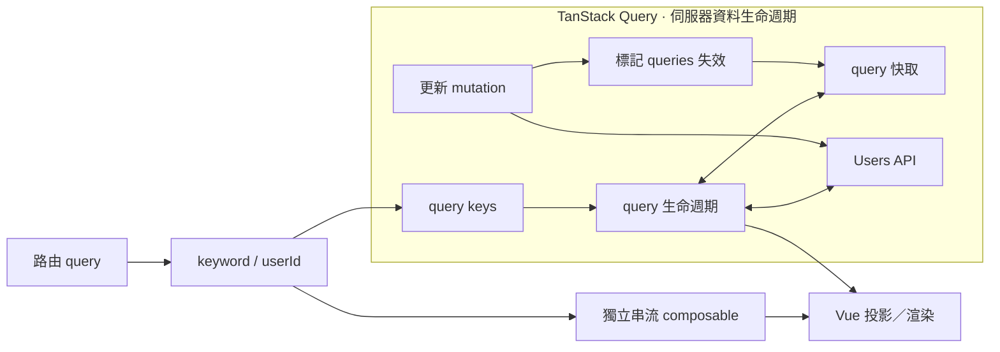

# 問題不只剩下共用狀態

## 遠端資料還有識別、新鮮度與關係

<div class="mt-7 text-center text-2xl font-semibold">
  同一份資料被多人讀取時，還要回答：<span class="text-cyan-600 dark:text-cyan-300">「現在這份還有效嗎？」</span>
</div>

<div class="mt-7 grid grid-cols-3 gap-4">
  <div v-click="1" class="rounded-2xl border border-cyan-300 p-4 dark:border-cyan-700">
    <div class="text-sm font-semibold text-cyan-600 dark:text-cyan-300">資料識別</div>
    <div class="mt-2 text-lg font-semibold">這是哪一份遠端資料？</div>
    <div class="mt-3 font-mono text-sm">['users', keyword]</div>
    <div class="mt-2 text-sm opacity-65">來源改變，資料身分也跟著改變。</div>
  </div>

  <div v-click="2" class="rounded-2xl border border-cyan-300 p-4 dark:border-cyan-700">
    <div class="text-sm font-semibold text-cyan-600 dark:text-cyan-300">資料新鮮度</div>
    <div class="mt-2 text-lg font-semibold">快取裡的資料還新嗎？</div>
    <div class="mt-3 text-sm">等待中 · 已過期 · 重新整理中</div>
    <div class="mt-2 text-sm opacity-65">保留狀態快照，同時維持目前請求的正確性。</div>
  </div>

  <div v-click="3" class="rounded-2xl border border-cyan-300 p-4 dark:border-cyan-700">
    <div class="text-sm font-semibold text-cyan-600 dark:text-cyan-300">資料關係</div>
    <div class="mt-2 text-lg font-semibold">mutation 影響誰？</div>
    <div class="mt-3 text-sm">使用者清單 ↔ 選取的詳細資料</div>
    <div class="mt-2 text-sm opacity-65">成功後，哪些相關資料需要失效與更新？</div>
  </div>
</div>

<div v-click="3" class="mt-5 rounded-xl bg-cyan-50 p-3 text-center text-lg font-semibold dark:bg-cyan-950">
  Pinia 沒有做錯；是問題範圍從共用流程，移到了伺服器資料生命週期。
</div>

<!--
Core: TanStack Query 這一幕不是把 Pinia 排成較低階方案，而是把問題範圍從 shared workflow 轉成 server-state identity、freshness 與關係。
Time: 70 秒。
Talk track:
前一幕用 Pinia 把 shared snapshot 和 actions 集中起來，對多人共用的 client workflow 很合理。但當資料來自 server，我們還多了三種問題。
第一個 click 是 identity。users 不只是一個陣列；keyword 不同，就代表不同的遠端資料身分。
第二個 click 是 freshness。cache 可以保留上一份 snapshot，但 runtime 仍要知道 request 是否進行中、資料是否 stale，以及目前顯示的是 pending 還是 refreshing。
第三個 click 是 relationship。更新一位使用者後，users list 和 selected detail 都可能失效。這不是單純把一個 ref 換成另一個 store，而是開始描述遠端資料彼此的關係。
所以我不是要說 Pinia 不適合 async；Pinia 解的是 shared state 與 workflow。現在只是把鏡頭移到 server-state lifecycle，交給專門的 runtime。
Transition: 先把 TanStack Query 接手的邊界畫出來，再看 application 還要宣告什麼。
Cut: 若時間不足，可只點出 identity、freshness、relationship 三詞與最後一句 problem-scope change。
-->

---
layout: default
---

# TanStack Query 接手哪一段？

## Query 執行層管理伺服器資料；Vue 仍負責消費與整合

<div class="tanstack-map mt-2">



</div>

<div class="mt-3 grid grid-cols-2 gap-4 text-sm">
  <div class="rounded-xl border border-cyan-300 p-3 dark:border-cyan-700">
    <b class="text-cyan-600 dark:text-cyan-300">Query 執行層接手</b>
    <span class="ml-2 opacity-70">狀態 · 取消 · 過期結果 · 快取互動</span>
  </div>
  <div class="rounded-xl border p-3">
    <b>應用程式仍宣告</b>
    <span class="ml-2 opacity-70">query function · 失效關係 · 串流橋接</span>
  </div>
</div>

<div class="mt-3 rounded-xl bg-gray-100 p-2 text-center font-semibold dark:bg-gray-800">
  Ownership 是重新分工，不是應用程式責任消失。
</div>

<style>
.tanstack-map .mermaid {
  display: flex;
  height: 260px;
  align-items: center;
  justify-content: center;
}

.tanstack-map :deep(.mermaid svg) {
  width: auto;
  height: 260px;
  max-width: 100%;
  max-height: 260px;
}
</style>

<!--
Core: Query runtime 接手 query、cache、mutation 與 invalidation 的 lifecycle；route、Vue projection、query function 的 domain 意義與 callback stream bridge 仍由 application 組合。
Time: 80 秒。
Talk track:
從左邊開始。route query 仍然是 keyword 和 userId 的 source，Vue page 負責把它們投影成 query keys。
進到藍色邊界後，TanStack Query runtime 維持 request status、取消訊號、stale result 與 cache interaction；mutation 成功後，也由 runtime 執行 invalidation 對應的 cache lifecycle。
但 runtime 不會猜 API 怎麼呼叫，也不會猜更新一位使用者在 domain 上應該影響哪些 query。query function 與 invalidation meaning 仍是 application 宣告。
右下角的 activity 是 callback-style persistent subscription。在這份 Demo 裡，它用獨立 Vue composable 維持 subscribe、source switch 與 cleanup，然後同樣投影到 Vue。這是刻意的邊界，不是 TanStack Query 的缺陷。
這張圖的重點是 ownership 重新分工：application code 變少，是因為 lifecycle mechanics 移入 runtime；domain meaning 和 framework integration 沒有消失。
Transition: 接著先看 query key，因為 ownership 的第一步是讓 runtime 知道「這是哪一份資料」。
Cut: 可略過 mutation 支線細節，只保留 query key → query/cache → Vue，以及 stream composable 支線。
-->

---
layout: default
clicks: 3
---

# Query key 不只是一串字

## 它同時宣告遠端資料識別與響應式依賴

<div class="mt-3 grid grid-cols-[1.25fr_0.75fr] gap-6">
  <div>
    <div v-if="$clicks === 0" class="mb-2 text-xs font-semibold opacity-55">
      Curated from <code>useUsersQueryDemo.ts</code>
    </div>
    <div v-else-if="$clicks === 1" class="mb-2 text-xs font-semibold text-cyan-600 dark:text-cyan-300">
      Step 1 · query key 宣告 identity 與 dependency
    </div>
    <div v-else-if="$clicks === 2" class="mb-2 text-xs font-semibold text-blue-600 dark:text-blue-300">
      Step 2 · query function 提供實際 work 與 cancellation signal
    </div>
    <div v-else class="mb-2 text-xs font-semibold text-emerald-600 dark:text-emerald-300">
      Step 3 · placeholderData 保留前一份 snapshot
    </div>

<div v-if="$clicks === 0" class="tanstack-code">

```ts
const usersQueryKey = computed(
  () => ['users', keyword.value] as const,
)
const usersQuery = useQuery({
  queryKey: usersQueryKey,
  queryFn: ({ queryKey, signal }) =>
    api.fetchUsers({ keyword: queryKey[1], signal }),
  placeholderData: previousData => previousData,
})
```

</div>

<div v-else-if="$clicks === 1" class="tanstack-code tanstack-code-focus tanstack-code-focus-key">

```ts
const usersQueryKey = computed(
  () => ['users', keyword.value] as const,
)
const usersQuery = useQuery({
  queryKey: usersQueryKey,
  queryFn: ({ queryKey, signal }) =>
    api.fetchUsers({ keyword: queryKey[1], signal }),
  placeholderData: previousData => previousData,
})
```

</div>

<div v-else-if="$clicks === 2" class="tanstack-code tanstack-code-focus tanstack-code-focus-function">

```ts
const usersQueryKey = computed(
  () => ['users', keyword.value] as const,
)
const usersQuery = useQuery({
  queryKey: usersQueryKey,
  queryFn: ({ queryKey, signal }) =>
    api.fetchUsers({ keyword: queryKey[1], signal }),
  placeholderData: previousData => previousData,
})
```

</div>

<div v-else class="tanstack-code tanstack-code-focus tanstack-code-focus-placeholder">

```ts
const usersQueryKey = computed(
  () => ['users', keyword.value] as const,
)
const usersQuery = useQuery({
  queryKey: usersQueryKey,
  queryFn: ({ queryKey, signal }) =>
    api.fetchUsers({ keyword: queryKey[1], signal }),
  placeholderData: previousData => previousData,
})
```

</div>
  </div>

  <div class="grid content-center gap-3 text-sm">
    <div class="rounded-xl border p-3" :class="$clicks === 1 ? 'border-cyan-400 bg-cyan-50 dark:border-cyan-600 dark:bg-cyan-950' : ''">
      <div class="font-mono font-semibold text-cyan-600 dark:text-cyan-300">queryKey</div>
      <div class="mt-1 opacity-70">keyword 改變 → identity 改變 → runtime 觀察新 query。</div>
    </div>
    <div class="rounded-xl border p-3" :class="$clicks === 2 ? 'border-blue-400 bg-blue-50 dark:border-blue-600 dark:bg-blue-950' : ''">
      <div class="font-mono font-semibold text-blue-600 dark:text-blue-300">queryFn</div>
      <div class="mt-1 opacity-70">Application 定義 work；runtime 提供 cancellation signal。</div>
    </div>
    <div class="rounded-xl border p-3" :class="$clicks >= 3 ? 'border-emerald-400 bg-emerald-50 dark:border-emerald-600 dark:bg-emerald-950' : ''">
      <div class="font-mono font-semibold text-emerald-600 dark:text-emerald-300">placeholderData</div>
      <div class="mt-1 opacity-70">保留上一份資料，是 projection policy，不是另一套 state。</div>
    </div>
  </div>
</div>

<div class="mt-4 rounded-xl bg-cyan-50 p-3 text-center font-semibold dark:bg-cyan-950">
  Runtime 能維持 lifecycle，是因為 application 先把 identity 與 work 說清楚。
</div>

<style>
.tanstack-code {
  overflow: hidden;
  border-radius: 0.5rem;
}

.tanstack-code .slidev-code-wrapper,
.tanstack-code .slidev-code {
  margin: 0;
}

.tanstack-code .slidev-code {
  padding: 1rem 1.1rem;
  font-size: 13px;
  line-height: 1.5;
}

.tanstack-code-focus .line {
  opacity: 0.28;
}

.tanstack-code-focus-key .line:nth-child(-n+3),
.tanstack-code-focus-function .line:nth-child(n+6):nth-child(-n+7),
.tanstack-code-focus-placeholder .line:nth-child(8) {
  display: inline-block;
  width: calc(100% + 2.2rem);
  margin-left: -1.1rem;
  padding-left: 1.1rem;
  opacity: 1;
  background: rgba(34, 211, 238, 0.18);
  box-shadow: inset 3px 0 #22d3ee;
}

.tanstack-code-focus-function .line:nth-child(n+6):nth-child(-n+7) {
  background: rgba(59, 130, 246, 0.2);
  box-shadow: inset 3px 0 #60a5fa;
}

.tanstack-code-focus-placeholder .line:nth-child(8) {
  background: rgba(16, 185, 129, 0.18);
  box-shadow: inset 3px 0 #34d399;
}
</style>

<!--
Core: query key 同時表達 server-state identity 與 reactive dependency；runtime 接手 lifecycle mechanics，但 query function 和 placeholder projection 仍由 application 宣告。
Time: 90 秒。
Talk track:
先看完整片段。這是 Demo 真正使用的 users query，不需要手寫 watch、generation guard 或 status transition。
第一個 click 聚焦 usersQueryKey。它不是隨便取的 cache 名稱。users 是資源類型，keyword 是這份遠端資料的 identity dependency；computed 變動後，Vue adapter 讓 Query runtime 觀察新的 key。
第二個 click 聚焦 queryFn。application 仍要定義怎麼呼叫 Users API；runtime 把目前 request 的 AbortSignal 傳進來，因此 source 改變時，取消與舊結果處理不必再由 composable 手寫 generation guard。
第三個 click 聚焦 placeholderData。keyword 改變時可以暫時保留 previousData，畫面把它投影成 refreshing，而不是退回空白 pending。這是 snapshot projection policy，不是另建一份 state。
TanStack Query 幫我們少寫的，不只是 watch，而是 status、cancellation、stale result 和 cache interaction 這整段 lifecycle mechanics。
Transition: Query 描述怎麼讀；下一張 mutation 要描述「寫完之後，哪些遠端資料關係失效」。
Cut: 若時間不足，只講 queryKey 與 queryFn；placeholderData 留一句帶過。
-->

---
layout: default
clicks: 4
---

# 失效更新（Invalidation）是一種領域關係

## 應用程式指出「誰受影響」；執行層維持快取生命週期

<div class="mt-3 grid grid-cols-[1.25fr_0.75fr] gap-6">
  <div>
    <div v-if="$clicks === 0" class="mb-2 text-xs font-semibold opacity-55">
      先不用記 API；先找出四個責任角色
    </div>
    <div v-else-if="$clicks === 1" class="mb-2 text-xs font-semibold text-violet-600 dark:text-violet-300">
      Step 1 · mutationFn：實際要執行的遠端 work
    </div>
    <div v-else-if="$clicks === 2" class="mb-2 text-xs font-semibold text-amber-600 dark:text-amber-300">
      Step 2 · list key：這次更新影響所有 users variants
    </div>
    <div v-else-if="$clicks === 3" class="mb-2 text-xs font-semibold text-orange-600 dark:text-orange-300">
      Step 3 · detail key：只影響目前 selected user
    </div>
    <div v-else class="mb-2 text-xs font-semibold text-cyan-600 dark:text-cyan-300">
      Step 4 · application 宣告關係；runtime 執行 cache lifecycle
    </div>

<div
  class="tanstack-code tanstack-code-small"
  :class="{
    'tanstack-code-focus tanstack-code-focus-mutation': $clicks === 1,
    'tanstack-code-focus tanstack-code-focus-list': $clicks === 2,
    'tanstack-code-focus tanstack-code-focus-detail': $clicks === 3,
    'tanstack-code-focus tanstack-code-focus-runtime': $clicks >= 4,
  }"
>

```ts
const updateMutation = useMutation({
  mutationFn: params => api.updateUser(params),
  onSuccess: async () => {
    const invalidations = [
      queryClient.invalidateQueries({ queryKey: ['users'] }),
    ]

    if (userId.value !== null) {
      invalidations.push(queryClient.invalidateQueries({
        queryKey: ['user', userId.value],
      }))
    }

    await Promise.all(invalidations)
  },
})
```

</div>
  </div>

  <div class="grid min-h-[315px] content-center">
    <div v-if="$clicks === 0" class="grid grid-cols-2 gap-3 text-center text-sm">
      <div class="rounded-xl border p-3"><b>1 · Work</b><br><code>mutationFn</code></div>
      <div class="rounded-xl border p-3"><b>2 · Timing</b><br><code>onSuccess</code></div>
      <div class="rounded-xl border p-3"><b>3 · Relationship</b><br><code>queryKey</code></div>
      <div class="rounded-xl border p-3"><b>4 · Handoff</b><br><code>invalidateQueries</code></div>
      <div class="col-span-2 mt-2 rounded-xl bg-gray-100 p-3 text-base font-semibold dark:bg-gray-800">
        先認角色，再讀語法。
      </div>
    </div>
    <div v-else-if="$clicks === 1" class="rounded-2xl border border-violet-300 p-5 dark:border-violet-700">
      <div class="text-sm font-semibold text-violet-600 dark:text-violet-300">MUTATION WORK</div>
      <div class="mt-3 text-xl font-semibold">怎麼寫入遠端資料？</div>
      <div class="mt-4 rounded-xl bg-violet-50 p-3 font-mono text-sm dark:bg-violet-950">
        params → api.updateUser(params)
      </div>
      <div class="mt-3 text-sm opacity-70">Query runtime 維持 mutation status；API work 仍由 application 提供。</div>
    </div>
    <div v-else-if="$clicks === 2" class="rounded-2xl border border-amber-300 p-5 dark:border-amber-700">
      <div class="text-sm font-semibold text-amber-600 dark:text-amber-300">LIST RELATIONSHIP</div>
      <div class="mt-3 text-xl font-semibold">所有 users list 都可能過期</div>
      <div class="mt-4 rounded-xl bg-amber-50 p-3 font-mono text-base dark:bg-amber-950">['users']</div>
      <div class="mt-3 text-sm opacity-70">Prefix key 會比對不同 keyword 的 users query variants。</div>
    </div>
    <div v-else-if="$clicks === 3" class="rounded-2xl border border-orange-300 p-5 dark:border-orange-700">
      <div class="text-sm font-semibold text-orange-600 dark:text-orange-300">DETAIL RELATIONSHIP</div>
      <div class="mt-3 text-xl font-semibold">目前 detail 也可能過期</div>
      <div class="mt-4 rounded-xl bg-orange-50 p-3 font-mono text-base dark:bg-orange-950">['user', userId]</div>
      <div class="mt-3 text-sm opacity-70">只有存在 selected user 時，才宣告這條精確關係。</div>
    </div>
    <div v-else class="grid gap-3">
      <div class="rounded-2xl border border-amber-300 p-4 dark:border-amber-700">
        <div class="text-sm font-semibold text-amber-600 dark:text-amber-300">APPLICATION 決定</div>
        <div class="mt-2 text-sm"><code>['users']</code> 與 <code>['user', userId]</code> 是受影響的 domain relationships</div>
      </div>
      <div class="text-center text-2xl opacity-40">↓</div>
      <div class="rounded-2xl border border-cyan-300 p-4 dark:border-cyan-700">
        <div class="text-sm font-semibold text-cyan-600 dark:text-cyan-300">QUERY RUNTIME 維持</div>
        <div class="mt-2 text-sm">比對 cache entries → 標記 stale → active query refetch</div>
      </div>
    </div>
  </div>
</div>

<div v-if="$clicks < 4" class="mt-3 rounded-xl bg-gray-100 p-3 text-center text-lg font-semibold dark:bg-gray-800">
  Invalidation 的語法不重要；先看懂 mutation 與 server state 的關係。
</div>
<div v-else class="mt-3 rounded-xl bg-amber-50 p-3 text-center text-lg font-semibold dark:bg-amber-950">
  Invalidation 移走了 cache mechanics，沒有移走 application 的 domain knowledge。
</div>

<style>
.tanstack-code {
  overflow: hidden;
  border-radius: 0.5rem;
}

.tanstack-code .slidev-code-wrapper,
.tanstack-code .slidev-code {
  margin: 0;
}

.tanstack-code .slidev-code {
  padding: 0.85rem 1rem;
  font-size: 11px;
  line-height: 1.35;
}

.tanstack-code-focus .line {
  opacity: 0.25;
}

.tanstack-code-focus-mutation .line:nth-child(-n+2),
.tanstack-code-focus-list .line:nth-child(n+3):nth-child(-n+6),
.tanstack-code-focus-detail .line:nth-child(n+8):nth-child(-n+12),
.tanstack-code-focus-runtime .line:nth-child(14) {
  display: inline-block;
  width: calc(100% + 2rem);
  margin-left: -1rem;
  padding-left: 1rem;
  opacity: 1;
  background: rgba(139, 92, 246, 0.2);
  box-shadow: inset 3px 0 #a78bfa;
}

.tanstack-code-focus-list .line:nth-child(n+3):nth-child(-n+6) {
  background: rgba(245, 158, 11, 0.18);
  box-shadow: inset 3px 0 #fbbf24;
}

.tanstack-code-focus-detail .line:nth-child(n+8):nth-child(-n+12) {
  background: rgba(249, 115, 22, 0.18);
  box-shadow: inset 3px 0 #fb923c;
}

.tanstack-code-focus-runtime .line:nth-child(14) {
  background: rgba(34, 211, 238, 0.18);
  box-shadow: inset 3px 0 #22d3ee;
}
</style>

<!--
Core: 先把 unfamiliar TanStack Query syntax 拆成 mutation work、success timing、list/detail relationships 與 runtime handoff；application 用 query keys 宣告受影響的 domain relationship，Query runtime 執行 matching、stale marking 與 active refetch。
Time: 90 秒。
Talk track:
如果你沒用過 TanStack Query，先不要逐字讀 API。初始畫面只找四個角色：mutationFn 是 work，onSuccess 是 timing，queryKey 描述 relationship，invalidateQueries 把後續 lifecycle 交給 runtime。
第一個 click 聚焦 mutationFn。Application 仍然提供 api.updateUser；Query runtime 接手 mutation 的 pending、success 與 error status，但不會替我們猜實際 work。
第二個 click 聚焦 ['users']。這個 prefix key 表達所有 keyword 對應的 users list variants 都可能因更新而過期。
第三個 click 聚焦 ['user', userId]。只有目前存在 selected user 時，才把這個精確 detail relationship 加進 invalidations。
第四個 click 聚焦 Promise.all。到這裡 application 已經說完「誰受影響」；runtime 接著比對 cache entries、標記 stale，並讓 active queries refetch。Promise.all 只是讓 mutation 的 success workflow 等這些 invalidations 完成。
這個 domain relationship 不可能由 generic runtime 自己猜出來。所以 invalidation 不是「不用思考更新後要做什麼」，而是把「誰受影響」和「如何維持 cache correctness」分成兩個 owner。
Transition: 最後把 callback stream 放回圖裡，確認這份 architecture 的完整邊界與成本。
Cut: 若時間不足，略過初始四角色與 Promise.all，只保留 mutationFn、兩個 query keys，以及 application/runtime 分工。
-->

---
layout: default
clicks: 2
---

# 伺服器資料與 Vue 響應式系統是兩個模型

## 分開管理，是 TanStack Query 的設計選擇

<div class="mt-2 min-h-[170px]">
  <div v-if="$clicks === 0" class="grid grid-cols-2 gap-4 text-sm">
    <div class="rounded-2xl border border-cyan-300 p-2 dark:border-cyan-700">
      <div class="font-semibold text-cyan-600 dark:text-cyan-300">TANSTACK QUERY 執行層</div>
      <div class="mt-2 grid grid-cols-2 gap-2">
        <div class="rounded-lg bg-cyan-50 p-2 dark:bg-cyan-950">請求生命週期</div>
        <div class="rounded-lg bg-cyan-50 p-2 dark:bg-cyan-950">快取識別</div>
        <div class="rounded-lg bg-cyan-50 p-2 dark:bg-cyan-950">mutation 狀態</div>
        <div class="rounded-lg bg-cyan-50 p-2 dark:bg-cyan-950">失效／重新抓取</div>
      </div>
    </div>
    <div class="rounded-2xl border border-blue-300 p-2 dark:border-blue-700">
      <div class="font-semibold text-blue-600 dark:text-blue-300">VUE 響應式系統＋轉接層</div>
      <div class="mt-2 grid grid-cols-2 gap-2">
        <div class="rounded-lg bg-blue-50 p-2 dark:bg-blue-950">路由 refs／computed 輸入</div>
        <div class="rounded-lg bg-blue-50 p-2 dark:bg-blue-950">query 結果 refs</div>
        <div class="rounded-lg bg-blue-50 p-2 dark:bg-blue-950">畫面投影／渲染</div>
        <div class="rounded-lg bg-blue-50 p-2 dark:bg-blue-950">串流 watch／composable</div>
      </div>
    </div>
  </div>
  <div v-else-if="$clicks === 1" class="grid grid-cols-2 gap-3 text-sm">
    <div class="rounded-xl border p-2"><b>路由 ref → Query 設定</b><br><span class="opacity-65"><code>computed(queryKey / enabled)</code> 轉接響應式輸入</span></div>
    <div class="rounded-xl border p-2"><b>Query 執行層 → Vue refs</b><br><span class="opacity-65">Vue Query 轉接層暴露可追蹤狀態快照</span></div>
    <div class="rounded-xl border p-2"><b>Vue refs → UI 投影</b><br><span class="opacity-65"><code>computed(data / status)</code> 整理畫面需要的形狀</span></div>
    <div class="rounded-xl border p-2"><b>userId → 串流 composable</b><br><span class="opacity-65"><code>watch</code> 維持 Query 快取之外的 callback 串流</span></div>
    <div class="col-span-2 rounded-xl bg-amber-50 p-2 text-center text-base font-semibold dark:bg-amber-950">
      computed／watch 是模型間的轉接；回應的新舊正確性仍由 Query 執行層維持。
    </div>
  </div>
  <div v-else class="grid grid-cols-2 gap-3 text-[13px] leading-tight">
    <div class="rounded-xl border border-cyan-300 p-2 dark:border-cyan-700">
      <div class="font-semibold text-cyan-600 dark:text-cyan-300">伺服器資料模型</div>
      <div class="mt-1 text-base font-semibold">TanStack Query 執行層</div>
      <div class="mt-1 opacity-70">識別 · 快取 · mutation · 失效 · 重新抓取</div>
      <div class="mt-1 rounded-lg bg-cyan-50 p-1 text-center text-xs dark:bg-cyan-950">維持 async lifecycle，並透過 observer 發布 snapshot</div>
    </div>
    <div class="rounded-xl border border-emerald-300 p-2 dark:border-emerald-700">
      <div class="font-semibold text-emerald-600 dark:text-emerald-300">VUE 響應式模型</div>
      <div class="mt-1 text-base font-semibold">Vue 轉接層＋消費端</div>
      <div class="mt-1 opacity-70">路由輸入 · 結果 refs · 投影 · 渲染</div>
      <div class="mt-1 rounded-lg bg-emerald-50 p-1 text-center text-xs dark:bg-emerald-950">接收 Query snapshot，不接手 cache lifecycle</div>
    </div>
  </div>
</div>

<div v-if="$clicks === 0" class="mt-2 grid grid-cols-6 gap-2 text-[9px] leading-3">
  <div class="rounded-lg border px-2 py-2"><b>問題範圍</b><br>伺服器資料生命週期</div>
  <div class="rounded-lg border px-2 py-2"><b>規則宣告</b><br>query options＋keys</div>
  <div class="rounded-lg border px-2 py-2"><b>生命週期維持</b><br>Query 快取／observer</div>
  <div class="rounded-lg border px-2 py-2"><b>Vue 的責任</b><br>輸入＋投影＋渲染</div>
  <div class="rounded-lg border px-2 py-2"><b>應用程式銜接</b><br>queryFn＋轉接層組合</div>
  <div class="rounded-lg border px-2 py-2"><b>成本／非目標</b><br>兩個模型間的邊界</div>
</div>
<div v-else-if="$clicks === 1" class="mt-2 grid grid-cols-3 gap-2 text-xs">
  <div class="rounded-lg border px-3 py-2"><b>輸入轉接</b><br>computed queryKey／enabled</div>
  <div class="rounded-lg border px-3 py-2"><b>輸出轉接</b><br>結果 refs／computed 畫面</div>
  <div class="rounded-lg border px-3 py-2"><b>Query 之外</b><br>watch＋串流 composable</div>
</div>
<div v-else class="mt-1 grid grid-cols-3 gap-2 text-[10px] leading-3">
  <div class="rounded-lg border px-3 py-1"><b>非同步生命週期</b> · Query 執行層</div>
  <div class="rounded-lg border px-3 py-1"><b>UI 響應式更新</b> · Vue 執行層</div>
  <div class="rounded-lg border px-3 py-1"><b>模型連接</b> · 轉接層＋組合程式碼</div>
</div>

<div v-if="$clicks === 0" class="mt-2 rounded-xl bg-emerald-50 p-2 text-center text-lg font-semibold dark:bg-emerald-950">
  伺服器資料不必搬進元件狀態；Query 執行層與 Vue 各自維持自己的模型。
</div>
<div v-else-if="$clicks === 1" class="mt-2 rounded-xl bg-amber-50 p-2 text-center text-lg font-semibold dark:bg-amber-950">
  轉接層讓狀態快照可追蹤；它沒有把伺服器資料生命週期變成 Vue 元件生命週期。
</div>
<div v-else class="mt-1 rounded-xl bg-emerald-50 p-2 text-center text-sm font-semibold leading-5 dark:bg-emerald-950">
  移動：伺服器資料生命週期 → Query 執行層　｜　留下：輸入／投影／串流 → Vue＋應用程式<br>
  下一個問題：非同步關係能不能先成為 Graph，再交給 Vue 消費？
</div>

<!--
Core: TanStack Query 把 server-state lifecycle responsibilities 移到 Query runtime；route input、view projection、render 與 Query cache 之外的 stream 仍留在 Vue 和 application integration。
Time: 90 秒。
Talk track:
初始畫面先把兩個模型並排。Query runtime 維持 query identity、cache、status、mutation、invalidation 與 refetch；Vue 維持 route input、component lifecycle、view projection 與 rendering。這種分離不是缺陷，而是 TanStack Query 的核心設計選擇。
第一個 click 再看連接方式。computed queryKey 和 enabled 把 route refs 適配成 query options；Vue Query adapter 把 QueryObserver 的 snapshot 暴露為 reactive refs；page computed 再整理 users、selectedUser 與 status。Callback stream 不屬於這份 query cache，所以 Demo 仍用 watch 和 composable 維持它。
這裡不要說 watch 在追蹤 response。Query result 更新本來就會透過 adapter 進入 Vue reactivity；computed/watch 是模型之間的 input、projection 與 composition glue，response currentness 仍由 Query runtime 維持。
第二個 click 把 responsibility movement 說清楚：server-state lifecycle 移到 Query runtime；route input、projection、render 和 callback stream 仍留在 Vue 與 application integration。下一章不是宣稱這樣不完整，而是改問：如果 source、async resource、invalidation 與 derived state 在進入 Vue 前先形成 reactive graph，這張 ownership map 會如何改變？
Transition: 下一幕不比較 cache 能力，而是把 async relationships 從「經 adapter 發布的 snapshot」改成「框架外先成立的 reactive graph」。
Cut: 若時間不足，保留初始兩欄與最後問題；第一個 click 只說 computed 是 input/projection、watch 是 Query 外的 stream。
-->
