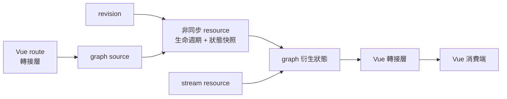
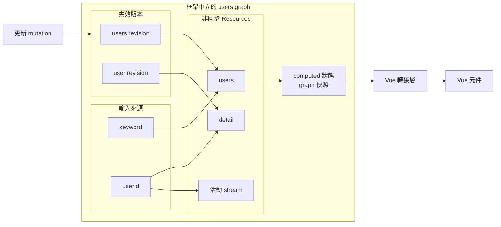

# 讓非同步狀態成為響應式圖的節點

## 把 Ownership 邊界從 Query 轉接層移到框架之外

<div class="mt-4 min-h-[265px]">
  <div v-if="$clicks === 0" class="grid grid-cols-[1fr_auto_1fr_auto_1fr] items-center gap-3 pt-10 text-center text-sm">
    <div class="rounded-2xl border border-blue-300 p-4 dark:border-blue-700">
      <div class="font-semibold text-blue-600 dark:text-blue-300">VUE 響應式系統</div>
      <div class="mt-2">route 狀態<br>computed 查詢選項</div>
    </div>
    <div class="text-3xl opacity-35">→</div>
    <div class="rounded-2xl border border-cyan-300 p-4 dark:border-cyan-700">
      <div class="font-semibold text-cyan-600 dark:text-cyan-300">QUERY 執行層</div>
      <div class="mt-2">伺服器狀態生命週期<br>快取 / QueryObserver</div>
    </div>
    <div class="text-3xl opacity-35">→</div>
    <div class="rounded-2xl border border-violet-300 p-4 dark:border-violet-700">
      <div class="font-semibold text-violet-600 dark:text-violet-300">VUE QUERY 轉接層</div>
      <div class="mt-2">可追蹤的結果 refs<br>Vue 消費端</div>
    </div>
    <div class="col-span-5 mt-6 rounded-xl bg-cyan-50 p-3 text-lg font-semibold dark:bg-cyan-950">
      伺服器狀態與 Vue 響應式系統分開；轉接層傳遞可追蹤的狀態快照。
    </div>
  </div>
  <div v-else class="signal-reactive-map">



  </div>
</div>

<div v-if="$clicks === 0" class="mt-2 rounded-xl bg-gray-100 p-3 text-center text-lg font-semibold dark:bg-gray-800">
  TanStack Query：非同步生命週期在 Query 執行層，Vue 接收 QueryObserver 狀態快照。
</div>
<div v-else class="mt-2 rounded-xl bg-emerald-50 p-3 text-center text-lg font-semibold dark:bg-emerald-950">
  signal-kernel：非同步狀態先進入響應式圖，再透過轉接層交給 Vue 消費。
</div>

<style>
.signal-reactive-map .mermaid {
  display: flex;
  height: 265px;
  align-items: center;
  justify-content: center;
}

.signal-reactive-map .mermaid svg {
  width: 100%;
  max-height: 265px;
}
</style>

<!--
Core: 這一章的切入點不是 TanStack Query 缺少響應式整合，而是重新配置 ownership：TanStack Query 讓伺服器狀態生命週期留在 Query 執行層，再透過 Vue Query 轉接層發布狀態快照；signal-kernel 則讓 source、非同步 resource、revision 與衍生狀態先形成框架中立的響應式圖，最後再交給 Vue 消費端。
Time: 70 秒。
Talk track:
上一張先把 TanStack Query 的設計說清楚。左邊是 Vue route 狀態與 computed 查詢選項；中間 Query 執行層維持伺服器狀態生命週期、快取和 QueryObserver；右邊 Vue Query 轉接層把狀態快照暴露成可追蹤的 refs。Vue 可以自然重新渲染，但非同步生命週期並沒有因此變成 Vue 生命週期。
第一個 click 才換模型。Route 狀態仍要經過輸入轉接層寫入 graph source；source 和 revision 直接成為非同步 resource 的響應式依賴，resource 的生命週期與狀態快照也成為 graph 節點。Graph 衍生狀態完成後，Vue 轉接層才把結果交給元件消費端。
所以不是「TanStack 不具響應性、signal-kernel 才有」。差異是非同步狀態的依賴模型放在哪裡：Query／快取模型後面接 Vue 轉接層，或是在進入框架前先建立響應式圖。
Transition: 下一張先定義這張 graph 最少需要哪些必要語彙。
Cut: 若時間不足，初始圖只說 Query 執行層與 Vue 轉接層分工，click 後只保留 source → resource → 轉接層 → 消費端。
-->

---
layout: default
clicks: 2
---

# signal-kernel 是什麼？

## 把非同步 Resource 當成響應式圖節點的實驗性執行層

<div class="mt-4 rounded-2xl border border-emerald-300 bg-emerald-50 p-4 text-center text-lg dark:border-emerald-700 dark:bg-emerald-950">
  在 Vue 之外描述 source、非同步生命週期、失效與衍生狀態的響應式關係。
</div>

<div class="mt-4 grid grid-cols-4 gap-3 text-sm">
  <div class="rounded-xl border p-3"><b class="text-emerald-600 dark:text-emerald-300">source</b><br><span class="opacity-65">響應式輸入<br>與 resource 識別</span></div>
  <div class="rounded-xl border p-3"><b class="text-cyan-600 dark:text-cyan-300">resource</b><br><span class="opacity-65">非同步生命週期<br>與響應式快照</span></div>
  <div class="rounded-xl border p-3"><b class="text-amber-600 dark:text-amber-300">revision</b><br><span class="opacity-65">響應式的<br>失效訊號</span></div>
  <div class="rounded-xl border p-3"><b class="text-violet-600 dark:text-violet-300">computed / observe</b><br><span class="opacity-65">衍生狀態<br>與依賴關係</span></div>
</div>

<div v-if="$clicks === 0" class="mt-4 rounded-xl bg-gray-100 p-3 text-center text-base font-semibold dark:bg-gray-800">
  關鍵不是 graph 長得多大；是非同步狀態本身能被響應式依賴模型描述。
</div>
<div v-else-if="$clicks === 1" class="mt-4 grid grid-cols-[1fr_auto_1fr_auto_1fr] items-center gap-3 text-center text-sm">
  <div class="rounded-xl border border-emerald-300 p-3 dark:border-emerald-700">source / revision<br><b>發生變化</b></div>
  <div class="text-2xl opacity-35">→</div>
  <div class="rounded-xl border border-cyan-300 p-3 dark:border-cyan-700">resource 執行層<br><b>維持非同步生命週期</b></div>
  <div class="text-2xl opacity-35">→</div>
  <div class="rounded-xl border border-violet-300 p-3 dark:border-violet-700">狀態快照 / computed<br><b>通知 graph 消費端</b></div>
</div>
<div v-else class="mt-4 grid grid-cols-[1.2fr_0.8fr] gap-4 text-sm">
  <div class="rounded-xl border border-emerald-300 p-3 dark:border-emerald-700">
    <b>這份 Demo 使用</b><br>
    <span class="font-mono text-xs">@signal-kernel/core 0.1.4<br>@signal-kernel/async-runtime 0.3.1<br>@signal-kernel/vue 0.2.1</span>
  </div>
  <div class="rounded-xl border border-amber-300 p-3 dark:border-amber-700">
    <b>定位揭露</b><br>
    <span class="text-xs">實驗階段 · 1.0 前版本<br>由作者維護</span>
  </div>
</div>

<!--
Core: signal-kernel 是框架中立的響應式執行層；resource 不只是 Promise 結果，而是同時帶有非同步生命週期、狀態快照與 graph 依賴的節點。這是可運行的架構實驗，不是 TanStack Query 或 Vue store 的直接替代品。
Time: 75 秒。
Talk track:
這張只教四組後面看程式碼需要的詞。Source 是響應式輸入，也會參與 resource 識別；resource 是非同步生命週期和狀態快照的 graph 節點；revision 是 mutation 成功後可以推進的失效訊號；computed 和 observe 分別描述衍生狀態與不必成為 run 輸入的依賴。
第一個 click 看狀態推移。Source 或 revision 改變，resource 執行層重新維持對應的非同步生命週期；狀態快照或 metadata 改變後，依賴它的 graph 消費端被通知。這一段在 Vue 掛載前就可以成立。
第二個 click 揭露定位。這份 Demo 實際使用 core 0.1.4、async-runtime 0.3.1、Vue 轉接層 0.2.1；它仍在 1.0 前的實驗階段，並由作者維護。
不要把它說成更完整的伺服器狀態產品。它要驗證的是：非同步狀態若成為響應式基本單位，ownership 能否更容易讀懂。
Transition: 接著把必要語彙放回 Demo users graph，看響應式關係在哪裡形成。
Cut: 若時間不足，四個詞各講一句，直接跳到成熟度揭露。
-->

---
layout: default
clicks: 1
---

# Graph 先描述非同步響應關係，再交給 Vue

## Graph factory 不依賴 Vue；轉接層才連接框架消費端

<div class="signal-users-graph mt-1">



</div>

<div class="mt-2 grid grid-cols-3 gap-3 text-xs">
  <div class="rounded-xl border border-emerald-300 p-3 dark:border-emerald-700"><b>Graph factory</b><br><span class="opacity-65">source / resource / revision / computed<br>不依賴 Vue</span></div>
  <div class="rounded-xl border border-cyan-300 p-3 dark:border-cyan-700"><b>Graph 實例</b><br><span class="opacity-65">這份 Demo 在 page setup 建立<br>擁有者仍應明確宣告</span></div>
  <div class="rounded-xl border border-violet-300 p-3 dark:border-violet-700"><b>Vue 轉接層</b><br><span class="opacity-65">訂閱 graph 快照<br>暴露 Vue refs</span></div>
</div>

<div v-click class="mt-2 rounded-xl bg-amber-50 p-2 text-center text-base font-semibold dark:bg-amber-950">
  Graph 可以比 Vue 消費端活得久；是否應該如此，由 Graph 擁有者決定。
</div>

<style>
.signal-users-graph .mermaid {
  display: flex;
  height: 255px;
  align-items: center;
  justify-content: center;
}

.signal-users-graph .mermaid svg {
  width: 100%;
  max-height: 255px;
}
</style>

<!--
Core: Users graph 在 Vue 之外先形成非同步響應關係，Vue 轉接層再把 graph 快照接入元件；元件是消費端，不因轉接層作用域結束就自動成為 Graph 生命週期的擁有者。
Time: 80 秒。
Talk track:
圖中央就是 Demo 的 users graph。Keyword、userId 是響應式 sources；users、detail、activity 是非同步 resources；mutation 推進 users 或 user revisions；resource metadata 再形成 computed 狀態。這些依賴在 createUsersGraph 裡已經存在，不需要 Vue 監聽回應才連起來。
右邊才出現 Vue 轉接層和元件。轉接層把 kernel value、resource 快照與 metadata 轉成 Vue refs，讓 template 和 computed 投影可以消費。
下方三張卡要分清楚：graph factory 沒有 Vue import；這份 Demo 的 Graph 實例雖在 SignalKernelPage setup 裡建立，Vue 轉接層仍只借用它。第一個 click 因此固定 ownership：Graph 可以跨元件消費端存活；是否要在 page 結束時 dispose，必須由真正建立並持有 Graph 的應用邊界明確決定，不能由轉接層猜測。
Transition: Graph 看起來很完整；下一張用一個 users resource 看響應式依賴實際怎麼寫。
Cut: 若時間不足，只講 keyword → users、revision → users、快照 → 轉接層 → 元件，再保留生命週期限制句。
-->

---
layout: default
clicks: 3
---

# 依賴關係直接寫進響應式 Resource

## 不是由 Vue 監聽回應；而是 graph 觀察 source 與 revision

<div class="mt-3 grid grid-cols-[1.25fr_0.75fr] gap-6">
  <div>
    <div v-if="$clicks === 0" class="mb-2 text-xs font-semibold opacity-55">先把 resource 看成「非同步狀態＋響應式依賴」</div>
    <div v-else-if="$clicks === 1" class="mb-2 text-xs font-semibold text-emerald-600 dark:text-emerald-300">第一步 · input：keyword source 決定目前的 resource 識別</div>
    <div v-else-if="$clicks === 2" class="mb-2 text-xs font-semibold text-amber-600 dark:text-amber-300">第二步 · observe：revision 是另一條響應式失效依賴</div>
    <div v-else class="mb-2 text-xs font-semibold text-cyan-600 dark:text-cyan-300">第三步 · run：應用提供工作；執行層維持生命週期與快照</div>

<div
  class="signal-resource-code"
  :class="{
    'signal-code-focus signal-code-focus-input': $clicks === 1,
    'signal-code-focus signal-code-focus-observe': $clicks === 2,
    'signal-code-focus signal-code-focus-run': $clicks >= 3,
  }"
>

```ts
const users = createResource({
  input: keyword.get,
  observe: usersRevision.get,
  run: (currentKeyword, context) =>
    api.fetchUsers({
      keyword: currentKeyword,
      signal: context.signal,
    }),
})
```

</div>
  </div>

  <div class="grid min-h-[300px] content-center">
    <div v-if="$clicks === 0" class="grid gap-3 text-sm">
      <div class="rounded-xl border p-3"><b>非同步狀態</b><br><span class="opacity-65">status · value · error · refresh</span></div>
      <div class="rounded-xl border p-3"><b>響應式輸入</b><br><span class="opacity-65">keyword source · users revision</span></div>
      <div class="rounded-xl bg-gray-100 p-3 text-center font-semibold dark:bg-gray-800">兩者寫在同一份 resource 宣告</div>
    </div>
    <div v-else-if="$clicks === 1" class="rounded-2xl border border-emerald-300 p-5 dark:border-emerald-700">
      <div class="font-semibold text-emerald-600 dark:text-emerald-300">輸入來源 → RESOURCE</div>
      <div class="mt-4 text-lg font-semibold">keyword 改變，graph 知道哪個 resource 受影響</div>
      <div class="mt-4 text-sm opacity-70">Vue 只把 route keyword 寫入 source；不監聽 fetch 回應。</div>
    </div>
    <div v-else-if="$clicks === 2" class="rounded-2xl border border-amber-300 p-5 dark:border-amber-700">
      <div class="font-semibold text-amber-600 dark:text-amber-300">REVISION → RESOURCE</div>
      <div class="mt-4 text-lg font-semibold">Mutation 推進 revision，resource 自動失效</div>
      <div class="mt-4 text-sm opacity-70">失效關係是 graph 依賴，不是 onSuccess 裡的 query 目標清單。</div>
    </div>
    <div v-else class="grid gap-3 text-sm">
      <div class="rounded-xl border border-violet-300 p-3 dark:border-violet-700"><b>應用負責</b><br>API 操作與領域失效語意</div>
      <div class="rounded-xl border border-cyan-300 p-3 dark:border-cyan-700"><b>執行層負責</b><br>pending / error / 取消 / 過期結果 / 發布快照</div>
      <div class="rounded-xl bg-emerald-50 p-3 text-center font-semibold dark:bg-emerald-950">快照更新 → graph 依賴端 → Vue 轉接層 refs</div>
    </div>
  </div>
</div>

<div v-if="$clicks === 0" class="mt-2 rounded-xl bg-gray-100 p-3 text-center text-lg font-semibold dark:bg-gray-800">Resource 同時描述非同步生命週期與響應式依賴。</div>
<div v-else-if="$clicks === 1" class="mt-2 rounded-xl bg-emerald-50 p-3 text-center text-lg font-semibold dark:bg-emerald-950">Source 變化是 graph 事件，不是元件裡的 fetch 編排。</div>
<div v-else-if="$clicks === 2" class="mt-2 rounded-xl bg-amber-50 p-3 text-center text-lg font-semibold dark:bg-amber-950">失效關係直接存在於 revision → resource。</div>
<div v-else class="mt-2 rounded-xl bg-cyan-50 p-3 text-center text-lg font-semibold dark:bg-cyan-950">Vue 讀取結果；resource 執行層持續維持非同步正確性。</div>

<style>
.signal-resource-code {
  overflow: hidden;
  border-radius: 0.5rem;
}

.signal-resource-code .slidev-code-wrapper,
.signal-resource-code .slidev-code {
  margin: 0;
}

.signal-resource-code .slidev-code {
  padding: 1rem 1.1rem;
  font-size: 15px;
  line-height: 1.55;
}

.signal-code-focus .line {
  opacity: 0.22;
}

.signal-code-focus-input .line:nth-child(2),
.signal-code-focus-observe .line:nth-child(3),
.signal-code-focus-run .line:nth-child(n+4):nth-child(-n+8) {
  display: inline-block;
  width: calc(100% + 2.2rem);
  margin-left: -1.1rem;
  padding-left: 1.1rem;
  opacity: 1;
  background: rgba(16, 185, 129, 0.18);
  box-shadow: inset 3px 0 #34d399;
}

.signal-code-focus-observe .line:nth-child(3) {
  background: rgba(245, 158, 11, 0.18);
  box-shadow: inset 3px 0 #fbbf24;
}

.signal-code-focus-run .line:nth-child(n+4):nth-child(-n+8) {
  background: rgba(34, 211, 238, 0.18);
  box-shadow: inset 3px 0 #22d3ee;
}
</style>

<!--
Core: createResource 把非同步生命週期與響應式依賴放在同一份宣告；input 連到 keyword source，observe 連到失效 revision，run 提供外部工作。狀態快照由 graph 傳播，再由 Vue 轉接層暴露給消費端，不需要 Vue 監聽回應。
Time: 95 秒。
Talk track:
初始畫面先不要逐行讀。左邊 resource 宣告同時描述兩件事：它是一份有 status、value、error、refresh 的非同步狀態，也有 keyword source 和 users revision 兩條響應式依賴。
第一個 click 聚焦 input。Keyword 是 graph source；route 改變時 Vue 的輸入轉接層只把新值寫入 source。接下來哪個 resource 應該重跑、舊 request 是否要取消，由 graph 和 resource 執行層接手，而不是在元件的 watch 裡重新編排 fetch。
第二個 click 聚焦 observe。Update mutation 成功後推進 users revision；因 users resource 宣告 observe 它，失效關係直接存在於 graph。這和 TanStack Query 的 onSuccess invalidateQueries 都有效，差異是關係被表示成響應式依賴，而不是在 callback 裡列出 query 目標。
第三個 click 聚焦 run。應用仍提供 api.fetchUsers 和領域語意；執行層維持 pending、error、取消、過期結果抑制與快照發布。快照一變，graph 依賴端更新，Vue 轉接層 refs 接著通知元件。
Transition: 既然回應不需要 Vue watch，下一張就精確看 Vue 還留下哪兩個轉接邊界。
Cut: 若時間不足，只講 input 與 observe；run 的分工濃縮成應用提供工作、執行層維持生命週期。
-->

---
layout: default
clicks: 2
---

# Vue 解除消費關係，不接管 Graph 生命週期

## 轉接層作用域與 Graph Ownership 是兩個邊界

<div class="mt-4 min-h-[300px]">
  <div v-if="$clicks === 0" class="grid grid-cols-[0.9fr_auto_1.2fr_auto_0.9fr] items-center gap-3 pt-5 text-center text-sm">
    <div class="rounded-2xl border border-blue-300 p-4 dark:border-blue-700">
      <div class="font-semibold text-blue-600 dark:text-blue-300">輸入轉接層</div>
      <div class="mt-3">route computed<br>watch → source.set</div>
    </div>
    <div class="text-3xl opacity-35">→</div>
    <div class="rounded-2xl border border-emerald-300 p-5 dark:border-emerald-700">
      <div class="font-semibold text-emerald-600 dark:text-emerald-300">SIGNAL-KERNEL GRAPH</div>
      <div class="mt-3 grid grid-cols-2 gap-2 text-xs">
        <div class="rounded-lg bg-emerald-50 p-2 dark:bg-emerald-950">sources / revisions</div>
        <div class="rounded-lg bg-emerald-50 p-2 dark:bg-emerald-950">非同步 resources</div>
        <div class="rounded-lg bg-emerald-50 p-2 dark:bg-emerald-950">computed 狀態</div>
        <div class="rounded-lg bg-emerald-50 p-2 dark:bg-emerald-950">生命週期資訊</div>
      </div>
    </div>
    <div class="text-3xl opacity-35">→</div>
    <div class="rounded-2xl border border-violet-300 p-4 dark:border-violet-700">
      <div class="font-semibold text-violet-600 dark:text-violet-300">輸出轉接層</div>
      <div class="mt-3">useResource<br>useKernelValue</div>
    </div>
    <div class="col-span-5 mt-5 rounded-xl bg-blue-50 p-3 text-lg font-semibold dark:bg-blue-950">
      Vue 不監聽回應或編排重新抓取；Vue 接收 graph 快照並負責渲染。
    </div>
  </div>
  <div v-else-if="$clicks === 1" class="grid grid-cols-2 gap-5 text-sm">
    <div class="rounded-2xl border border-blue-300 p-4 dark:border-blue-700">
      <div class="font-semibold text-blue-600 dark:text-blue-300">VUE → GRAPH</div>
      <div class="mt-3 rounded-xl bg-gray-100 p-3 font-mono text-xs leading-6 dark:bg-gray-900">
        <div>watch(keyword, value =&gt;</div>
        <div>&nbsp;&nbsp;graph.sources.keyword.set(value))</div>
        <div class="h-3"></div>
        <div>watch(userId, value =&gt;</div>
        <div>&nbsp;&nbsp;graph.sources.userId.set(value))</div>
      </div>
      <div class="mt-3 opacity-70">Vue route 的響應式狀態只轉接成 graph source。</div>
    </div>
    <div class="rounded-2xl border border-violet-300 p-4 dark:border-violet-700">
      <div class="font-semibold text-violet-600 dark:text-violet-300">GRAPH → VUE</div>
      <div class="mt-3 rounded-xl bg-gray-100 p-3 font-mono text-xs leading-6 dark:bg-gray-900">
        <div>const resource = useResource(graph.resources.users)</div>
        <div>const status = useKernelValue(graph.computed.usersStatus)</div>
        <div class="h-3"></div>
        <div>const users = computed(() =&gt;</div>
        <div>&nbsp;&nbsp;resource.value.value ?? [])</div>
      </div>
      <div class="mt-3 opacity-70">轉接層暴露 refs；computed 只整理畫面需要的形狀。</div>
    </div>
  </div>
  <div v-else class="grid grid-cols-3 gap-4 text-sm">
    <div class="rounded-2xl border border-emerald-300 p-4 dark:border-emerald-700">
      <div class="font-semibold text-emerald-600 dark:text-emerald-300">GRAPH 執行層</div>
      <div class="mt-3 leading-7">依賴追蹤<br>非同步生命週期<br>快照傳播<br>source 切換清理</div>
    </div>
    <div class="rounded-2xl border border-blue-300 p-4 dark:border-blue-700">
      <div class="font-semibold text-blue-600 dark:text-blue-300">VUE 轉接層＋消費端</div>
      <div class="mt-3 leading-7">route 轉接<br>下游觀察<br>畫面投影<br>渲染</div>
    </div>
    <div class="rounded-2xl border border-amber-300 p-4 dark:border-amber-700">
      <div class="font-semibold text-amber-600 dark:text-amber-300">GRAPH 擁有者</div>
      <div class="mt-3 leading-7">實例生命週期<br>resource 清理規則<br>外部 stream 清理<br>應用邊界</div>
    </div>
    <div class="col-span-3 grid grid-cols-2 gap-3 text-xs">
      <div class="rounded-xl bg-emerald-50 p-2 text-center dark:bg-emerald-950">✓ Vue 作用域結束：停止轉接層的 observer</div>
      <div class="rounded-xl bg-blue-50 p-2 text-center dark:bg-blue-950">✓ 借用式轉接層：不自動呼叫 resource.cancel()</div>
    </div>
    <div class="col-span-3 rounded-xl bg-amber-50 p-2 text-center text-xs font-semibold dark:bg-amber-950">
      Graph 是否終止，由 Graph 擁有者決定；元件卸載不是預設的 dispose 訊號。
    </div>
  </div>
</div>

<div v-if="$clicks === 0" class="mt-2 rounded-xl bg-gray-100 p-3 text-center text-lg font-semibold dark:bg-gray-800">Vue 是輸入邊界與 UI 消費端；非同步正確性留在 graph resource。</div>
<div v-else-if="$clicks === 1" class="mt-2 rounded-xl bg-blue-50 p-3 text-center text-lg font-semibold dark:bg-blue-950">computed / watch 沒有消失；它們不再擁有回應生命週期。</div>
<div v-else class="mt-2 rounded-xl bg-amber-50 p-3 text-center text-lg font-semibold dark:bg-amber-950">解除 Vue 消費關係 ≠ 銷毀 Graph；框架中立的 Graph 可以跨元件存活。</div>

<!--
Core: Vue 在 signal-kernel 版本中是輸入邊界與 UI 消費端；元件卸載只停止轉接層 observer，不預設取消 resource 或銷毀 Graph。Graph 生命週期必須由框架中立的 Graph 擁有者決定。
Time: 100 秒。
Talk track:
初始畫面先看完整資料流。左邊輸入轉接層把 Vue route computed 經 watch 寫進 graph sources；中間 graph 維持 sources、revisions、非同步 resources、computed 狀態和生命週期資訊；右邊輸出轉接層用 useResource 和 useKernelValue 暴露 Vue refs。元件主要負責讀取、互動和渲染。
第一個 click 看實際程式碼。兩個 watch 還存在，所以不能說 Vue 完全只是被動消費端；它是 route 響應式狀態進 graph 的輸入邊界。另一邊 useResource、useKernelValue 接回 graph 快照，外層 computed 只把 value.value 整理成 template 想讀的 users 陣列。它不是在追蹤回應是否回來。
第二個 click 結算擁有者。Graph 執行層維持依賴、非同步生命週期、快照傳播與 source 切換；Vue 轉接層和消費端維持 route 轉接、下游觀察、畫面投影和渲染；Graph 擁有者才決定實例生命週期、resource 清理規則與外部 stream 清理。
signal-kernel 的 Vue 轉接層測試已證明兩件刻意並存的行為：Vue 作用域結束會停止 kernel effect 對 Vue ref 的同步；useResource 和 useStreamResource 不會因此呼叫 resource.cancel。這不是缺少清理，而是借用式消費契約。元件卸載不是 Graph dispose 訊號；如果應用決定結束 Graph，應由 Graph 擁有者的明確契約處理 resource 與外部 effect 清理。
Transition: 最後不問誰的程式碼比較短，而是結算把非同步狀態變成 graph 節點得到什麼、又多了什麼。
Cut: 若時間不足，保留初始資料流和第二個 click 的三個擁有者；實際轉接程式碼口頭帶過。
-->

---
layout: default
clicks: 1
---

# 響應式 Graph 的清晰度不是免費的

## Ownership 更集中，不代表只剩一個執行層

<div class="mt-3 grid grid-cols-2 gap-5 text-sm">
  <div class="rounded-2xl border border-emerald-300 p-4 dark:border-emerald-700">
    <div class="text-lg font-semibold text-emerald-600 dark:text-emerald-300">採用 GRAPH 得到</div>
    <div class="mt-3 grid grid-cols-2 gap-3">
      <div class="rounded-lg bg-emerald-50 p-3 dark:bg-emerald-950">非同步狀態是 graph 節點</div>
      <div class="rounded-lg bg-emerald-50 p-3 dark:bg-emerald-950">source / revision 是依賴</div>
      <div class="rounded-lg bg-emerald-50 p-3 dark:bg-emerald-950">衍生狀態先於 Vue</div>
      <div class="rounded-lg bg-emerald-50 p-3 dark:bg-emerald-950">Vue 更接近 UI 消費端</div>
    </div>
  </div>
  <div class="rounded-2xl border border-amber-300 p-4 dark:border-amber-700">
    <div class="text-lg font-semibold text-amber-600 dark:text-amber-300">採用 GRAPH 付出</div>
    <div class="mt-3 grid grid-cols-2 gap-3 text-xs">
      <div class="rounded-lg bg-amber-50 p-3 dark:bg-amber-950">兩套響應式執行層</div>
      <div class="rounded-lg bg-amber-50 p-3 dark:bg-amber-950">輸入＋輸出轉接層</div>
      <div class="rounded-lg bg-amber-50 p-3 dark:bg-amber-950">新語彙＋除錯模型</div>
      <div class="rounded-lg bg-amber-50 p-3 dark:bg-amber-950">實驗階段成熟度</div>
      <div class="col-span-2 rounded-lg bg-amber-50 p-3 text-center dark:bg-amber-950">明確的 Graph 擁有者／外部清理策略</div>
    </div>
  </div>
</div>

<div class="mt-3 grid grid-cols-3 gap-2 text-[10px] leading-4">
  <div class="rounded-lg border px-3 py-2"><b>問題範圍</b><br>非同步狀態成為響應式 Graph</div>
  <div class="rounded-lg border px-3 py-2"><b>規則宣告</b><br>Graph factory＋resource 宣告</div>
  <div class="rounded-lg border px-3 py-2"><b>生命週期擁有者</b><br>resource 執行層＋Graph 擁有者</div>
  <div class="rounded-lg border px-3 py-2"><b>Vue 仍負責</b><br>route 轉接＋互動＋渲染</div>
  <div class="rounded-lg border px-3 py-2"><b>應用銜接</b><br>API＋轉接層＋訂閱橋接</div>
  <div class="rounded-lg border px-3 py-2"><b>成本／非目標</b><br>不是通用的伺服器狀態替代品</div>
</div>

<div v-click class="mt-2 rounded-xl bg-emerald-50 p-2 text-center text-base font-semibold dark:bg-emerald-950">
  當你需要「非同步依賴本身」先於框架被響應式 Graph 表達，這個成本才值得。
</div>

<!--
Core: signal-kernel 的收益不是讓 TanStack Query 變得多餘，而是讓非同步狀態、source、失效與衍生狀態在進入 Vue 前就有響應式表示。代價是 kernel 與 Vue 仍是兩套響應式執行層，必須維護轉接層、必要語彙、除錯模型、成熟度，以及明確的 Graph ownership 與外部清理規則。
Time: 80 秒。
Talk track:
這一章最後結算真正得到的東西。非同步狀態是 graph 節點；source 和 revision 是它的依賴；衍生狀態在 Vue 掛載前就能形成；Vue 因此更接近輸入邊界和 UI 消費端，不必擁有回應生命週期。
但不要把「一張 graph」講成「只剩一個響應式執行層」。Kernel graph 和 Vue 響應式系統仍是兩套執行層，兩邊需要輸入與輸出轉接層。還要支付新語彙、除錯模型、實驗階段成熟度，以及明確宣告 Graph 擁有者和外部清理規則的成本。
下方六個欄位把 ownership 契約說完整。問題範圍是讓非同步狀態成為響應式 Graph；規則在 graph factory 和 resource 宣告；resource 執行層維持每次非同步工作，Graph 擁有者決定實例生命週期；Vue 和應用銜接都還在，只是責任變窄。
第一個 click 給決策規則：只有當需求是讓非同步依賴本身先於框架被響應式 Graph 表達，而且這份清晰度的收益高於維護 Graph 和轉接層的成本，才值得採用。這不是 TanStack Query 的下一級。
Transition: 下一章用同樣的 ownership 欄位平行比較 Pure Vue、Pinia、TanStack Query 與 signal-kernel，不排工具名次。
Cut: 若時間不足，左右各講兩點，最後只保留「仍是兩套執行層」與選擇規則。
-->
